## Overview {.smaller}

::: columns

::: {.column width="33%" }
### 🌍 VarPro  
**Variable Priority for Global Variable Selection**

- Model-independent variable importance  
- Based on rule-and-release regions  
- Targets **population-level effects**  
- Identifies variables driving the conditional mean  


:::

::: {.column width="33%"}
### 👤 iVarPro  
**Variable Priority for Individual Variable Selection**

- Extends VarPro to **individual level**  
- Estimates **local gradients** within rules  
- Captures **heterogeneity across subjects**  
- Enables personalized interpretation  

:::

::: {.column width="33%"}
### 💻 Software  

**R package: `varPro`**

- Efficient implementation of VarPro & iVarPro  
- User-friendly workflow for analysis  

**Resources:**
- Tutorials and examples  

🔗 https://www.varprotools.org/  

:::

:::


## Overview {.smaller}

::: columns

::: {.column width="33%" .varpro-highlight}
### 🌍 VarPro  
**Variable Priority for Global Variable Selection**

- Model-independent variable importance  
- Based on rule-and-release regions  
- Targets **population-level effects**  
- Identifies variables driving the conditional mean  


:::

::: {.column width="33%"}
### 👤 iVarPro  
**Variable Priority for Individual Variable Selection**

- Extends VarPro to **individual level**  
- Estimates **local gradients** within rules  
- Captures **heterogeneity across subjects**  
- Enables personalized interpretation  

:::

::: {.column width="33%"}
### 💻 Software  

**R package: `varPro`**

- Efficient implementation of VarPro & iVarPro  
- User-friendly workflow for analysis  

**Resources:**
- Tutorials and examples  

🔗 https://www.varprotools.org/  

:::
:::


## Background and Related Work {.smaller}

- Linear regression:
  $$
  y_i = \beta_0 + \beta_1 x_{i1} + \cdots + \beta_p x_{ip}
  $$
Prediction and variable selection are **simultaneous**
where coefficients $\beta_j$ directly encode importance  

- <span class="blue-text">Nonparametric Models</span>: The Problem

No explicit coefficients  in the prediction function:
  $$
 \hat{y} = f(x_1, x_2, \dots, x_p)
  $$
<span class="blue-text">How do we assess variable importance?</span>

---


### Existing Approaches {.smaller}
- **Permutation Variable Importance**

<div style="display: flex; justify-content: space-around; align-items: center;">

<div>
<b>Original Data</b>
<table style="border-collapse: collapse; text-align: center;">
<tr>
<th>$$\hat{y}$$</th><th>$$x_1$$</th><th>$$x_2$$</th><th style="background-color:#cce5ff;">$$x_3$$</th>
</tr>
<tr><td>2.1</td><td>1</td><td>0</td><td style="background-color:#cce5ff;">3</td></tr>
<tr><td>3.5</td><td>2</td><td>1</td><td style="background-color:#cce5ff;">1</td></tr>
<tr><td>1.8</td><td>0</td><td>1</td><td style="background-color:#cce5ff;">2</td></tr>
</table>
</div>

<div style="font-size: 30px;">⟶</div>

<div>
<b>After Permuting $x_3$</b>
<table style="border-collapse: collapse; text-align: center;">
<tr>
<th style="background-color:#ffd6cc;">$$\hat{y}^{perm}$$</th><th>$$x_1$$</th><th>$$x_2$$</th><th style="background-color:#cce5ff;">$$x_3$$</th>
</tr>
<tr><td style="background-color:#ffd6cc;">2.9</td><td>1</td><td>0</td><td style="background-color:#cce5ff;">1</td></tr>
<tr><td style="background-color:#ffd6cc;">2.7</td><td>2</td><td>1</td><td style="background-color:#cce5ff;">3</td></tr>
<tr><td style="background-color:#ffd6cc;">2.0</td><td>0</td><td>1</td><td style="background-color:#cce5ff;">2</td></tr>
</table>
</div>

</div>

::: {.fragment fragment-index=1}
- Knockoff Methods<br>
<span class="fragment" fragment-index="2">⚠️ Both rely on **creating artificial data**</span> 
:::

---


### Motivation {.smaller}

We need a method that avoids **artificial data generation**
and preserves **data structure**

👉 This leads to Variable Priority (**VarPro**)

<div style="position: relative; width: 85%; margin: auto;">

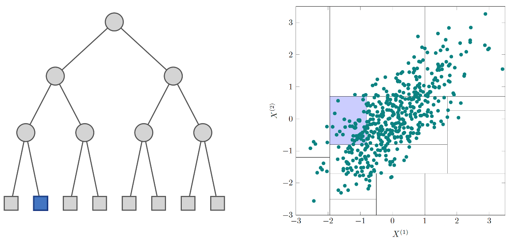

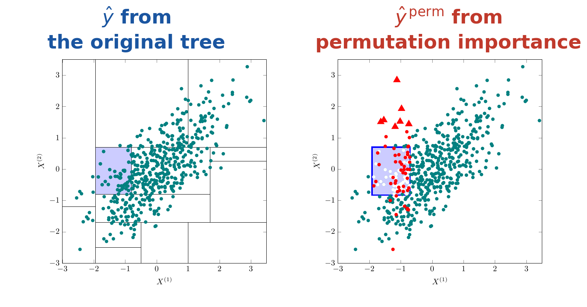

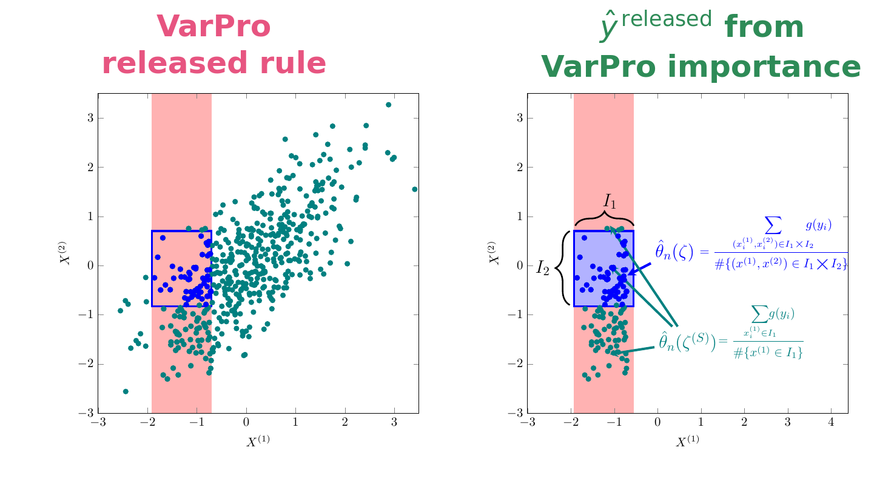

</div>

---

## Variable Priority (VarPro) {.smaller}

##### ``Rule-and-Release" Approach

<div style="position: relative; width: 75%; margin: auto;">


</div>

VarPro provides a **model-independent framework** for measuring variable importance based on rule regions in the feature space

Key ideas:

- Use **rules** derived from tree-based partitions
- Measure **local conditional mean sensitivity** within each rule region
- Aggregate rule-level contributions to obtain **global importance scores**

---

## Data Setup {.smaller}

Assume a dataset $\{(X_i, Y_i)\}_{i=1}^n$

where

- $X_i = (X_{i1}, \ldots, X_{ip})$ are predictors
- $Y_i$ is the outcome

Goal: identify which variables drive the **target functional**

$$
\psi(\mathbf{X}) = \mathbb{E}[g(Y) \mid \mathbf{X}]
$$

where $g$ is chosen to reflect the scientific question (e.g., $g(Y)=Y$ for regression, $g(Y)=I\{Y=c\}$ for classification)

The **true signal set** $\mathcal{S} \subseteq \{1,\ldots,p\}$ indexes variables that genuinely influence $\psi(\mathbf{X})$; the complementary **noise set** is

$$
\mathcal{N} = \{1,\ldots,p\} \setminus \mathcal{S}
$$

Goal: recover $\mathcal{S}$ and screen out $\mathcal{N}$

::: footer
:::

---

## Rule Regions {.smaller}

A **rule** $\zeta$ specifies a local region of the feature space $\mathcal{X}$:

$$
R(\zeta) \subseteq \mathcal{X}
$$

Rules are obtained from tree paths (e.g., *age $> 50$ and tumor size $< 2$ cm*).

Local estimator within rule $\zeta$:

$$
\hat{\theta}_n(\zeta) = \frac{1}{\#\{i \mid \mathbf{X}_i \in R(\zeta)\}} \sum_{i:\,\mathbf{X}_i \in R(\zeta)} g(Y_i)
$$

---

## Local Variable Sensitivity {.smaller}

To test whether $X^{(j)}$ matters, **release** it from rule $\zeta$ by setting $S = \{j\}$:

$$
R(\zeta^{(S)}) = \bigl\{\mathbf{x} \in \mathcal{X} \mid \mathbf{x}^{\setminus(S)} \in R(\zeta)\bigr\}
$$


with local estimator 
$\hat{\theta}_n(\zeta^{(S)}) = \frac{1}{\#\{i \mid \mathbf{X}_i \in R(\zeta^{(S)})\}} \sum_{i \mid \mathbf{X}_i \in R(\zeta^{(S)})} g(Y_i)$

The local importance score compares averages before and after releasing:

$$
\bigl|\hat{\theta}_n(\zeta^{(S)}) - \hat{\theta}_n(\zeta)\bigr|
$$

::: columns

::: {.column width="60%" }
- Large difference → $X^{(j)}$ strongly influences predictions in this region
- Near zero → $X^{(j)}$ is locally irrelevant (noise behavior)

:::
::: {.column width="40%" }
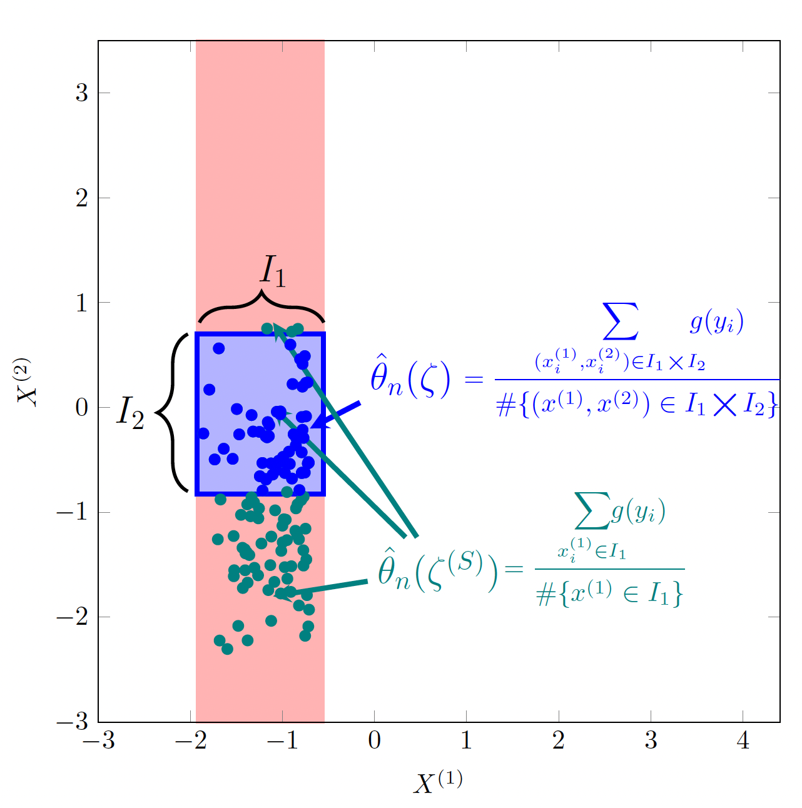{fig-alt="Global importance schematic" width="60%"}
:::
:::

::: footer
:::
---

## Examples of Release Regions {.smaller}

:::: {.columns}

::: {.column width="50.5%"}
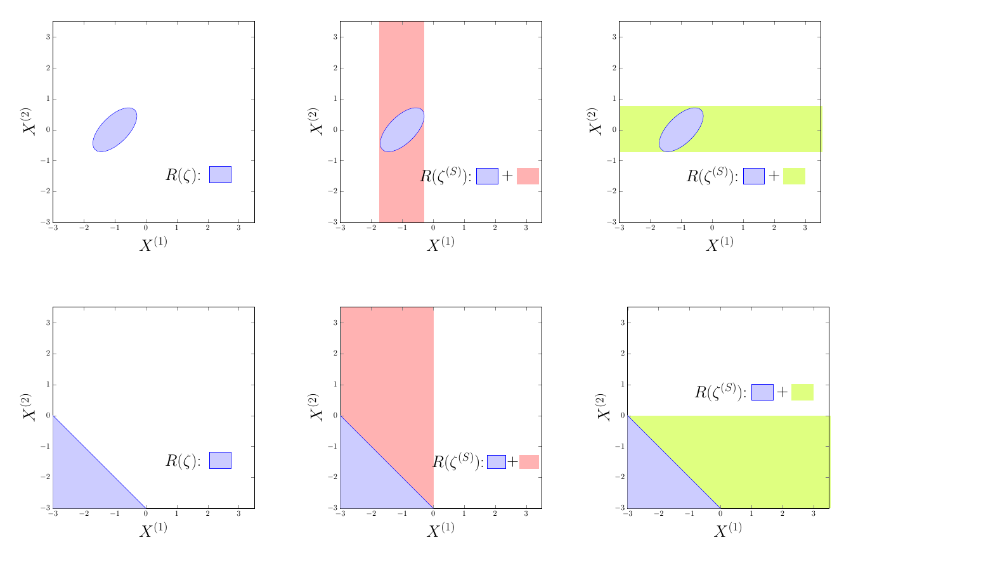{width=100%}

- **Top row**: elliptical rule; **Bottom row**: hyperplane rule
- Middle column: release $X^{(2)}$ ($S = \{2\}$); Right column: release $X^{(1)}$ ($S = \{1\}$)
- Release is **coordinate-specific**: each variable is released independently along its own axis
:::

::: {.column width="2%"}
:::

::: {.column width="47.5%" .fragment}
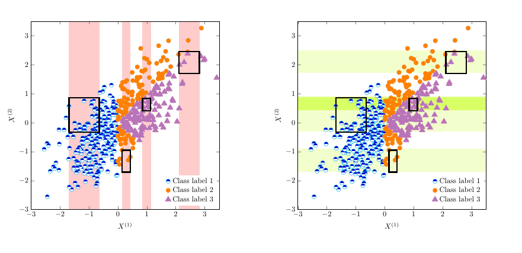{width=100%}

- The computed statistic $|\hat{\theta}_n(\zeta^{(S)}) - \hat{\theta}_n(\zeta)|$ can target **any class label** by choosing $g(Y) = \mathbf{1}\{Y = c\}$
- Release regions and importance scores are therefore both **coordinate-specific** and **class-specific**
:::

::::


## Aggregating Across Rules {.smaller}

Aggregate the local scores over $K_n$ rules with weights $W_{n,k}$ proportional to rule support:

$$
\Delta_n(S) = \sum_{k=1}^{K_n} W_{n,k} \, \bigl|\hat{\theta}_n(\zeta_{n,k}^{(S)}) - \hat{\theta}_n(\zeta_{n,k})\bigr|
$$


- $\Delta_n(\{j\})$ measures **global variable priority** for $X^{(j)}$, where set $S = \{j\}$:
- Weights $W_{n,k} = m_{n,k} / \sum_j m_{n,j}$ prioritize rules with more observations


## Theoretical Guarantee {.smaller}

**Theorem 1 (Lu & Ishwaran, 2024).** *Assume (A1)–(A4). Suppose $K_n = O(\log n)$ and $\min_k m_{n,k} \geq m_n$, where $m_n = n^{1/2}\gamma_n$ and $\gamma_n \to \infty$ with $\gamma_n / \log n \to \infty$. Then*

$$
\Delta_n(S) \xrightarrow{P} 0 \quad \text{whenever } S \subseteq \mathcal{N}
$$

- Noise variables are **asymptotically filtered out**
- No synthetic permutations or joint distribution assumptions required
- Conditions (A1)–(A4): finite moments, smoothness, shrinking rule regions, bounded gradients
- Holds for regression, classification, and survival settings

---

## Algorithm Outline {.smaller}

**Repeat for** $b = 1, \ldots, B$:

1. **Split** data $\mathcal{D}$ into rule-generation set $\mathcal{D}^b_\text{rg}$ ($63.2\%$) and scoring set $\mathcal{D}^b_\text{vp}$ ($36.8\%$)
2. **Generate rules** from $\mathcal{D}^b_\text{rg}$ using randomized trees with guided feature sampling (weights from lasso + shallow-tree split frequencies)
3. **Score** each variable $X^{(s)}$ on $\mathcal{D}^b_\text{vp}$: compute $\Delta_n^b(s)$ by aggregating $|\hat{\theta}_n(\zeta_{n,k}^{(s)}) - \hat{\theta}_n(\zeta_{n,k})|$ over $K_n$ rules

**After** $B$ replications, compute the **standardized importance score**:

$$
I_{n,B}(X^{(s)}) = \frac{\bar{\Delta}_n(s)}{\sqrt{\widehat{\mathrm{Var}}_n(s)}}
$$

Declare $X^{(s)}$ a **signal** if $I_{n,B}(X^{(s)}) > Z_0$ (e.g.\ $Z_0 = 2$, or chosen by out-of-sample validation)

---

## Simulation Studies: Regression  {.smaller .tiny}
<div style="font-size: 85%;">

**20 synthetic datasets**; most use $N = 2{,}000$, $p = 40$; high-dimensional designs (*supX*, *sup2X*) use $N = 500$, $p = 200$; designs include:

- Linear (*lm*, *lmi1*, *lmi2*), nonlinear (*friedman1*, *friedman3*, *cobra2/8*)
- Interaction-based (*inx1*, *inx2*, *inx3*), support-constrained (*sup*, *supX*)
- Independent and correlated features (Gaussian copula, $\rho = 0.9$)


<div style="font-size: 80%;">

| Comparison methods | Description |
|:---|:---|
| BC-VIMP | Breiman–Cutler permutation importance (random forest) |
| GBM | Gradient boosted trees relative influence |
| Knockoffs (glmnet) | Lasso coefficient differences vs. knockoff variables |
| Knockoffs (forest) | Random forest impurity differences vs. knockoff variables |
| Lasso | Absolute coefficients, `glmnet`, 10-fold CV tuning |
| MDI | Mean decrease in impurity (random forest) |
| RReliefF | Relief algorithm for regression (`CORElearn`) |
| Wrapper KNN | Sequential forward search with $k$-nearest neighbors |
| Wrapper GBM | Sequential forward search with gradient boosted trees |

</div>

**Metrics:** AUC-PR and Gmean (geometric mean of TPR and TNR); $B = 500$ replications, $K_n = 75$ rules
</div>

---

#### Regression Results: Uncorrelated Features  {.smaller}

::: {.column width="50%"}
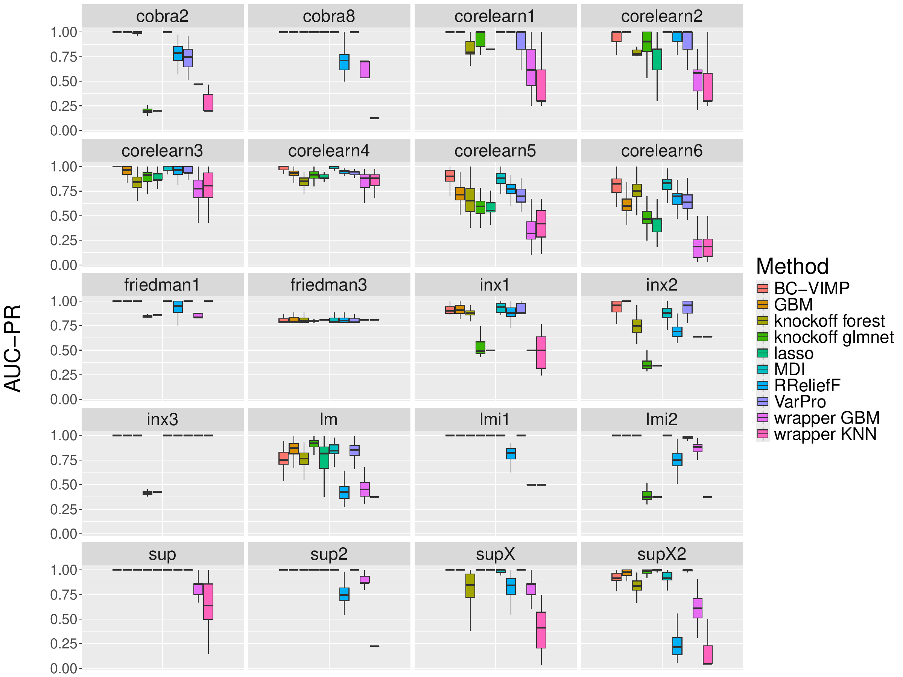{width=100%}
:::
::: {.column width="50%"}
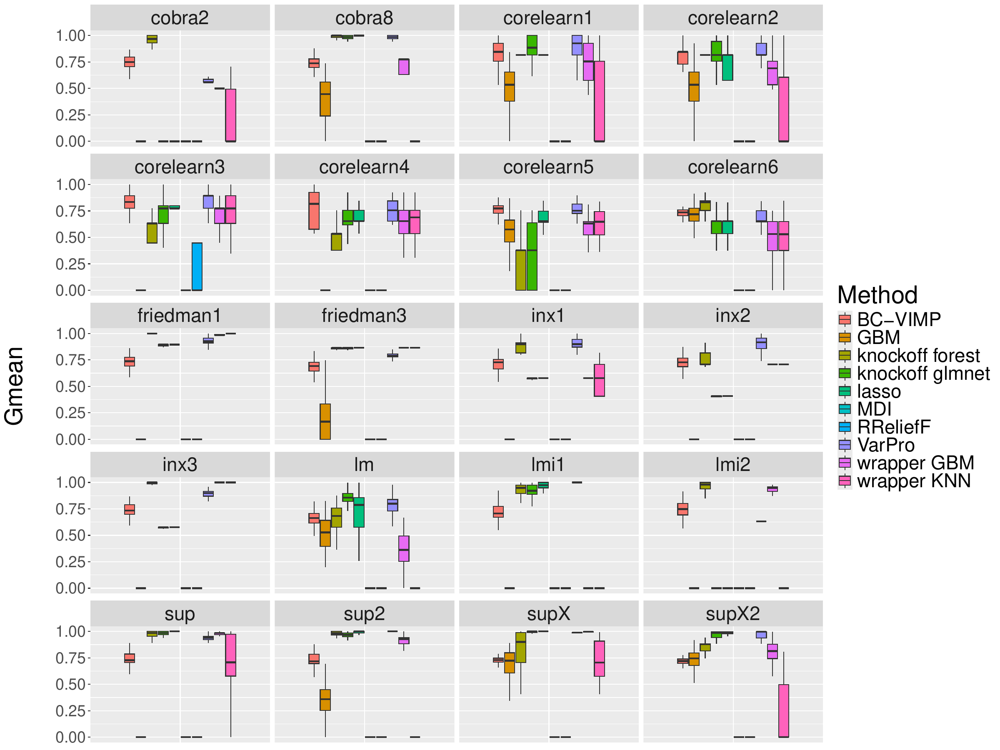{width=100%}
:::

<div style="font-size: 60%;">
VarPro achieves **consistently high AUC-PR and Gmean** across all designs
</div>
---


#### Regression Results: Correlated Features  {.smaller}

::: {.column width="50%"}
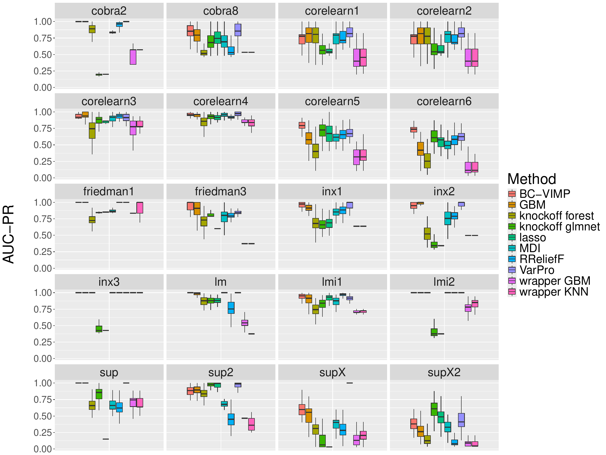{width=120%}
:::
::: {.column width="50%"}
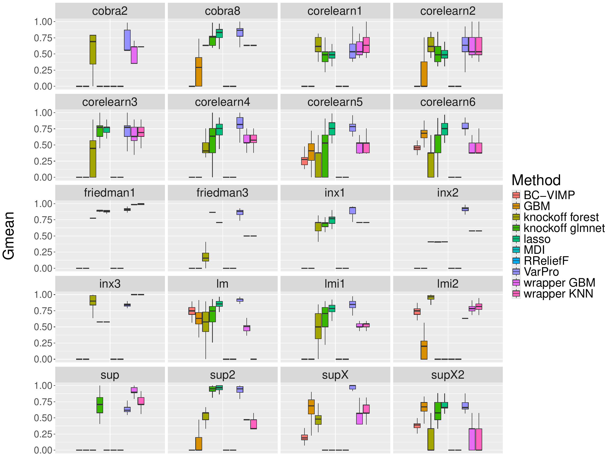{width=120%}
:::

<div style="font-size: 60%;">
VarPro achieves **consistently high AUC-PR and Gmean** across all designs
</div>

---

 
#### Regression Results: Critical Difference Plots {.smaller}

:::: {.columns}

::: {.column width="50%"}
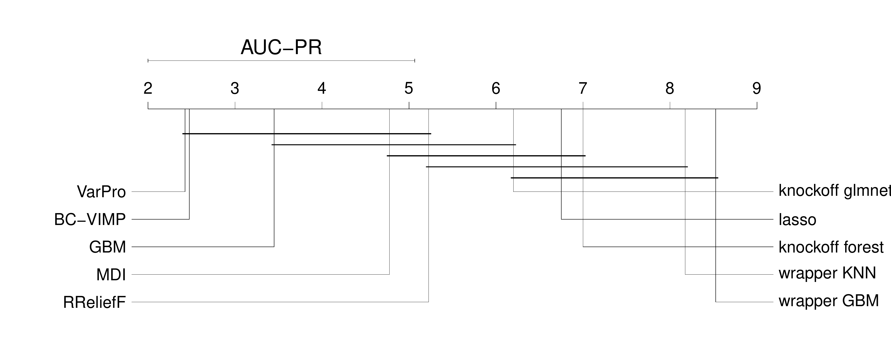{width=100%}

:::

::: {.column width="50%"}

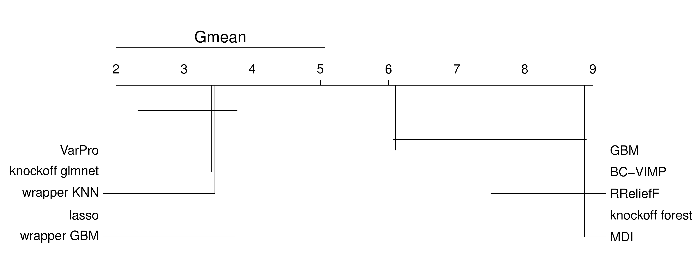{width=100%}

:::

::::
<div style="font-size: 64%;">
- **AUC-PR**: VarPro and BC-VIMP within top rank margin; VarPro achieves the best average rank
- **Gmean**: VarPro ranks first — strongest signal/noise separation among all comparison methods
</div>
---

## Classification: Multiclass Simulation {.smaller}

$L = 3$ classes, $N = 2000$, $p = 20$; signals $X^{(1)}$–$X^{(9)}$; correlated noise pairs $(X^{(3)},X^{(10)})$, $(X^{(6)},X^{(15)})$, $(X^{(9)},X^{(20)})$ with $\rho = 0.9$

::: columns

::: {.column width="50%"}
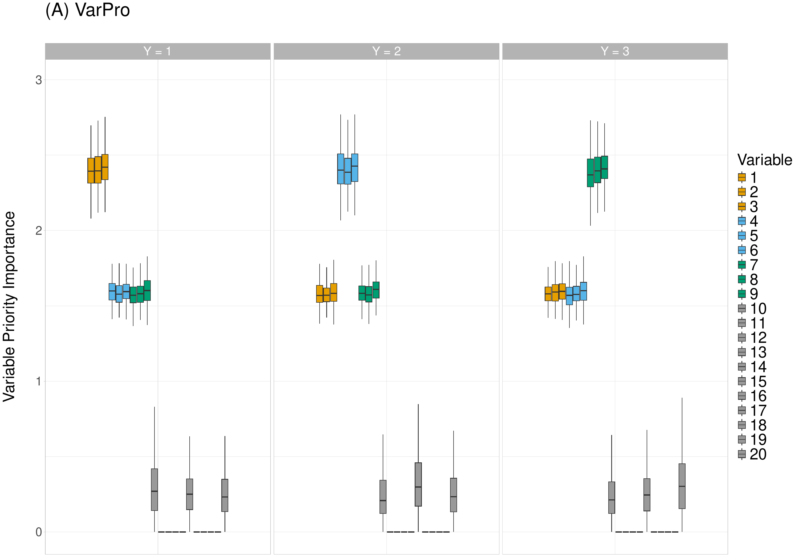{width=100%}
:::

::: {.column width="50%"}
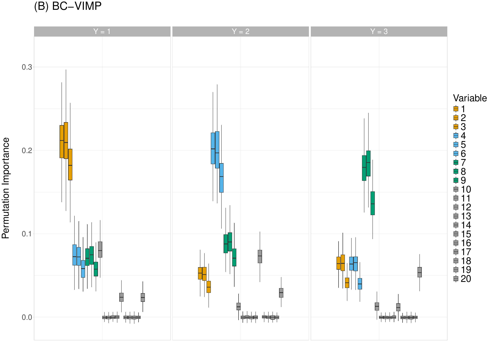{width=100%}
:::

:::

- **VarPro** (top): clear separation of signal and noise within each class
- **BC-VIMP** (bottom): correlation inflates noise variable scores — poor separation

---


##### Classification: High-Dimensional Microarray <br>(Linear Outcome) {.smaller}
<div style="font-size: 64%;">

22 cancer microarray datasets; $N = 62$–$248$, $p = 456$–$54{,}613$; outcomes: Linear, Quadratic, Quadratic+Interaction

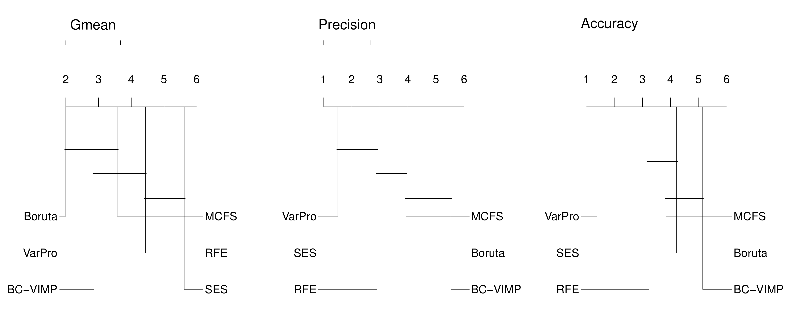{width=65%}
<div style="font-size: 54%;">

| Method | Description |
|:---|:---|
| **VarPro** | Rule-based variable priority (this work) |
| BC-VIMP | Permutation importance via random forests (`rfsrc`) |
| MCFS | Monte Carlo Feature Selection; threshold by permutations (`rmcfs`) |
| SES | Statistically Equivalent Signatures; constraint-based Bayesian network learning (`MXM`) |
| Boruta | Wrapper with artificial shadow features; random forest base learner (`Boruta`) |
| RFE | Recursive Feature Elimination; backward selection with random forests (`caret`) |

</div>
</div>
---

##### Classification: High-Dimensional Microarray <br>(Quadratic Outcome) {.smaller}

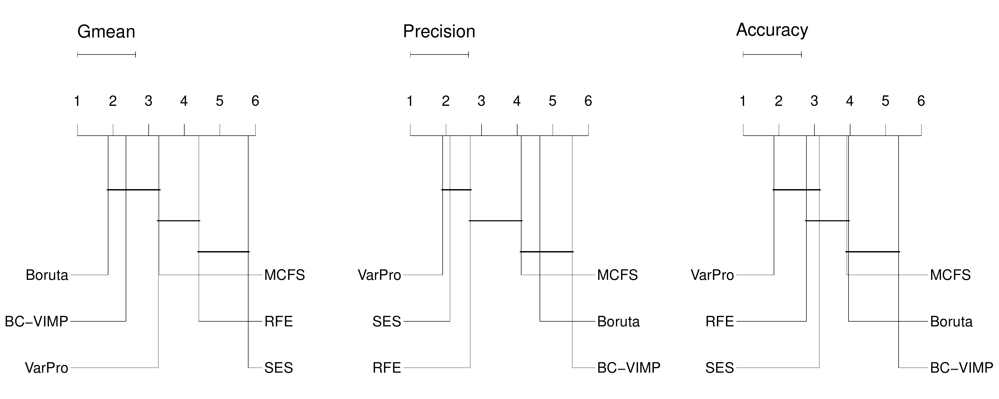{width=95%}


---

##### Classification: High-Dimensional Microarray <br>(Quadratic+Interaction) {.smaller}

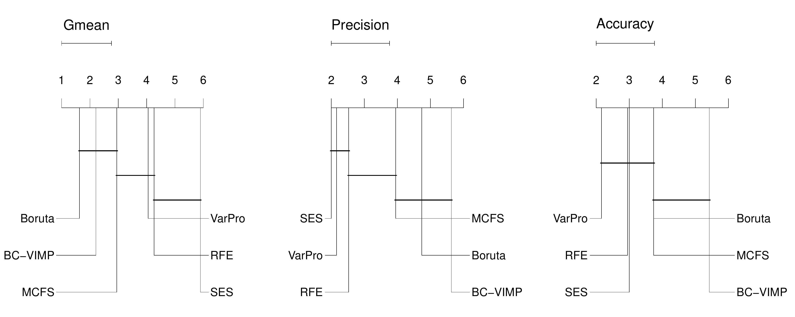{width=95%}
VarPro maintains **balanced performance** (gmean, precision, accuracy) across all complexity levels

---

## Survival Simulation: Setup and Results {.smaller}

High-dimensional survival: $N = 200$, $p \in \{500, 1000, 1500\}$, $p_0 = 10$ correlated signal variables; censoring at 50% and 75%; Target $\psi(\mathbf{X})$: integrated CHF estimated via **random survival forests**

:::: {.columns}
::: {.column width="50%"}
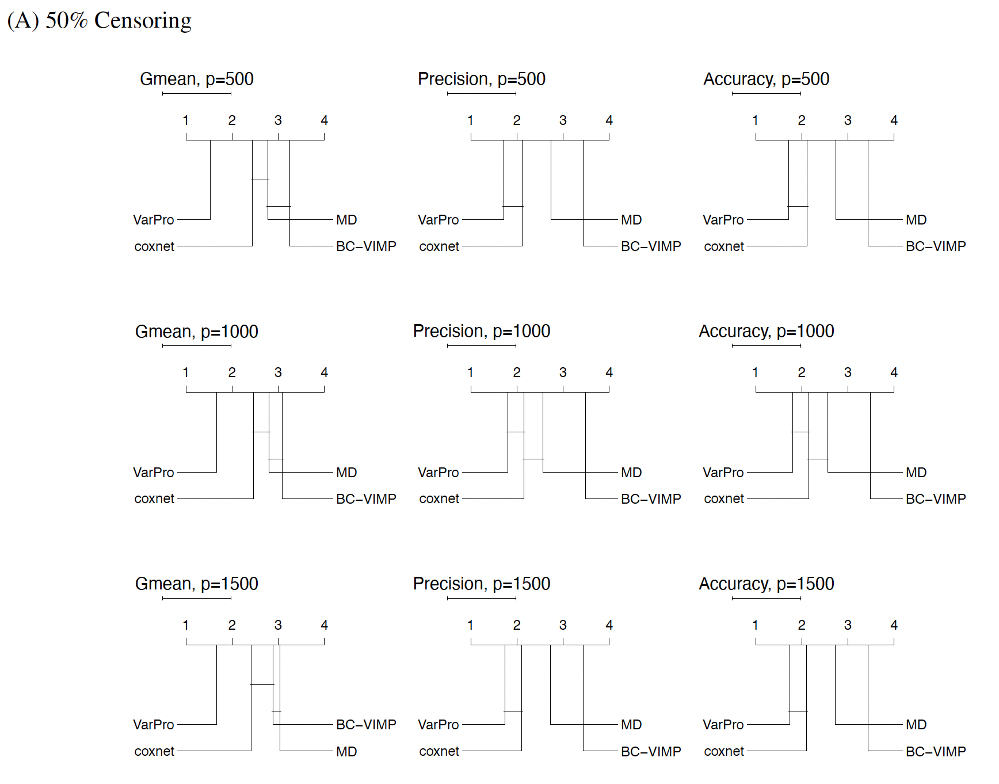{width=90%}
:::
::: {.column width="50%"}
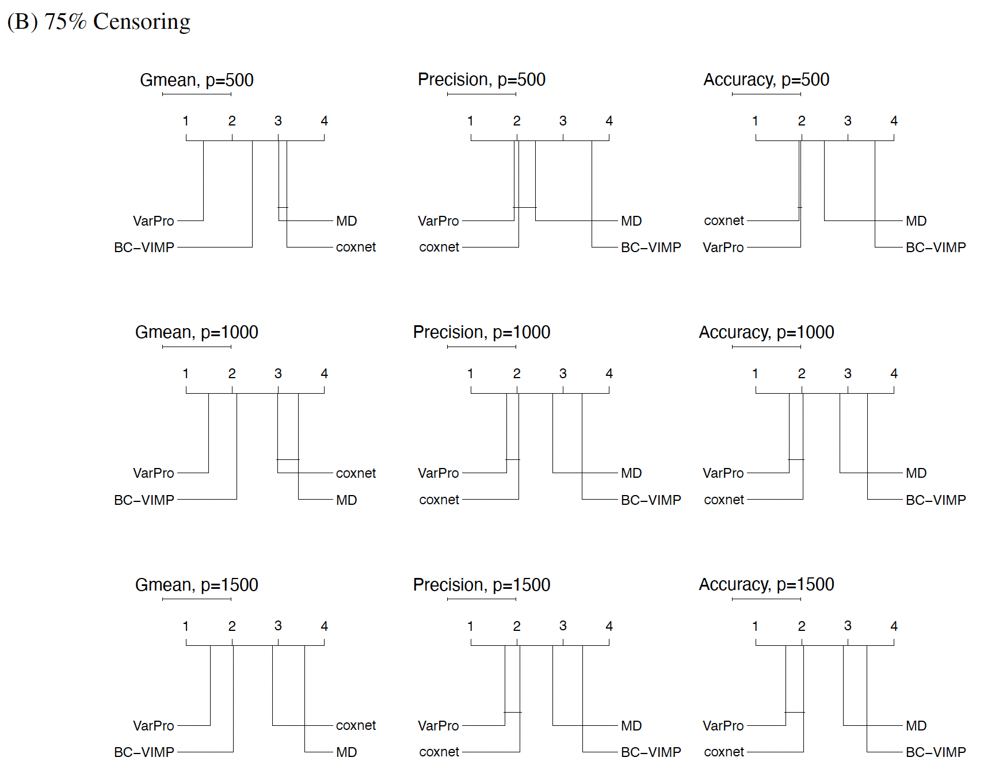{width=90%}
:::
::::

VarPro consistently **outperforms** coxnet, BC-VIMP, and MD (minimal depth) on gmean, precision, and accuracy

---

### Survival Simulation: Numerical Summary 

<div style="font-size: 80%;">

<table style="border-collapse: collapse; margin: auto; text-align: center;">
  <thead>
    <tr>
      <th></th>
      <th colspan="3">Gmean</th>
    </tr>
    <tr>
      <th>Method</th>
      <th>$p=500$</th>
      <th>$p=1000$</th>
      <th>$p=1500$</th>
    </tr>
  </thead>
  <tbody>
    <tr>
      <td><b>VarPro</b></td>
      <td>0.95</td><td>0.96</td><td>0.97</td>
    </tr>
    <tr>
      <td>coxnet</td>
      <td>0.91</td><td>0.93</td><td>0.94</td>
    </tr>
    <tr>
      <td>BC-VIMP</td>
      <td>0.86</td><td>0.89</td><td>0.91</td>
    </tr>
    <tr>
      <td>MD</td>
      <td>0.88</td><td>0.88</td><td>0.89</td>
    </tr>
  </tbody>
</table>

</div>

Results at **50% censoring** averaged over 100 runs.  
VarPro achieves superior precision (0.55–0.57) while maintaining high accuracy (0.97–0.99)


---

#### Adult Glioma:<br> DNA Methylation Subtypes {.smaller}
<div style="font-size: 60%;">
**Data:** $N = 880$ human tissues, $p = 1241$ variables (CpG probes + clinical/molecular)

**Outcome:** 7 glioma subtypes — Classic, Codel, G-CIMP-high, G-CIMP-low, LGm6-GBM, Mesenchymal-like, PA-like

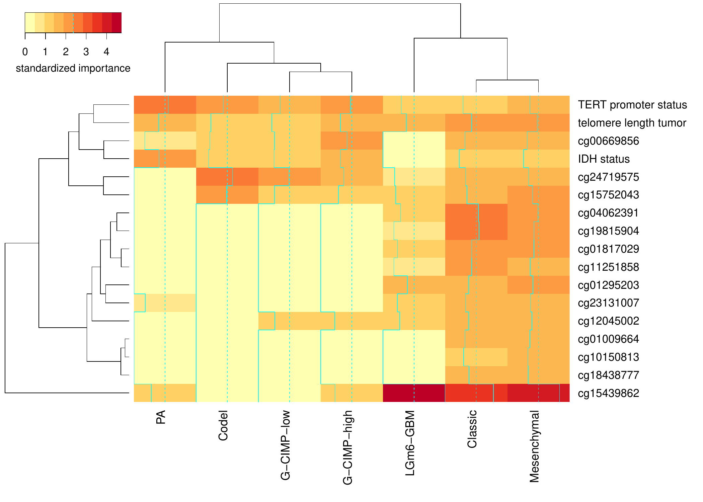{width=50%}

VarPro identifies **IDH status, TERT promoter status, telomere length** and multiple CpG probes as top discriminating features
</div>

---

##### Adult Glioma:<br> Top DNA Methylation Probes {.smaller}

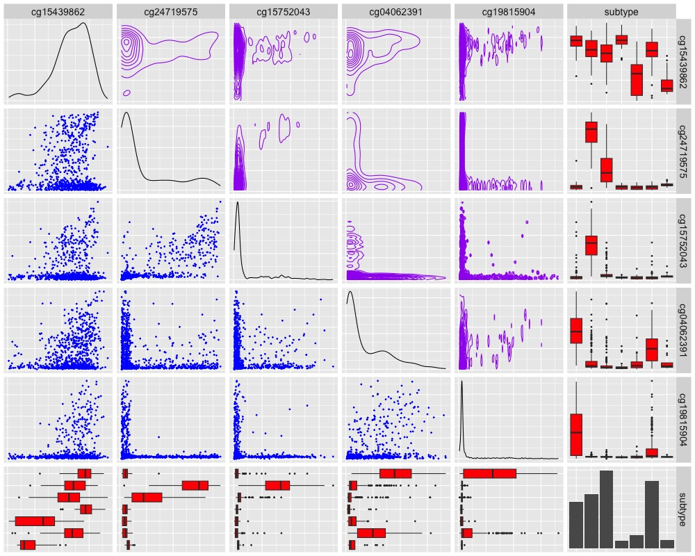{width=50%}
<div style="font-size: 60%;">
- Subtype-specific methylation patterns are clearly visible (e.g., cg15439862 distinguishes LGm6-GBM and Mesenchymal from other subtypes)
- VarPro probes **add discriminatory power beyond** known molecular variables
</div>
---

## Heart Rate Recovery and Survival {.smaller}

**Data:** $N = 23{,}701$ patients, $p = 85$ variables; outcome: all-cause mortality

**Target:** Restricted mean survival time (RMST) at $\tau = 3$ years, estimated via random survival forests

::: columns

::: {.column width="50%" }

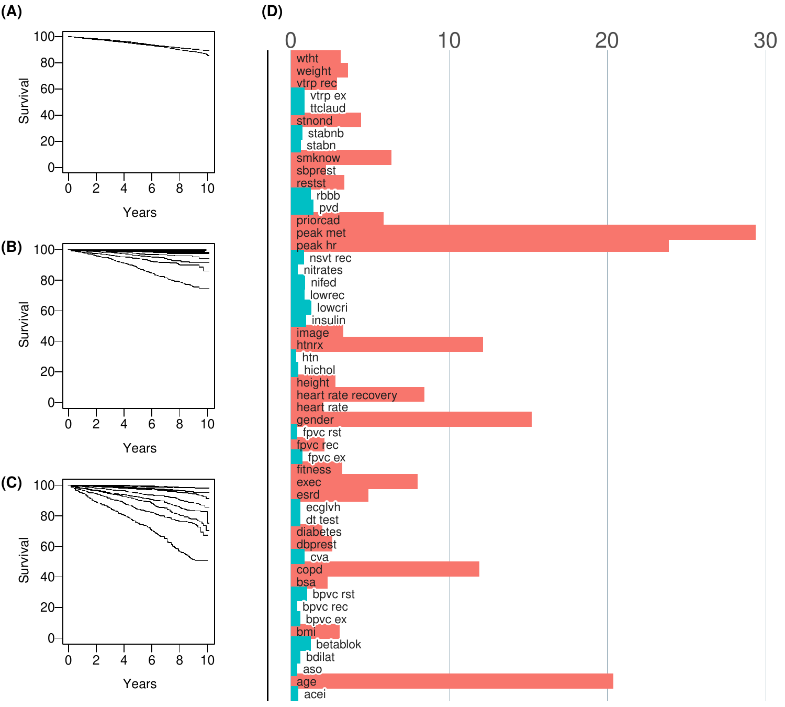{width=95%}

:::
::: {.column width="50%" }

<div style="font-size: 80%;">
The figure shows results of heart rate recovery survival analysis using the VarPro procedure. (A) Survival by sex; (B) survival for women stratified by peak MET; (C) survival for men stratified by peak MET; (D) standardized variable importance (red = signal, blue = noise).

- **Top signals:** peak METs, age, heart rate recovery, sex (red bars)
- VarPro identifies **sex** as a top-5 variable — missed entirely by gradient boosting
- Stratified survival curves reveal interaction: men are more adversely affected by low peak METs than women
</div>
:::
:::

---


## Properties of VarPro {.smaller}

Advantages:

- Model-independent
- Captures **nonlinear effects**
- Captures **interaction effects**
- Provides **interpretable rule-based importance**

Unlike permutation importance:

- does not destroy feature correlations
- preserves local structure.

---


## Overview {.smaller}

::: columns

::: {.column width="33%" }
### 🌍 VarPro  
**Variable Priority for Global Variable Selection**

- Model-independent variable importance  
- Based on rule-and-release regions  
- Targets **population-level effects**  
- Identifies variables driving the conditional mean  


:::

::: {.column width="33%" .varpro-highlight}
### 👤 iVarPro  
**Variable Priority for Individual Variable Selection**

- Extends VarPro to **individual level**  
- Estimates **local gradients** within rules  
- Captures **heterogeneity across subjects**  
- Enables personalized interpretation  

:::

::: {.column width="33%"}
### 💻 Software  

**R package: `varPro`**

- Efficient implementation of VarPro & iVarPro  
- User-friendly workflow for analysis  

**Resources:**
- Tutorials and examples  

🔗 https://www.varprotools.org/  

:::

:::


## Why care about individual importance? {.smaller}

::: incremental
- Average (global) importance can miss **heterogeneity**  <br>e.g. $y_i = \beta_0 + \beta_1 x_{i1} + \beta_2 x_{i2} + \dots + \beta_p x_{ip} + \varepsilon_i$
- Precision decisions need **patient-specific** drivers  
- We want sensitivity: “how much does a tiny nudge in $x^{(s)}$ change my outcome?”
:::

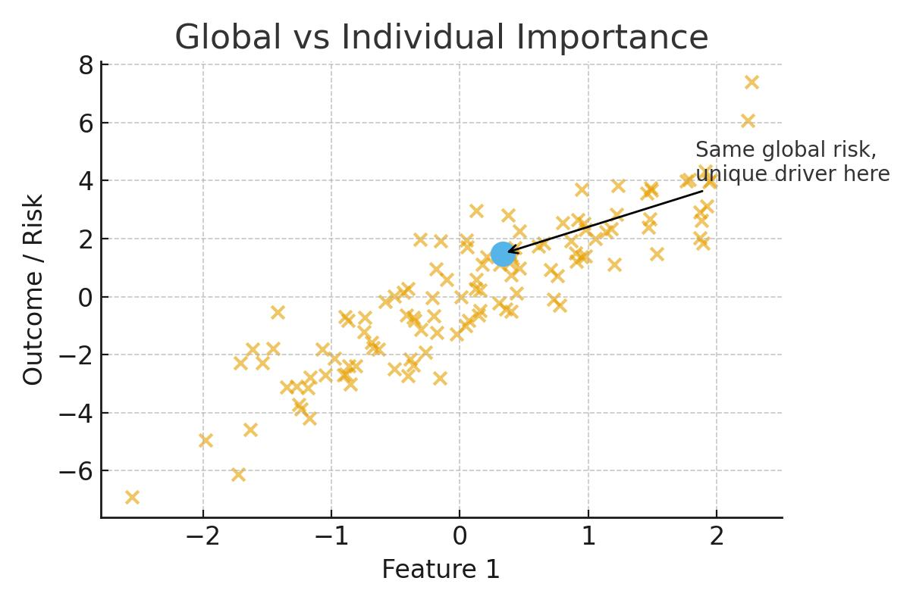{fig-alt="Global vs individual importance schematic" width="70%"}


## From population to individual {.smaller}

- Population: “What matters *on average*?” (Breiman's permutation importance) 
- Individual: “What matters **for this case**?” 

Let $\def\grad{{ \nabla}}\def\x{{\bf x}}\def\xs#1{x^{(#1)}}\psi(\x) = \mathbb{E}(\phi(Y) | \x)$ be the unknown target function for
the feature vector $\x = (\xs{1}, \ldots, \xs{p})^T$, where $Y$ is the
outcome and the choice of $\phi$ depends on the specific
problem

**iVarPro** defines individual importance as the **local gradient**:
$$
\grad \psi(\x) = \left(\frac{\partial \psi(\x)}{\partial \xs{1}},
\ldots, \frac{\partial \psi(\x)}{\partial \xs{p}}\right)^T
:= \left(g^{(1)}(\x), \ldots, g^{(p)}(\x)\right)^T
$$
The values $g^{(s)}(\x)$ represent the individual variable importance
for features $\xs{s}, s = 1, \ldots, p$

Intuition: gradient = *sensitivity* to small changes in $x^{(s)}$ at **this** $\x$

## Core idea in one picture {.smaller}

- Use **tree rules** to define a **local region** $R$ around a point  
- **Release** the constraint on one variable $x^{(s)}$ to get variation only along that axis  
<br>


::: columns

::: {.column width="50%"}

####  $\quad\quad$     Random Forest 

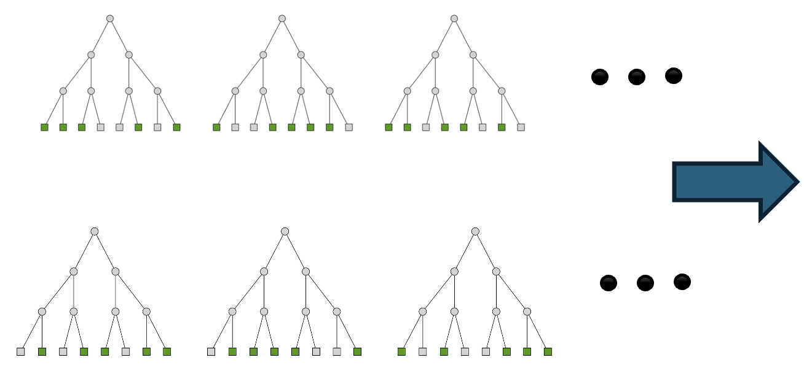{fig-alt="Tree partitions and release region schematic" width="100%"}

:::

::: {.column width="50%" .fragment}

#### Variable Priority (VarPro) rules

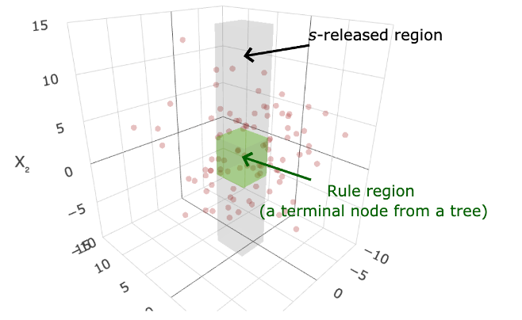{fig-alt="rule region schematic" width="80%"}

:::
:::

## Core idea in one picture {.smaller}

- Use **tree rules** (VarPro) to define a **local region** $R$ around a point  
- **Release** the constraint on one variable $x^{(s)}$ to get variation only along that axis  
- Fit a tiny **local linear regression** to get the slope = gradient  
- Average over many rules to obtain individual variable priority (iVarPro) score

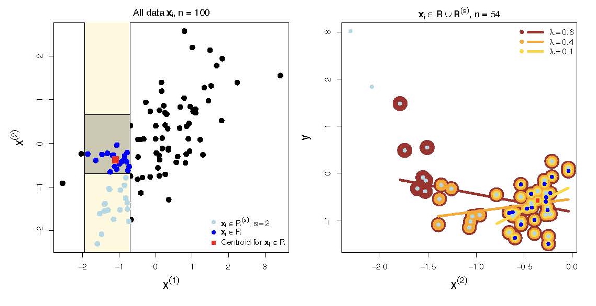{fig-alt="Tree partitions and release region schematic" width="70%"}

## Why not just SHAP or LIME? {.smaller}

- SHAP (Shapley Additive Explanations) or LIME (Local Interpretable Model-Agnostic Explanations) depend on the **fitted model** and a **background distribution**  
- Perturbations can create **unrealistic points**  
- iVarPro stays **model-independent**, uses **observed data** only, and targets **directional derivatives** directly

*Working theory:* when the *surface* $\psi(x)$ is smooth locally, these tiny local regressions recover gradients well

## VarPro: using rules to obtain local gradients  {.smaller}

The importance of
a variable $s \in \{1, \ldots, p\}$ is assessed by comparing estimates
within a rule's region $R$ to those in its corresponding release
region, defined as the region $R$ expanded where constraints on
$\xs{s}$ are removed [@varpro2024]

Let $\x_0 := \x_0(R)$ denote the centroid of $R$, and assign its
gradient to all cases in $R$. To define the gradient at $\x_0 = (x_0^{(1)},\ldots,x_0^{(p)})^T$ along
coordinate $s$, let $\psi_R^{(s)}(z)$ represent the evaluation of
$\psi$ at $\x_0$, with the $s$-th coordinate perturbed by an increment
$z$:
$$
\psi_R^{(s)}(z) = \psi(x_0^{(1)},\ldots,x_0^{(s-1)},x_0^{(s)}+z,x_0^{(s+1)},\ldots,x_0^{(p)})
$$
By construction, $\psi_R^{(s)}(0) = \psi(\x_0)$, and the gradient of
$\psi$ at $\x_0$ along coordinate $s$ is formally given by
$$
g_R^{(s)} := g_R^{(s)}(\x_0)
=\lim_{z\rightarrow 0}
\frac{\psi_R^{(s)}(z)-\psi_R^{(s)}(0)}{z}
$$

## Gradient estimation via local linear regression  {.smaller}

To estimate the gradient, we employ a local linear regression model.
In small regions around $\x_0(R)$ along the coordinate direction $s$,
we approximate $\psi$ using the linear model:
$$
\psi_R^{(s)}(z) = \psi_R^{(s)}(0) + z g_R^{(s)}
$$
Given training data $(\x_1, y_1),\ldots,(\x_n, y_n)$, we regress
$\{y_i\}$ on the $s$-coordinate features $\{x_i^{(s)}\}$ using an
intercept-slope model based on data local to $R$. The gradient
$g_R^{(s)}$ is estimated using the least squares estimate of the
slope


## Standardized covariates  {.smaller}

::: columns
::: {.column width="50%" }
To systematically control the extent of this expansion, we introduce
an index $\scriptsize \def\l{\lambda} \def\psihat{\widehat{\psi}} \def\ghat{\widehat{g}} \def\bhat{\widehat{\beta}} 0 \le \l \le \l_0$ that determines the proportion of
individuals selected from the release region $\scriptsize R^{(s)}$. Larger values
of $\scriptsize \l$ correspond to a greater number of included individuals. The
expanded region is then defined as $\scriptsize R(s,\l) = R \cup R_\l^{(s)}$,
where $\scriptsize R_\l^{(s)}$ is a restricted subset of $\scriptsize R^{(s)}$ determined by
$\scriptsize \l$ 

we center
$\scriptsize x_i^{(s)}$ at the centroid value $\scriptsize x_0^{(s)}(R)$ and then scale it to
have unit length, denoting the transformed values by $\scriptsize z_i^{(s)}$:

::: 
::: {.column width="50%" }
$$
\scriptsize
z_i^{(s)}
= \frac{x_i^{(s)} - x_0^{(s)}(R)}
{\sqrt{\displaystyle\sum_{\x_j\in  R(s,\lambda)}(x_j^{(s)} - x_0^{(s)}(R))^2}}
%\quad \x_i\in R(s,\lambda)
$$

The local gradient is estimated via least squares regression using the
data $\scriptsize \{z_i^{(s)},\psihat(\x_i)\}$ within $\scriptsize R(s,\lambda)$:
$$
\scriptsize
\psihat(\x_i) = \alpha_R^{(s)} + z_i^{(s)} \beta_R^{(s)} + \varepsilon_i,
\quad \x_i \in R(s,\lambda)
$$
The least-squares slope is then used as the local gradient estimate:
$\scriptsize \ghat_R^{(s)}:=\bhat_R^{(s)}$
:::
:::

## Cross-Validation for optimizing the fit {.smaller}

For a given $\scriptsize \def\l{\lambda} \def\fhat{\widehat{f}}  \l$, the Predicted Residual Sum of Squares (PRESS) statistic is computed as follows. The
leave-one-out (LOO) residual for observation $\scriptsize i$ is:
$$
{\tiny
e_i = \psihat(\x_i) - \fhat^{(-i)}(z_i^{(s)}),
}
$$
where $\scriptsize \fhat^{(-i)}(z_i^{(s)})$ is the least squares predicted value
at $\scriptsize z_i^{(s)}$ when the $\scriptsize i$-th observation is excluded from the
regression fit. The PRESS statistic is then given by:
$$
{\tiny
\text{PRESS}(s,\l) = \frac{1}{|R(s,\l)|} \sum_{i\in R(s,\l)} e_i^2
}
$$
Since local regression follows a linear model, the PRESS statistic
simplifies in terms of leverage values $\scriptsize h_i$: $\scriptsize e_i = \frac{\psihat(\x_i) - \fhat(z_i^{(s)})}{1 - h_i},$
where $\scriptsize h_i$ is the leverage for $\scriptsize z_i^{(s)}$ and $\scriptsize \fhat$ is the 
least squares predictor.
Thus, the PRESS
statistic can be rewritten as:
$${\tiny
\text{PRESS}(s,\l) = \frac{1}{|R(s,\l)|} \sum_{i\in R(s,\l)}
\left( \frac{\psihat(\x_i) - \fhat(z_i^{(s)})}{1 - h_i} \right)^2
}
$$
The optimal $\scriptsize \l^*=\text{argmin}_\l \text{PRESS}(s,\l)$ is selected

::: footer
:::

## iVarPro pipeline  {.smaller}

::: columns
::: {.column width="50%" }

1. Build **VarPro** rules (randomized trees) <br> → small rectangular regions \(R\)  
2. For each feature $s$ and rule $R$:
   - **Release** $x^{(s)}$ to form $R^{(s)}(\lambda)$  
   - **Standardize** $x^{(s)}$ around the region centroid  
   - Regress \(\widehat{\psi}(x)\) on standardized $x^{(s)}$, choose $\lambda$ by PRESS (LOO)  
   - Slope $\Rightarrow \widehat{g}^{(s)}_R$
3. For case $x_i$: **average** $\widehat{g}^{(s)}_R$ over all rules containing $x_i$

*Tip:* $\widehat{\psi}$ from RF/GBM/XGBoost smooths noise → better local slopes

:::
::: {.column width="50%" }
{fig-alt="Simulation contour gradients" width="100%"}
:::
:::
::: footer
:::


## Synthetic experiments {.smaller}

::: columns
::: {.column width="50%" }
#### Model 1 is generated according to a piecewise function:
$$
\tiny{
\psi(x^{(1)}, x^{(2)}) =
\begin{cases} 
      1, & x^{(2)} \leq 0.25, \\
      15x^{(2)}, & x^{(1)} \leq 0.5 \text{ and } x^{(2)} > 0.25, \\
      7x^{(1)} + 7x^{(2)}, & x^{(1)} > 0.5 \text{ and } x^{(2)} > 0.25
\end{cases}
}
$$

#### Model 2 is a quadratic function of the predictors, defining the response as a function of the squared Euclidean norm:

$$
\tiny{
\psi(x^{(1)}, x^{(2)}) = 5r 1_{\{r \leq 0.5\}}, \quad \text{where } r = (x^{(1)})^2 + (x^{(2)})^2
}
$$

#### Model 3 follows a simple multiplicative interaction between the two predictors:

$$
\tiny{
\psi(x^{(1)}, x^{(2)}) = 6x^{(1)}x^{(2)}
}
$$
:::

::: {.column width="50%"}

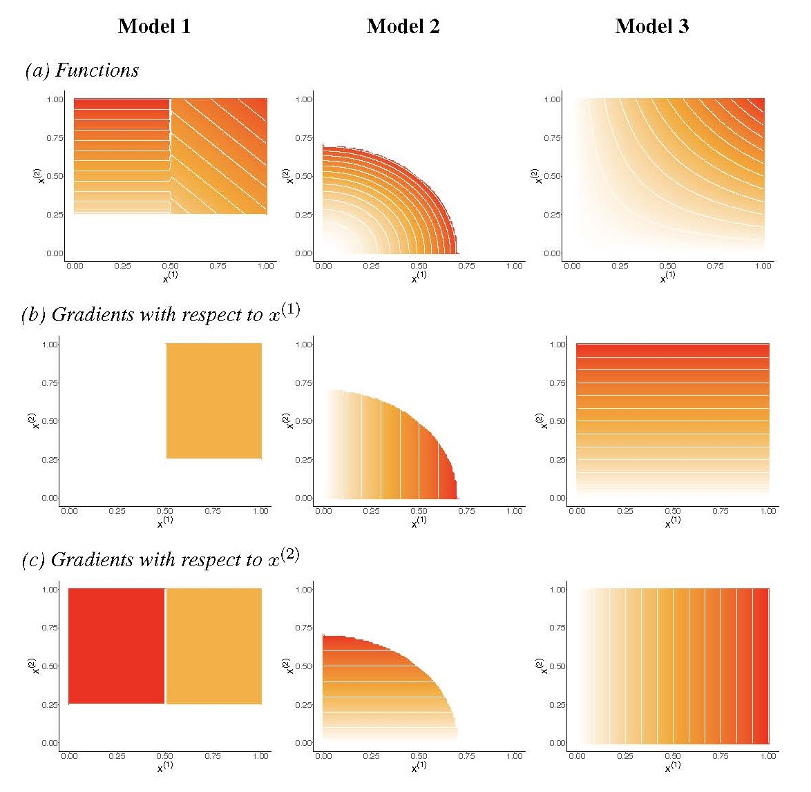{fig-alt="Simulation contour gradients" width="100%"}
:::
:::


## Comparison procedures {.smaller}

We compare iVarPro to three established methods:

- CSRF (Case-Specific Random Forests) importance [@xu2016case], implemented using the
  `ranger` R package [@wright2017ranger]
  
- SHAP, computed using the `treeshap` R package [@treeshap]
  
- LIME, computed using the `lime` R package [@lime2022]

. . .

Both SHAP and LIME were applied to a trained XGBoost model [@chen2016xgboost],
with hyperparameters selected via cross-validation. We also evaluate three additional versions of iVarPro based on
different choices of the external predictor ${\widehat{\psi}}$:

- iVarPro-raw: No external model is used; local gradients are
  estimated directly using the raw response values $y$
  

- iVarPro-gbm: The external predictor ${\widehat{\psi}}$ is a gradient
  tree boosted model fit using the `gbm` R package [@gbmr]
  

- iVarPro-xgb: The external predictor ${\widehat{\psi}}$ is an XGBoost
  model
  
## Simulation overview {.smaller}

- Benchmark functions (piecewise, radial, interaction); $p \in \{10,200\}$, $n \in \{250,2000\}$  
- Correlated/uncorrelated predictors:  features for the uncorrelated
setting are independently drawn from a Uniform$(0,1)$
distribution, and predictors for the correlated
setting are drawn from  a normal
copula with common correlation $\rho = 0.8$
- Compare **iVarPro** vs **CSRF**, **SHAP**, **LIME**  
- Metrics: **Kendall’s $\tau_b$**, **C-index**, **PR-AUC** (ranking of true $|\nabla\psi|$)


## Simulation result {.smaller}

::: columns
::: {.column width="33%" }
<br><br>
Kendall's $\tau_b$ scores evaluating the performance of iVarPro and
comparison procedures in a synthetic setting. Red error bars denote
95\% confidence intervals for the mean, slightly offset to the right
for visual clarity
:::

::: {.column width="67%" }
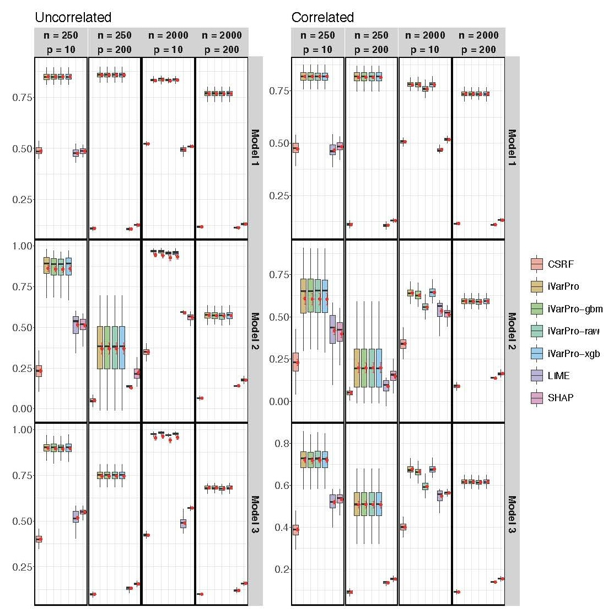{fig-alt="Uncorrelated gradient recovery" width="90%"}  
:::
:::

::: footer
:::
  
## Simulation result {.smaller}

::: columns
::: {.column width="33%" }
<br><br>
C-index scores evaluating the performance of iVarPro and
comparison procedures in a synthetic setting
:::

::: {.column width="67%" }
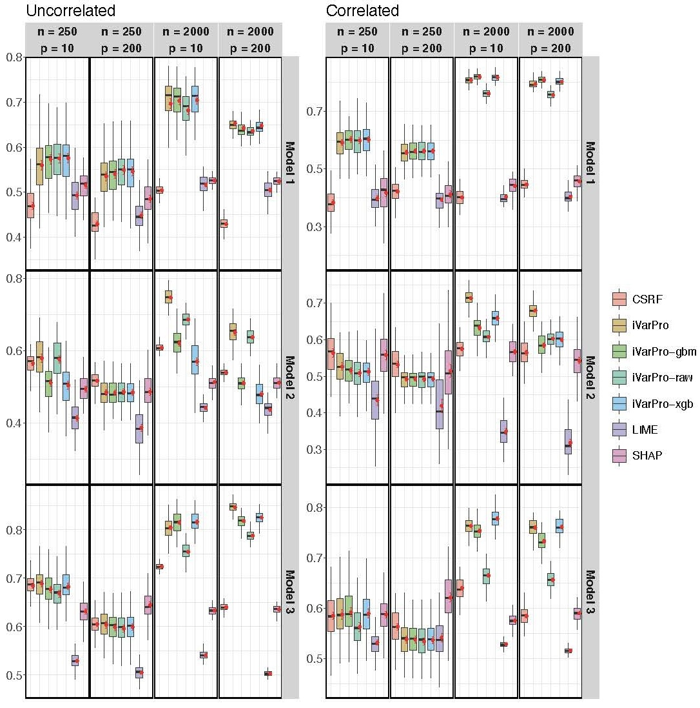{fig-alt="Uncorrelated gradient recovery" width="90%"}  
:::
:::

::: footer
:::

## Simulation result {.smaller}

::: columns
::: {.column width="50%" }
PR-AUC scores 
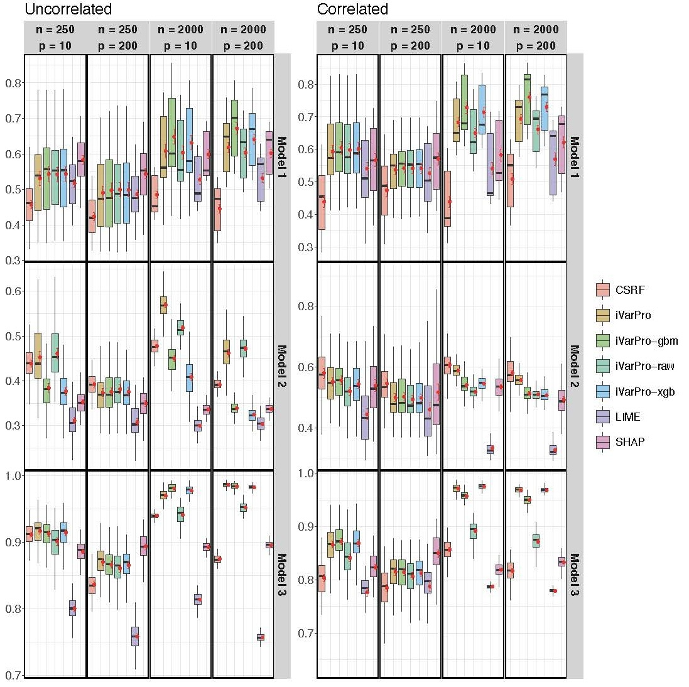{fig-alt="Uncorrelated gradient recovery" width="110%"}  
:::

::: {.column width="50%" }
MSE scores
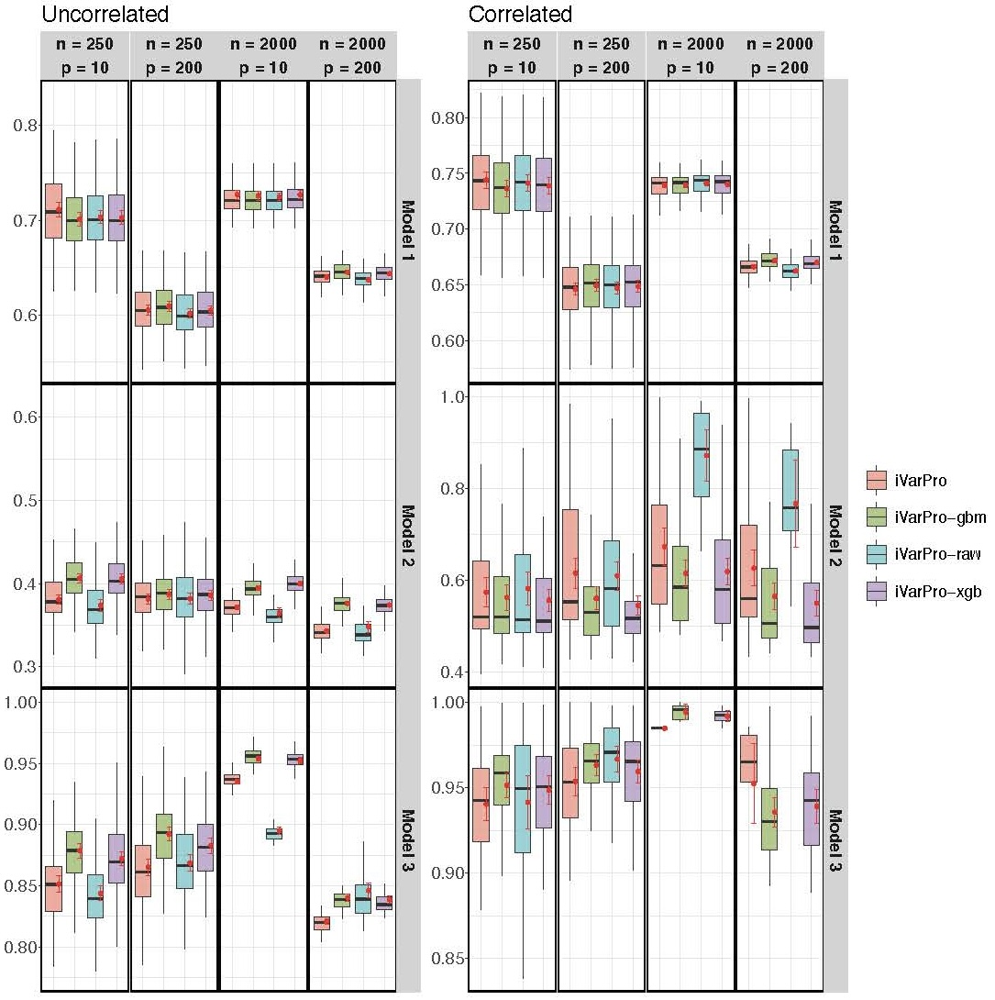{fig-alt="Uncorrelated gradient recovery" width="110%"}  
:::
:::

::: footer
:::

## A single run of Model 2 (uncorrelated) {.smaller}

::: columns
::: {.column width="50%" }
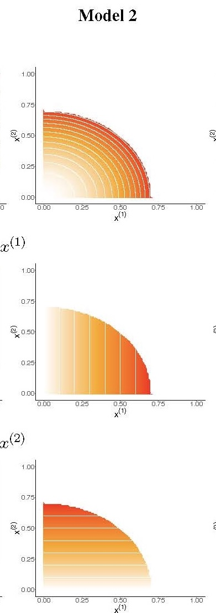{fig-alt="Uncorrelated gradient recovery" width="42%"}  
:::

::: {.column width="50%" }
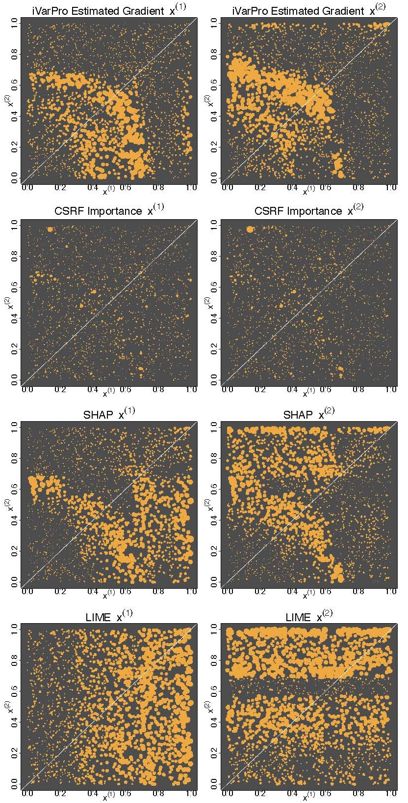{fig-alt="Uncorrelated gradient recovery" width="62%"}  
:::
:::

::: footer
:::

## A single run of Model 2 from iVarPro {.smaller}

::: columns
::: {.column width="47.5%" }
Uncorrelated

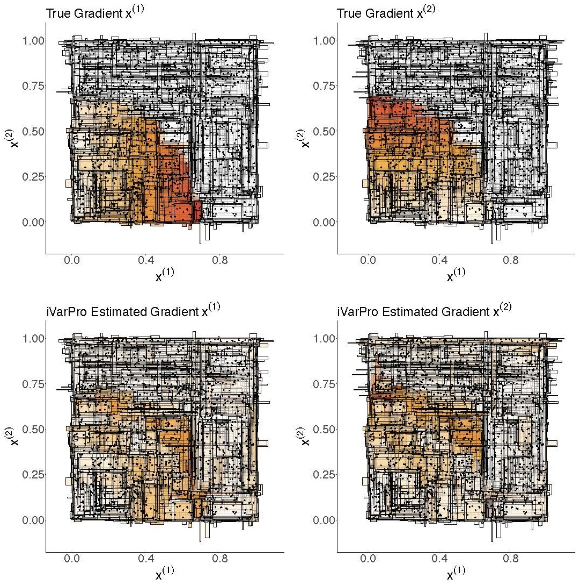{fig-alt="Uncorrelated gradient recovery" width="100%"}  
:::

::: {.column width="5%" }
:::

::: {.column width="47.5%" .fragment }
Correlated

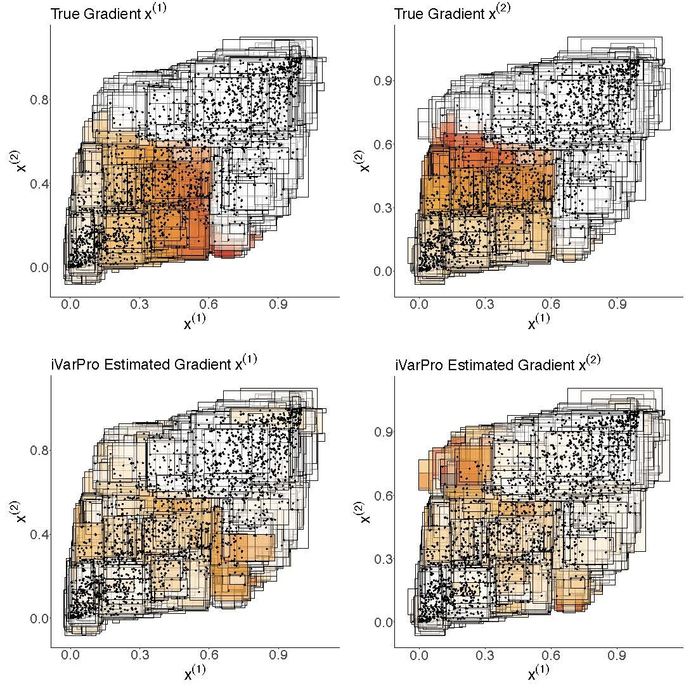{fig-alt="Uncorrelated gradient recovery" width="100%"}  
:::
:::

::: footer
:::


## Synthetic survival example {.smaller}

::: columns
::: {.column width="50%"}
The true (potentially unobserved) survival time:  
$$
\def\Xs#1{X^{(#1)}}
\def\x{{\bf x}}
\def\X{{\bf X}}
\def\PP{\mathbb{P}}
\def\xs#1{x^{(#1)}}
{\tiny
T^o = \log
\left[1 + V +
  \exp(\sum_{s=1}^4 \beta_s \Xs{s} 
  + \beta_5 \Xs{5} 1_{\{\Xs{2} > 0.5\}} ) \right]
}
$$
The variable $\scriptsize V$ follows a standard exponential distribution and the features $\scriptsize \Xs{s}$ is 
drawn from Uniform$\scriptsize (0,1)$. We take $\scriptsize \psi(\x)$ to be the restricted mean survival time
(RMST) [@irwin1949standard, @andersen2004regression,@royston2011use, @kim2017restricted] up to a specified time horizon $\scriptsize \tau>0$:
${\tiny \psi(\X) = \int_0^\tau S(t | \X)\,dt,}$
where ${\tiny S(t|\x) = \PP\{T^o > t | \X=\x\}}$

To derive a closed-form expression for the
gradient of $\scriptsize \psi(\x)$, we have ${\tiny S(t|\x) =\PP\left\{ \log [1 + V + A(\x) ]  > t \right\}},$
where  ${\tiny A(\x) = \exp (\sum_{s=1}^4 \beta_s \xs{s}}$ ${\tiny+ \beta_5 \xs{5} 1_{\{\xs{2} > 0.5\}})}$


:::

::: {.column width="50%" }
We obtain the partial derivatives:
$$
\def\L{\Lambda}
{\tiny
\begin{array}
\frac{\partial \psi(\x)}{\partial \xs{s}}
&=& \beta_s A(\x) e^{A(\x)}  \L(\tau),
\quad s = 1,2,3,4\\
\frac{\partial \psi(\x)}{\partial \xs{5}}
&=& \beta_5 A(\x) e^{A(\x)} \L(\tau) 1_{\{\xs{2} > 0.5\}}
\end{array}
}
$$ 
Parameters were $\beta_s = 2$ for $s =
1, \ldots, 5$, and additionally, 15 noise variables were included,
resulting in a total of $p = 20$ features. Random censoring at a 25\%
rate was applied, and a total of $n = 2000$ data points were sampled
:::
:::

::: footer
:::

## Synthetic survival example {.smaller}

::: columns
::: {.column width="50%"}
The true (potentially unobserved) survival time:  
$$
\def\Xs#1{X^{(#1)}}
\def\x{{\bf x}}
\def\X{{\bf X}}
\def\PP{\mathbb{P}}
\def\xs#1{x^{(#1)}}
{\tiny
T^o = \log
\left[1 + V +
  \exp(\sum_{s=1}^4 \beta_s \Xs{s} 
  + \beta_5 \Xs{5} 1_{\{\Xs{2} > 0.5\}} ) \right]
}
$$
The variable $\scriptsize V$ follows a standard exponential distribution and the features $\scriptsize \Xs{s}$ is 
drawn from Uniform$\scriptsize (0,1)$. We take $\scriptsize \psi(\x)$ to be the restricted mean survival time
(RMST) [@irwin1949standard, @andersen2004regression,@royston2011use, @kim2017restricted] up to a specified time horizon $\scriptsize \tau>0$:
${\tiny \psi(\X) = \int_0^\tau S(t | \X)\,dt,}$
where ${\tiny S(t|\x) = \PP\{T^o > t | \X=\x\}}$

To derive a closed-form expression for the
gradient of $\scriptsize \psi(\x)$, we have ${\tiny S(t|\x) =\PP\left\{ \log [1 + V + A(\x) ]  > t \right\}},$
where  ${\tiny A(\x) = \exp (\sum_{s=1}^4 \beta_s \xs{s}}$ ${\tiny+ \beta_5 \xs{5} 1_{\{\xs{2} > 0.5\}})}$


:::

::: {.column width="50%" }
We obtain the partial derivatives:
$$
\def\L{\Lambda}
{\tiny
\begin{array}
\frac{\partial \psi(\x)}{\partial \xs{s}}
&=& \beta_s A(\x) e^{A(\x)}  \L(\tau),
\quad s = 1,2,3,4\\
\frac{\partial \psi(\x)}{\partial \xs{5}}
&=& \beta_5 A(\x) e^{A(\x)} \L(\tau) 1_{\{\xs{2} > 0.5\}}
\end{array}
}
$$ 
The figure below shows the estimated iVarPro values where
  $\scriptsize \xs{5}$ has a smaller effect that is modulated by
  $\scriptsize \xs{2}$ and influences survival only $\scriptsize \xs{2} > 0.5$
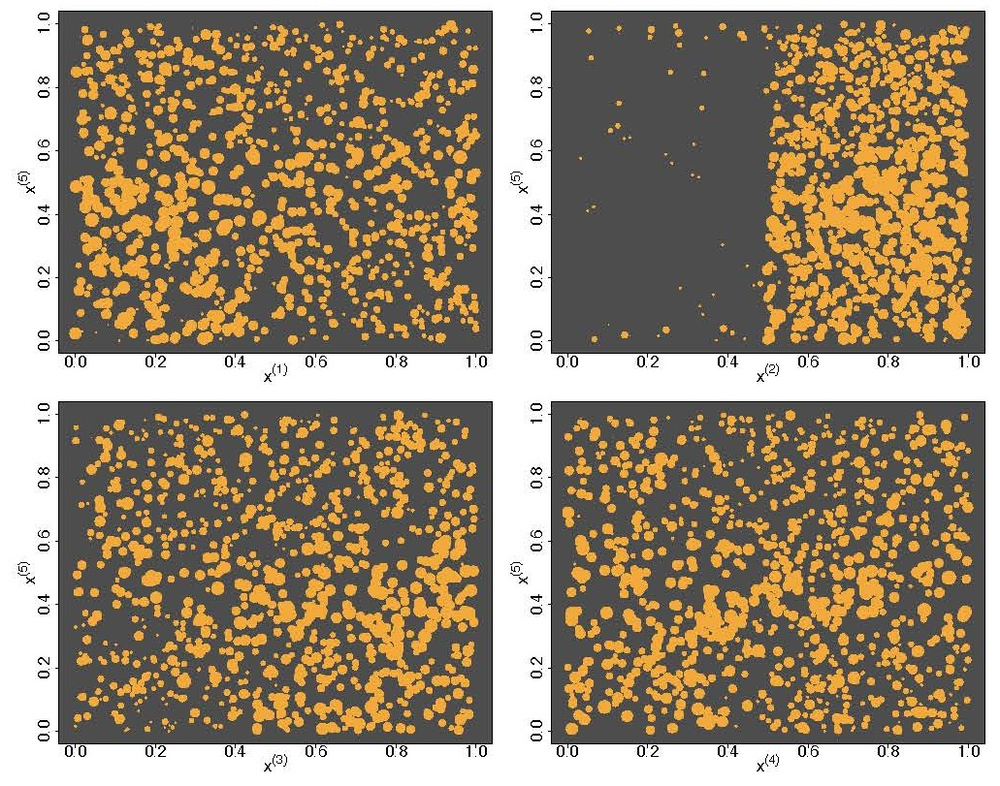{fig-alt="Uncorrelated gradient recovery" width="80%"}  
:::
:::

::: footer
:::

## Survival use case: CAD treadmill cohort {.smaller}

- 18,964 patients who underwent treadmill exercise testing for
the evaluation of suspected coronary artery disease (CAD). Notably, all
patients had a clinically normal resting electrocardiogram (ECG) and
no known history of cardiovascular disease at the time of testing
- outcome: all-cause mortality  
- $\psi$: integrated cumulative hazard; $\widehat{\psi}$: random survival forest  

. . .

#### Results
- Population leaders: **Peak METs** (Metabolic Equivalents at Peak Exercise), **Duke Treadmill Score (DTS)**  
- iVarPro finds **ECG** features with **localized** importance


## ECG vs Clinical gradients {.smaller}

**Visualizing clinical variable (Peak METs) versus ECG variable (ST-segment above the baseline)**  

::: columns
::: {.column width="50%"}
The top panel scales circle size by the Peak METs gradient, and the bottom panel scales by the ECG gradient. 
Data are stratified by patient mortality
  
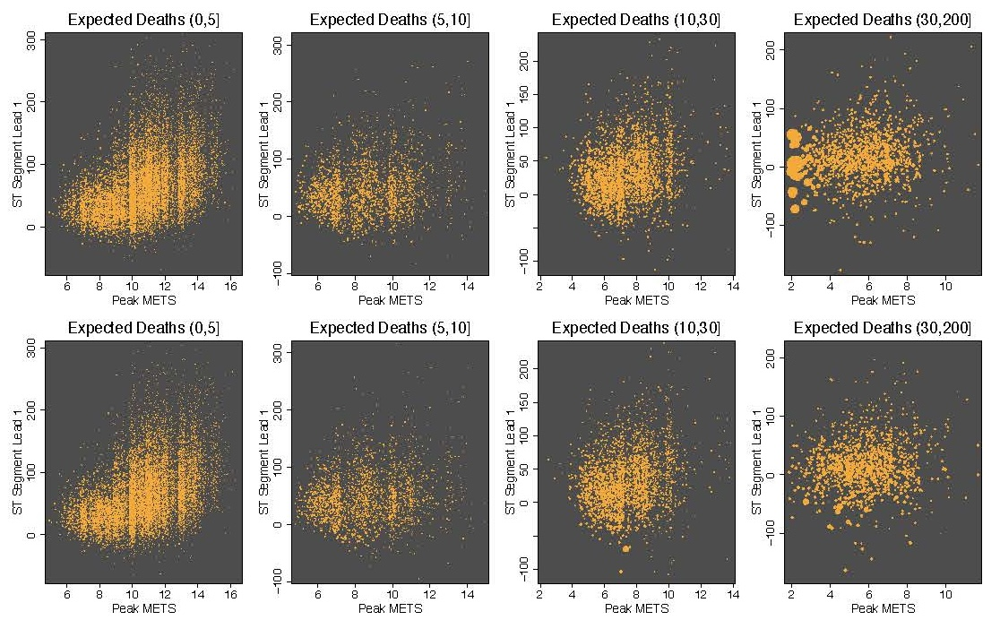{fig-alt="ECG vs survival gradients" width="100%"}  

::: 

::: {.column width="50%" .fragment}

Same as left, but with the vertical axis 
  representing the Duke Treadmill Score (DTS).
  Circle are scaled to the gradients for 
  Peak METs and DTS, respectively
  
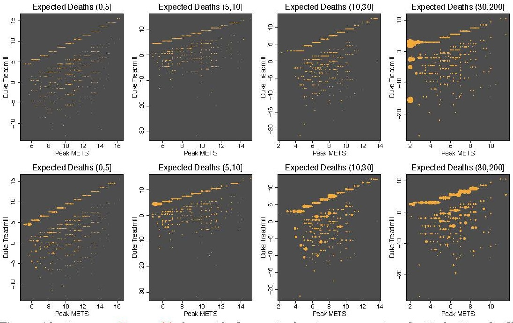{fig-alt="ECG vs survival gradients" width="100%"}  
:::
:::

::: footer
:::

## Kaplan–Meier sanity checks {.smaller}

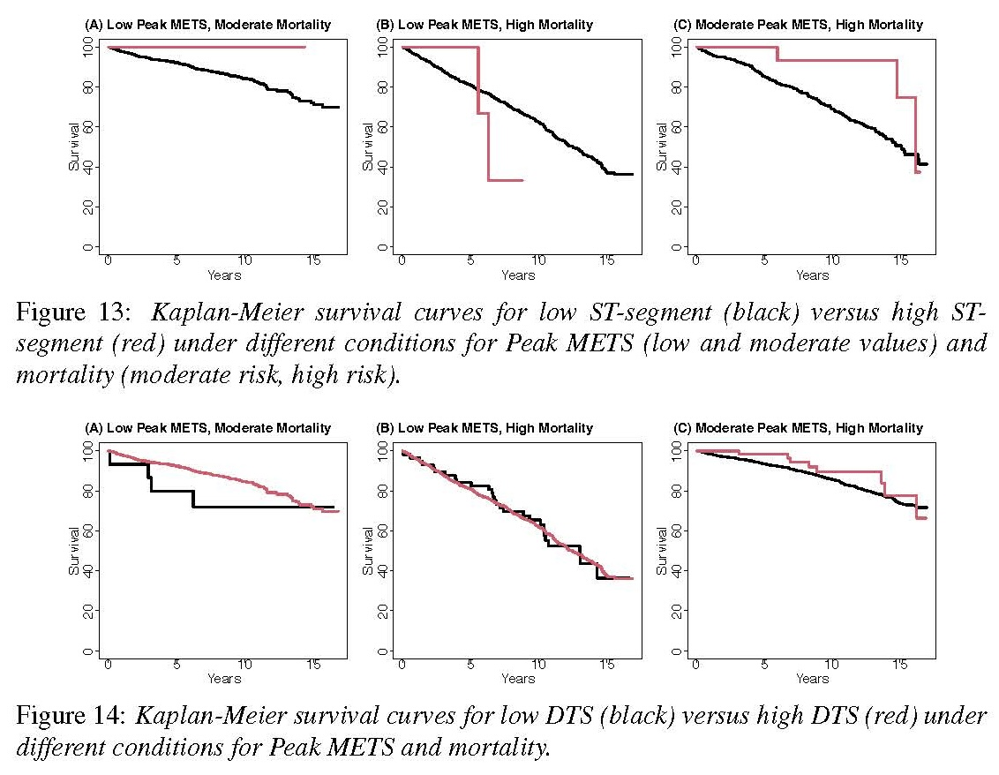{fig-alt="KM stratified by ST segment" width="80%"}


## Summary  {.smaller}

- **iVarPro** = **local gradient** importance using **rules + release**  
- **Model-independent**, **data-grounded**, **individualized**  
- Robust in high $p$, correlated features; empirically strong vs SHAP/LIME/CSRF  
- Practical for **precision medicine**: surfaces what matters **for this person**

**Message:** population signals + **patient-specific** signals → better precision interpretation

---


## Overview {.smaller}

::: columns

::: {.column width="33%" }
### 🌍 VarPro  
**Variable Priority for Global Variable Selection**

- Model-independent variable importance  
- Based on rule-and-release regions  
- Targets **population-level effects**  
- Identifies variables driving the conditional mean  


:::

::: {.column width="33%"}
### 👤 iVarPro  
**Variable Priority for Individual Variable Selection**

- Extends VarPro to **individual level**  
- Estimates **local gradients** within rules  
- Captures **heterogeneity across subjects**  
- Enables personalized interpretation  

:::

::: {.column width="33%"  .varpro-highlight}
### 💻 Software  

**R package: `varPro`**

- Efficient implementation of VarPro & iVarPro  
- User-friendly workflow for analysis  

**Resources:**
- Tutorials and examples  

🔗 https://www.varprotools.org/  

:::

:::


## The varPro R package {.smaller}

> A **unified**, rule-based interface for variable prioritization across supervised, unsupervised, and individual-level settings — using observed data only, without synthetic covariates or permutations.

**Key design goals:**


- Reproducible, observed-data workflows
- Scalable tree engine · parallel execution

---

## The varPro Framework {.smaller}

:::{.r-stack}
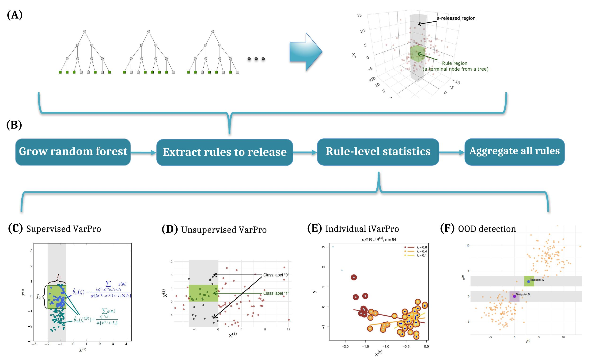{width="75%"}
:::

::: {style="font-size: 0.72em; color: #555; margin-top: 0.2em; text-align: left;"}
**(A)** Random forest grows trees with terminal-node rules → **(B)** Four-step rule-and-release ensemble: Grow · Extract · Compute statistic · Aggregate → **(C–F)** Analysis modes: Supervised VarPro · Unsupervised UVarPro · Individual iVarPro · OOD (out-of-distribution) detection outPro
:::

---

## Rule-and-Release: The Core Idea  {.smaller}

::: {.columns}
::: {.column width="52%"}

**Unified algorithm — 5 steps:**

1. **Grow** a forest, extract terminal-node rules $\{\zeta_k\}$
2. **Release** each rule by dropping constraints on variable $s$
3. **Compute** problem-specific statistic $T_{k,s}$ from $R_k$ and $R_k^{(s)}$
4. **Aggregate** $\{T_{k,s}\}$ across rules and trees
5. **Return** structured objects for downstream analysis

:::
::: {.column width="48%"}

**Four analysis modes — same algorithm, different $T_{k,s}$:**

| Mode | Statistic |
|------|-----------|
| **VarPro** | Conditional mean contrast |
| **UVarPro** | $\ell_1$-logistic models |
| **iVarPro** | Local gradient (slope) |
| **outPro** | Subspace distance |

::: {style="background: #e8f4ec; border-left: 4px solid #4a7c59; padding: 0.6em 0.8em; border-radius: 4px; margin-top: 0.8em; font-size: 0.88em;"}
No synthetic covariates, no permutations — all contrasts use **observed data only**.
:::

:::
:::

---

## Core Functions {.smaller}

::: {style="font-size: 0.80em;"}

| Function | Description | Visualization | Helpers |
|---|---|---|---|
| `varpro()` | Supervised global variable importance (regression, classification, survival) | `partialpro()`, `plot()` | `importance()` |
| `cv.varpro()` | Supervised importance with cross-validated cutoff selection | — | — |
| `uvarpro()` | Unsupervised global variable importance | `sdependent()` |  `importance()`, `get.beta.entropy()` |
| `ivarpro()` | Supervised individual (case-specific) variable importance | `shap.ivarpro()`, `partial.ivarpro()` | — |
| `isopro()` | Anomalous observation detection via isolation forests | — | `predict()` |
| `outpro()` | Supervised and unsupervised OOD detection | — | `outpro.null()` |

: {tbl-colwidths="[16,32,28,24]"}

:::


---

## `varpro()` — Supervised Variable Priority {.smaller}

::: {.columns}
::: {.column width="50%"}

**Fit and extract importance**

```{r}
#| eval: false
#| echo: true
library(varPro)
library(mlbench)
data(BostonHousing, package = "mlbench")

vp <- varpro(medv ~ ., BostonHousing[-(1:5), ])
imp_vp <- importance(vp)
print(head(imp_vp))
```

```
##          names   zscores standardize
## 1         lstat 14.46825   1.0000000
## 2            rm  9.88023   0.6829607
## 3           nox  7.23514   0.5000259
## 4           dis  6.85193   0.4735151
## 5         ptratio  5.54280  0.3831861
## 6            tax  4.60117   0.3180329
```

:::
::: {.column width="50%" .fragment}

**Partial effects — `partialpro()`**

```{r, eval=FALSE}
#| eval: false
#| echo: true
oo_boston <- partialpro(vp, nvar = 3,
               learner = rf.learner(vp))
plot(oo_boston)
```

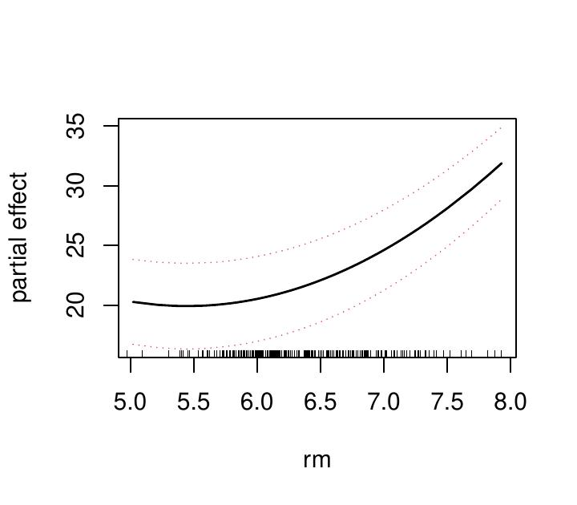{width="65%"}

::: {style="font-size: 0.72em; color: #555;"}
Partial effect of `nox` (ranked 3rd in importance) on median house value, produced by `partialpro()`.
:::

:::
:::

---

## `cv.varpro()` <br>— Cross-Validated Cutoff Selection {.smaller}

::: {.columns}
::: {.column width="40%"}

**Cross-validated importance with conservative / liberal variable sets**

```{r}
#| eval: false
#| echo: true
vp_cv <- cv.varpro(medv ~ ., BostonHousing)
print(vp_cv$imp.conserve)
print(vp_cv$zcut.conserve)
```

```
## Conservative selected variables:
##      names  zscores
## 1    lstat 14.20183
## 2       rm  9.75342
## 3      nox  7.11208
## 4      dis  6.70194
## 5  ptratio  5.48922

## zcut.conserve: 4.52
```

:::
::: {.column width="60%"}

::: {style="background: #f0f7f2; border-left: 4px solid #4a7c59; padding: 0.7em 0.9em; border-radius: 4px; font-size: 0.88em; margin-top: 0.6em;"}
**Returns a list with:**

- `$imp` — full importance table
- `$imp.conserve` — conservative variable set
- `$imp.liberal` — liberal variable set
- `$zcut.conserve` — cross-validated z-score cutoff
- `$err` — CV grid of cutoffs and errors

:::

::: {style="background: #fff8e1; border-left: 4px solid #f4a261; padding: 0.7em 0.9em; border-radius: 4px; font-size: 0.88em; margin-top: 0.6em;"}
**When to use `cv.varpro()` vs `varpro()`:**
Use `cv.varpro()` when you need a **data-driven cutoff** for variable selection rather than a full ranking.
:::

:::
:::

---

## `uvarpro()` <br>— Unsupervised Variable Priority {.smaller}

::: {.columns}
::: {.column width="56%"}

**Fit, extract importance scores**

```{r}
#| eval: false
#| echo: true
uvp <- uvarpro(BostonHousing[-(1:5), ])
print(head(importance(uvp)))
```

```
##      names   zscores
## 1    lstat  8.341252
## 2       rm  7.916084
## 3      dis  6.204817
## 4      nox  5.983761
## 5      age  4.742198
## 6  ptratio  4.210573
```
::: {.fragment}
```{r}
#| eval: false
#| echo: true
beta <- get.beta.entropy(uvp)
print(beta[1:5, 1:5])
```

```
##              rm     lstat       nox      dis       age
## [1,]  0.14823  0.19204  0.08341  0.11732  0.04215
## [2,]  0.11092  0.21837  0.10984  0.09841  0.03672
## [3,] -0.09341  0.17620  0.12048  0.14230  0.05891
## [4,]  0.06482 -0.15330  0.09317  0.10845  0.02140
## [5,]  0.12047  0.18274  0.07632  0.13502  0.04892
```
:::
:::
::: {.column width="44%" .fragment}

**`sdependent()` — S-dependence visualization**

```{r, eval=FALSE}
#| eval: false
#| echo: true
sdependent(beta)
```

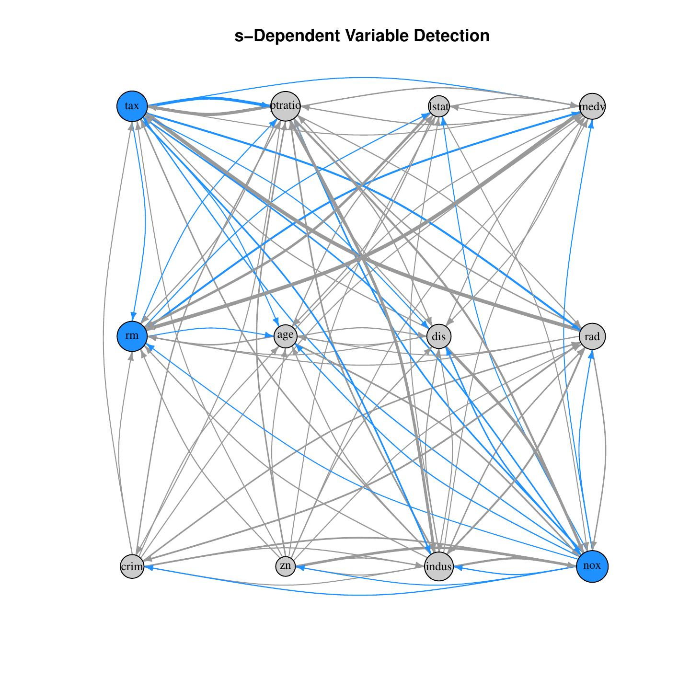{width="68%"}

::: {style="font-size: 0.72em; color: #555; text-align: left;"}
S-dependence heatmap of the $\ell_1$-logistic coefficient matrix — reveals variable dependence structure without labels.
:::

:::
:::

::: footer
:::

---

## `ivarpro()` — Individual Variable Priority {.smaller}

::: {.columns}
::: {.column width="47%"}

**Case-specific importance matrix**

```{r}
#| eval: false
#| echo: true
data(peakVO2, package = "randomForestSRC")
o <- varpro(Surv(ttodead, died) ~ .,
            peakVO2, ntree = 50)
ivp <- ivarpro(o)
print(ivp[1:5, 1:8])
```

```
##      age    gender bmi   peak.vo2 chemo  
## [1,]  0.041  NA  0.028   0.312   NA    
## [2,]  NA     NA  0.011   0.284   0.022  
## [3,]  0.014  0.031  NA   0.271   NA    
## [4,]  0.033  NA  0.019   0.290   0.017  
```

::: {style="font-size: 0.80em; color: #555; margin-top: 0.4em;"}
Returns an $N \times p$ matrix of case-specific importance values. `NA` = variable not important for that case.
:::

:::
::: {.column width="53%" .fragment}

**`shap.ivarpro()` — SHAP-like summary**

```{r, eval=FALSE}
#| eval: false
#| echo: true
imp <- ivarpro(o, cut.max = 2, adaptive = FALSE)
shap.ivarpro(imp)
```

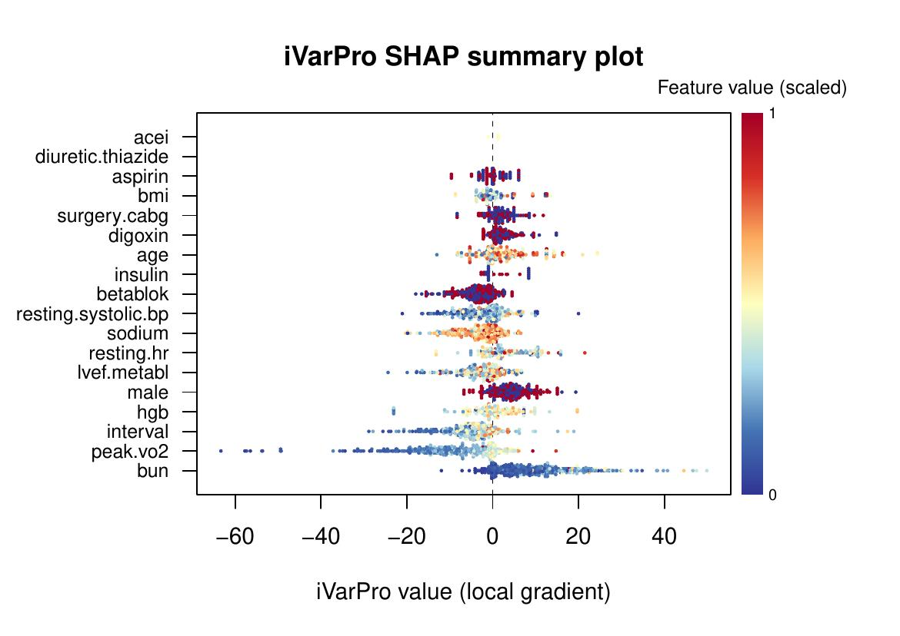{width="96%"}

::: {style="font-size: 0.72em; color: #555; text-align: center;"}
SHAP-like beeswarm plot: each dot = one case, color = feature value, x-axis = individualized importance.
:::

:::
:::

---

## partial.ivarpro() · isopro() · outpro() {.smaller}

::: {.columns}
::: {.column width="50%"}

**`partial.ivarpro()` — case-level partial plot**

```{r, eval=FALSE}
#| eval: false
#| echo: true
partial.ivarpro(imp, var = "peak.vo2",
                col.var = "interval",
                size.var = "y")
```

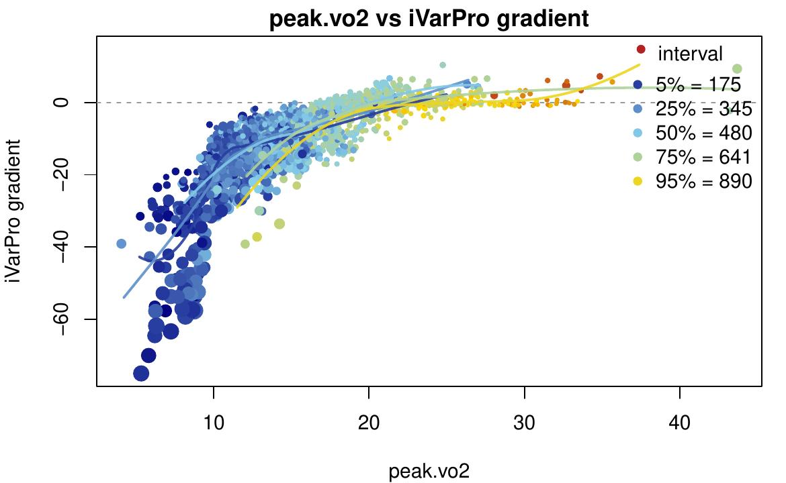{width="90%"}

::: {style="font-size: 0.72em; color: #555;"}
Case-specific importance for `peak.vo2`, points colored by `interval`, sized by outcome `y`.
:::

:::
::: {.column width="50%" .fragment}

**`isopro()` — anomaly scoring**

```{r}
#| eval: false
#| echo: true
vp_train <- varpro(medv ~ ., BostonHousing[-(1:5), ])
iso <- isopro(vp_train)
print(predict(iso, BostonHousing[1:5, ]))
# Find most anomalous observations:
BostonHousing[iso$howbad <=
  quantile(iso$howbad, 0.01), 1:5]
```
```
##         crim zn indus chas   nox
## 138  0.35233  0 21.89    0 0.624
## 139  0.24980  0 21.89    0 0.624
## 140  0.54452  0 21.89    0 0.624
## 477  4.87141  0 18.10    0 0.614
## 478 15.02340  0 18.10    0 0.614
## 479 10.23300  0 18.10    0 0.614
```

::: {.fragment}
**`outpro()` — OOD detection**

```{r}
#| eval: false
#| echo: true
vp2 <- varpro(medv ~ ., data = train_data)
op  <- outpro(vp2, newdata = test_data)
print(head(op$distance))

op_null <- outpro.null(vp2)
print(head(op_null$quantile))
```

```
## [1] 2.412  1.893  3.041  2.174  1.756

##    50%    75%    90%    95%    99%
##  1.823  2.614  3.198  3.742  4.521
```
:::
:::
:::
::: footer
:::

---

## Summary {.smaller}


**What varPro delivers**

- **Unified interface** — one package for supervised, unsupervised, and individual-level importance via consistent S3 generics

- **Observed-data only** — no permutations, no synthetic covariates; rule/release contrasts use the original data

- **Four analysis modes** each built on the same rule-and-release core:
  - `varpro()` / `cv.varpro()` — global screening
  - `uvarpro()` — unsupervised feature selection
  - `ivarpro()` — case-specific interpretation
  - `outpro()` / `isopro()` — deployment diagnostics

- **Scalable** — parallel execution, interfaces with `randomForestSRC`


## Looking ahead {.smaller}

- Software: varPro R and Python packages and vignettes

**Manuscript:** 

Lu M. and Ishwaran H. (2024). [Model-independent variable selection via the rule-based variable priority](https://arxiv.org/pdf/2409.09003?). (under review).

Lu M. and Ishwaran H. (2026). General OOD Detection via Model-aware and Subspace-aware Variable Priority. (under revision at *Knowledge and Information Systems*). 

**Publication:** 

Lu M. and Ishwaran H. (2025). [Individual variable priority: A model-independent local gradient method for variable importance](https://ishwaran.org/papers/LI_AIR_2025.pdf).  *Artifical Intelligence Review*. 58:407

Zhu L., Lu M. and Ishwaran H. (2026). [Variable priority for unsupervised variable selection](https://doi.org/10.1016/j.patcog.2025.112727).  *Pattern Recognition*. Volume 172, Part D.

**Slides:** [https://luminwin.github.io/iVarPro](https://luminwin.github.io/iVarPro)

---

## Thank You! 


::: {style="text-align: center; margin-top: 1.5em;"}

Questions welcome!

:::

---

## References {.smaller}


