## Brief Overview

This cover covers the following R packages

1. `randomForestSRC`: Fast Unified Random Forests for Survival, Regression, and Classification [(CRAN link)](https://cran.r-project.org/package=randomForestSRC)
2. `randomForestSRC.run`: Integrated visualiation for the `randomForestSRC` package [(Github link)](https://github.com/kogalur/randomForestSRC.run)
3. `varPro`: Model-Independent Variable Selection via the Rule-Based Variable
        Priority [(Github link)](https://github.com/kogalur/varPro)

## Outline {.smaller}

::: columns

::: {.column width="47.5%"}
#### [Part I: Training](https://luminwin.github.io/shortCourse/presentationPartI.html)

1.	Quick start
2.	Data structures allowed
3.	Training (grow) with examples <br>(regression, classification, survival)

#### [Part II:  Inference and Prediction](https://luminwin.github.io/shortCourse/presentationPartII.html)

1.	Inference (OOB)
2.	Prediction Error
3.	Prediction
4.	Restore
5.	Partial Plots
:::

::: {.column width="5%"}

:::

::: {.column width="47.5%" .fragment}
#### [Part III: Variable Selection](https://luminwin.github.io/shortCourse/presentationPartIII.html)

1.	VIMP
2.	Subsampling (Confidence Intervals)
3.	Minimal Depth
4.	VarPro

#### [Part IV:  Advanced Examples](https://luminwin.github.io/shortCourse/presentationPartIV.html)

1.	Class Imbalanced Data
2.	Competing Risks
3.	Multivariate Forests
:::
:::

::: footer
:::

## Brief Overview

[randomForestSRC]{style="color:#00589b"} is a fast OpenMP and memory
efficient package for fitting random forests (RF) for univariate,
multivariate, unsupervised, survival, competing risks, class imbalanced
classification and quantile regression

## Brief Overview

::: hidden
```{=tex}
\def\x{{\bf x}}
\def\hF{{\hat{F}}}
\def\T{{{\bf\Theta}_b}}
```
:::

::: {.fragment .fade-in-then-semi-out}
A random forest (RF) [@Breiman2001] consists of a collection of random tree structured
predictors {$h({\bf x},{{\bf\Theta}_b}), b= 1,2,\ldots, B$} where
{${{\bf\Theta}_b}$} are independent identically distributed random
vectors. The RF predictor is the ensemble
$$F_{{\!\text{ens}}}({\bf x})=\frac{1}{B}\sum_{b=1}^B h({\bf x},{{\bf\Theta}_b})$$
:::
::: {.fragment .fade-in}
Typically, ${{\bf\Theta}_b}$ encode the instructions for bootstrapping the data and for
random feature selection used for tree splitting 
:::

## Brief Overview

[rfsrc]{.fragment .highlight-blue
fragment-index="1"}([formula]{.fragment .highlight-blue
fragment-index="2"}, [data]{.fragment .highlight-blue
fragment-index="3"}, [ntree, mtry, nodesize]{.fragment .highlight-blue
fragment-index="4"})

Grow (train) your RF through [rfsrc]{.fragment .highlight-blue
fragment-index="1"}<br> Specify your model in [formula]{.fragment
.highlight-blue fragment-index="2"}<br> Provide your data frame in
[data]{.fragment .highlight-blue fragment-index="3"}<br> Tune your model
via [ntree, mtry, nodesize]{.fragment .highlight-blue
fragment-index="4"}

## Brief Overview {.smaller}

[rfsrc([formula]{.fragment
.highlight-blue}, data, ntree, mtry, nodesize)]{style="color:#00589b; font-size:50px;font-weight: bold;"}

. . .

| Family                                                                                                                                       | Example Grow Call with Formula Specification                                                                                                                                                                  |
|--------------------------------------|----------------------------------|
| Survival                                                                                                                                     | `rfsrc(Surv(time, status)~., data = veteran)`                                                                                                                                                                 |
| Competing Risk                                                                                                                               | `rfsrc(Surv(time, status)~., data = wihs)`                                                                                                                                                                    |
| Regression <br> Quantile Regression                                                                                                          | `rfsrc(Ozone~., data = airquality)` <br> `quantreg(mpg~., data = mtcars)`                                                                                                                                     |
| Classification <br> Imbalanced Two-Class                                                                                                     | `rfsrc(Species~., data = iris)` <br> `imbalanced(status~., data = breast)`                                                                                                                                    |
| Multivariate Regression <br> Multivariate Mixed Regression <br> Multivariate Quantile Regression <br> Multivariate Mixed Quantile Regression | `rfsrc(Multivar(mpg, cyl)~., data = mtcars)` <br> `rfsrc(cbind(Species,Sepal.Length)~.,data=iris)` <br> `quantreg(cbind(mpg, cyl)~., data = mtcars)` <br> `quantreg(cbind(Species,Sepal.Length)~.,data=iris)` |
| Unsupervised <br> sidClustering <br> Breiman (Shi-Horvath)                                                                                   | `rfsrc(data = mtcars)` <br> `sidClustering(data = mtcars)` <br> `sidClustering(data = mtcars, method = "sh")`                                                                                                 |

: {.striped .border .small}

## Quick Start

``` {.r code-line-numbers="1-2"}
# Run this if you haven’t installed the R package
install.packages("randomForestSRC", repos = "https://cran.us.r-project.org") 
```

## Quick Start

```{mermaid}
flowchart LR
  A[Grow a forest] --> B[Check the output] --> C[Make the prediction]
```

## Quick Start

```{mermaid}
flowchart LR
  A[<h3 style="color:darkgreen">Grow a forest</h3>] --> B[Check the output] --> C[Make the prediction]
```

``` {.r code-line-numbers="1-3"}
library(randomForestSRC)
# New York air quality measurements. Mean ozone in parts per billion.
airq.obj <- rfsrc(Ozone ~ ., data = airquality)
```

## Quick Start

```{mermaid}
flowchart LR
  A[Grow a forest] --> B[<h3 style="color:darkgreen">Check the output</h3>] --> C[Make the prediction]
```

``` {.r code-line-numbers="19-20"}
library(randomForestSRC)
# New York air quality measurements. Mean ozone in parts per billion.
airq.obj <- rfsrc(Ozone ~ ., data = airquality)
print(airq.obj)


>  1                           Sample size: 111
>  2                       Number of trees: 500
>  3             Forest terminal node size: 5
>  4         Average no. of terminal nodes: 14.68
>  5  No. of variables tried at each split: 2
>  6                Total no. of variables: 5
>  7         Resampling used to grow trees: swor
>  8      Resample size used to grow trees: 70
>  9                              Analysis: RF-R
>  10                               Family: regr
>  11                       Splitting rule: mse *random*
>  12        Number of random split points: 10
>  13                      (OOB) R squared: 0.70871819
>  14    (OOB) Requested performance error: 322.53346594
```

## Quick Start {.smaller}

::: callout-tip
## Tip

The last line(s) will show the cross validated prediction performance
:::

``` r
>  13                      (OOB) R squared: 0.70871819
>  14    (OOB) Requested performance error: 322.53346594
```

::: incremental
-   Model performance is displayed in the last two lines in terms of out-of-bag (OOB) prediction error. In
    regression, this the cross-validated
    (leave-one-out bootstrap) mean squared error (MSE) estimated via the
    out-of-bag data shown in line 14
-   Since MSE is scale dependent, standardized MSE, defined as the MSE
    divided by the variance of the outcome, is used and converted to R
    squared (or percent variance explained) which has an intuitive and universal interpretation, shown in
    line 13
:::

## What is OOB prediction error? {.smaller}

::: incremental
-   Since each tree is grown from a random subset (bootstrap) of the data, the
    package returns both out-of-sample and in-sample predicted values
    from the forest, where the former are calculated using the hold out
    data for each tree (`$predicted.oob`), and the latter are from the
    bootstrap data used to train the tree (`$predicted`)
-   Only `$predicted.oob` should be used for
    inference on the training data since they are cross-validated and
    will not over-fit the data. 
    <!--- See the [Forest Weights, In-Bag (IB) and
    Out-of-Bag (OOB) Ensembles
    vignette](https://www.randomforestsrc.org/articles/forestWgt.html)
    for a more formal description of IB and OOB and how they are used to
    define the ensemble --->
    <br/>
:::

. . .

``` r
>  13                      (OOB) R squared: 0.70871819
>  14    (OOB) Requested performance error: 322.53346594
```

we can get the error rate (mean-squared error) directly from the OOB
ensemble by comparing the response to the OOB predictor below

``` r
print(mean((airq.obj$yvar - airq.obj$predicted.oob)^2))
> [1] 322.53346594
```

::: footer
Learn more: https://www.randomforestsrc.org/articles/forestWgt.html
:::

## Prediction error {.smaller}

<hr style="margin: 10px; visibility:hidden;" />

Family | Prediction Error |
|------|-------------|
|Regression  <br>   Quantile Regression      |  mean-squared error <br> mean-squared error| 
|Classification  <br> Imbalanced Two-Class |  misclassification, Brier score <br> G-mean, misclassification, Brier score| 
|Survival  |   Harrell's C-index (1 minus concordance) | 
|Competing Risk  |   Harrell's C-index (1 minus concordance) | 
|Multivariate Regression <br> Multivariate Classification <br> Multivariate Mixed Regression <br> Multivariate Quantile Regression |  per response: same as above for Regression <br> per response: same as above for Classification <br> per response: same as above for Regression, Classification <br> same as Multivariate Regression| 
|Unsupervised <br> sidClustering <br> Breiman (Shi-Horvath) | none <br> same as Multivariate Mixed Regression <br> same as Classification| 

: {.striped .border .small}


## Quick Start {.smaller}

::: columns
::: {.column width="65%"}
<h5>Output (Values/Verbose)</h5>

``` {.r code-line-numbers="8"}
library(randomForestSRC)
# New York air quality measurements. Mean ozone in parts per billion.
airq.obj <- rfsrc(Ozone ~ ., data = airquality)
print(airq.obj)


>  1                           Sample size: 111
>  2                       Number of trees: 500
>  3             Forest terminal node size: 5
>  4         Average no. of terminal nodes: 14.68
>  5  No. of variables tried at each split: 2
>  6                Total no. of variables: 5
>  7         Resampling used to grow trees: swor
>  8      Resample size used to grow trees: 70
>  9                              Analysis: RF-R
>  10                               Family: regr
>  11                       Splitting rule: mse *random*
>  12        Number of random split points: 10
>  13                      (OOB) R squared: 0.70871819
>  14    (OOB) Requested performance error: 322.53346594
```
:::

::: {.column width="35%"}
<br><br><br>

<h5>Corresponding input (arguments)</h5>

``` r
rfsrc(…, ntree = 500)
```
:::
:::

## Quick Start {.smaller}

::: columns
::: {.column width="65%"}
<h5>Output (Values/Verbose)</h5>

``` {.r code-line-numbers="9|10"}
library(randomForestSRC)
# New York air quality measurements. Mean ozone in parts per billion.
airq.obj <- rfsrc(Ozone ~ ., data = airquality)
print(airq.obj)


>  1                           Sample size: 111
>  2                       Number of trees: 500
>  3             Forest terminal node size: 5
>  4         Average no. of terminal nodes: 14.68
>  5  No. of variables tried at each split: 2
>  6                Total no. of variables: 5
>  7         Resampling used to grow trees: swor
>  8      Resample size used to grow trees: 70
>  9                              Analysis: RF-R
>  10                               Family: regr
>  11                       Splitting rule: mse *random*
>  12        Number of random split points: 10
>  13                      (OOB) R squared: 0.70871819
>  14    (OOB) Requested performance error: 322.53346594
```
:::

::: {.column width="35%"}
<br><br><br><br>

<h5>Corresponding input (arguments)</h5>

``` r
rfsrc(…, nodesize = 5)
```

::: {.fragment .fade-left}
line 4 displays the average number of terminal nodes for a tree
:::
:::
:::

## Quick Start {.smaller}

::: columns
::: {.column width="65%"}
<h5>Output (Values/Verbose)</h5>

``` {.r code-line-numbers="11-12"}
library(randomForestSRC)
# New York air quality measurements. Mean ozone in parts per billion.
airq.obj <- rfsrc(Ozone ~ ., data = airquality)
print(airq.obj)


>  1                           Sample size: 111
>  2                       Number of trees: 500
>  3             Forest terminal node size: 5
>  4         Average no. of terminal nodes: 14.68
>  5  No. of variables tried at each split: 2
>  6                Total no. of variables: 5
>  7         Resampling used to grow trees: swor
>  8      Resample size used to grow trees: 70
>  9                              Analysis: RF-R
>  10                               Family: regr
>  11                       Splitting rule: mse *random*
>  12        Number of random split points: 10
>  13                      (OOB) R squared: 0.70871819
>  14    (OOB) Requested performance error: 322.53346594
```
:::

::: {.column width="35%"}
<br><br><br><br>

<h5>Corresponding input (arguments)</h5>

``` r
rfsrc(…, mtry = NULL)
```

::: {.fragment .fade-left}
lines 5 and 6 are related to `mtry`, which is the number of variables to possibly split at each node
:::
:::
:::

::: {.fragment .fade-left}
Default is number of variables divided by 3 for regression. For all other families (including unsupervised settings), it is the square root of number of variables. Values are rounded up
:::

## Quick Start {.smaller}

::: columns
::: {.column width="65%"}
<h5>Output (Values/Verbose)</h5>

``` {.r code-line-numbers="13|14"}
library(randomForestSRC)
# New York air quality measurements. Mean ozone in parts per billion.
airq.obj <- rfsrc(Ozone ~ ., data = airquality)
print(airq.obj)


>  1                           Sample size: 111
>  2                       Number of trees: 500
>  3             Forest terminal node size: 5
>  4         Average no. of terminal nodes: 14.68
>  5  No. of variables tried at each split: 2
>  6                Total no. of variables: 5
>  7         Resampling used to grow trees: swor
>  8      Resample size used to grow trees: 70
>  9                              Analysis: RF-R
>  10                               Family: regr
>  11                       Splitting rule: mse *random*
>  12        Number of random split points: 10
>  13                      (OOB) R squared: 0.70871819
>  14    (OOB) Requested performance error: 322.53346594
```
:::

::: {.column width="35%"}
<br><br><br><br><br>

<h5>Corresponding input (arguments)</h5>

``` r
rfsrc(…, samptype ="swor")
```

where `“swor”` refers to sampling without replacement and `“swr”` refers
to sampling with replacemen
:::
:::

::: {.fragment .fade-left}
line 8 displays the sample size for line 7 where for `swor`, the number
equals to about 63.2% observations, which matches the usual bootstrap
sample size
:::

## Quick Start {.smaller}

::: columns
::: {.column width="65%"}
<h5>Output (Values/Verbose)</h5>

``` {.r code-line-numbers="15-16"}
library(randomForestSRC)
# New York air quality measurements. Mean ozone in parts per billion.
airq.obj <- rfsrc(Ozone ~ ., data = airquality)
print(airq.obj)


>  1                           Sample size: 111
>  2                       Number of trees: 500
>  3             Forest terminal node size: 5
>  4         Average no. of terminal nodes: 14.68
>  5  No. of variables tried at each split: 2
>  6                Total no. of variables: 5
>  7         Resampling used to grow trees: swor
>  8      Resample size used to grow trees: 70
>  9                              Analysis: RF-R
>  10                               Family: regr
>  11                       Splitting rule: mse *random*
>  12        Number of random split points: 10
>  13                      (OOB) R squared: 0.70871819
>  14    (OOB) Requested performance error: 322.53346594
```
:::

::: {.column width="35%"}
<br><br><br><br><br><br><br>

<h5>Explanation</h5>

line 9 and 10 show the type of forest where `RF-R` and `regr` refer to
regression
:::
:::

## Quick Start {.smaller}

::: columns
::: {.column width="65%"}
<h5>Output (Values/Verbose)</h5>

``` {.r code-line-numbers="17"}
library(randomForestSRC)
# New York air quality measurements. Mean ozone in parts per billion.
airq.obj <- rfsrc(Ozone ~ ., data = airquality)
print(airq.obj)


>  1                           Sample size: 111
>  2                       Number of trees: 500
>  3             Forest terminal node size: 5
>  4         Average no. of terminal nodes: 14.68
>  5  No. of variables tried at each split: 2
>  6                Total no. of variables: 5
>  7         Resampling used to grow trees: swor
>  8      Resample size used to grow trees: 70
>  9                              Analysis: RF-R
>  10                               Family: regr
>  11                       Splitting rule: mse *random*
>  12        Number of random split points: 10
>  13                      (OOB) R squared: 0.70871819
>  14    (OOB) Requested performance error: 322.53346594
```
:::

::: {.column width="35%"}
<br><br><br><br><br><br><br><br>

<h5>Corresponding input (arguments)</h5>

``` r
rfsrc(…, splitrule =“mse")
```
:::
:::

## Quick Start {.smaller}

::: columns
::: {.column width="65%"}
<h5>Output (Values/Verbose)</h5>

``` {.r code-line-numbers="18"}
library(randomForestSRC)
# New York air quality measurements. Mean ozone in parts per billion.
airq.obj <- rfsrc(Ozone ~ ., data = airquality)
print(airq.obj)


>  1                           Sample size: 111
>  2                       Number of trees: 500
>  3             Forest terminal node size: 5
>  4         Average no. of terminal nodes: 14.68
>  5  No. of variables tried at each split: 2
>  6                Total no. of variables: 5
>  7         Resampling used to grow trees: swor
>  8      Resample size used to grow trees: 70
>  9                              Analysis: RF-R
>  10                               Family: regr
>  11                       Splitting rule: mse *random*
>  12        Number of random split points: 10
>  13                      (OOB) R squared: 0.70871819
>  14    (OOB) Requested performance error: 322.53346594
```
:::

::: {.column width="35%"}
<br><br><br><br><br><br><br><br><br>

<h5>Corresponding input (arguments)</h5>

``` r
rfsrc(…, nsplit = 10)
```

which shows the number of random splits to consider for each candidate
splitting variable
:::
:::

## Quick Start

```{mermaid}
flowchart LR
  A[Grow a forest] --> B[Check the output] --> C[<h3 style="color:darkgreen">Make the prediction</h3>]
```

::: {.fragment .fade-up}
### Predicted outcome

``` {.r code-line-numbers="4"}
library(randomForestSRC)
# New York air quality measurements. Mean ozone in parts per billion.
airq.obj <- rfsrc(Ozone ~ ., data = airquality[-c(1:10),])
head(airq.obj$predicted.oob)
>  21.97727  25.38251  21.26051  12.87687  24.10623  
```
:::

::: {.fragment .fade-up}
### Prediction on new data

``` {.r code-line-numbers="1-2"}
airq.pred <- predict(airq.obj, newdata = airquality[c(1:10),])
head(airq.pred$predicted)
>  35.43525 23.75033 25.86907 24.55133 29.10551 
```
:::

## Data {.smaller}

::: {.fragment .fade-in-then-semi-out}
### Data structures allowed

Data must be real or factors and in `data.frame` format and you have to use the
`as.data.frame()` command to convert `matrix`, `tibble`, etc
:::

::: columns
::: {.column .fragment .fade-in-then-semi-out width="50%"}
### Clean up your data

Choose your variables in `formula` and grow a tree<br >

``` r
o <- rfsrc(y ~ a + z, data= dta, ntree = 1)
```

your outcome(s) will be saved in `o$yvar` and your predictors are in
`o$xvar` from `dta` without missing values<br >
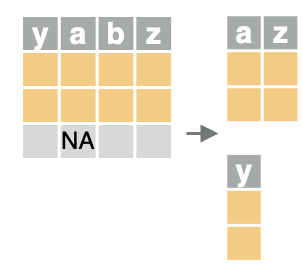{width="30%"}
:::

::: {.column width="50%"}
::: {.fragment .fade-in-then-semi-out}
### Impute your data

To impute your data, use the following commands

``` r
o <- impute(y ~ ., data = dta, nimpute = 3) # for supervised problem
o <- impute(data = dta) # for unsupervised problem
```
:::

::: {.callout-tip .fragment}
## Tip: factors or characters

Unlike `lm()`, `glm()`, or machine learning packages like `ranger`,
`rfsrc()` does not require contrast/dummy coding
:::
:::
:::

## General call to rfsrc {.smaller}

::: {.fragment .fade-left}
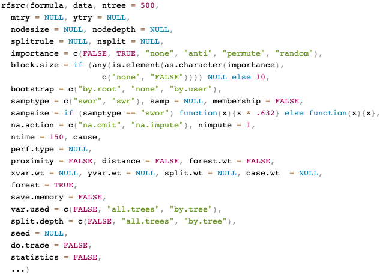{width="75%"}
:::

## General call to rfsrc.cart {.smaller}

rfsrc.cart(formula, data, ntree = 1, mtry = ncol(data), bootstrap =
"none", ...)

. . .

::: callout-tip
## Tip: convenient interface for growing a Classification And Regression Tree (CART)

`rfsrc.cart()` is useful for growing single trees of almost any type
:::

<center>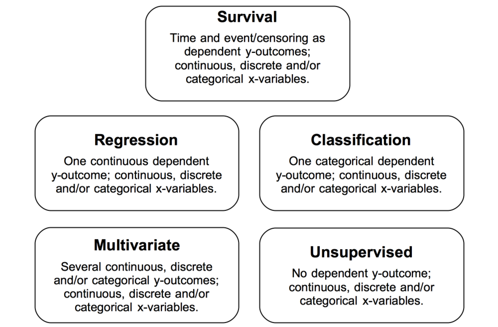{width="50%"}</center>

##  Visualizing a CART tree {.smaller}

::: callout-tip
## Tip:

`get.tree()` is useful for visualizing a single tree from a `rfsrc.cart`
or `rfsrc` object specified by `tree.id`
:::

::: columns
::: {.column width="60%"}
``` r
## visualizing a tree from a rfsrc.cart object
airq.tree <- rfsrc.cart(Ozone ~ ., data = airquality)
plot(get.tree(airq.tree, tree.id = 1))
```
:::

::: {.column width="40%"}
::: r-stack
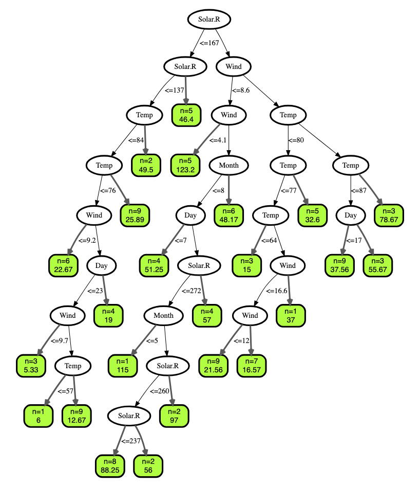{.fragment width="100%"}
:::
:::
:::

## Visualizing a CART tree {.smaller}

::: callout-tip
## Tip: 

`get.tree()` is useful for visualizing a single tree from a `rfsrc.cart`
or `rfsrc` object specified by `tree.id`
:::

::: columns
::: {.column width="60%"}
``` r
## visualizing a tree from a rfsrc object
plot(get.tree(airq.obj, tree.id = 3))
```
:::

::: {.column width="40%"}
::: r-stack
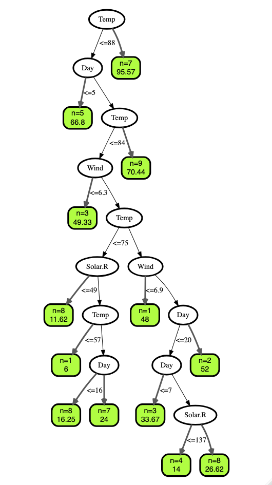{.fragment width="65%"}
:::
:::
:::

## Nonparametric regression {.smaller}
<br>

| Family                                                                                                                                       | Example Grow Call with Formula Specification                                                                                                                                                                     |
|--------------------------------------|----------------------------------|
| [Regression]{style="color:#00589b; font-weight: bold;"} <br> Quantile Regression                                   | [rfsrc(Ozone~., data = airquality)]{style="color:#00589b; font-weight: bold;"} <br> `quantreg(mpg~., data = mtcars)`                                                                              |
| Classification <br> Imbalanced Two-Class                                                                                                     | `rfsrc(Species~., data = iris)` <br> `imbalanced(status~., data = breast)`                                                                                                                                    |
| Survival                                                                                                                                     | `rfsrc(Surv(time, status)~., data = veteran)`                                                                                                                                                                  |
| Competing Risk                                                                                                                               | `rfsrc(Surv(time, status)~., data = wihs)`                                                                                                                                                                     |
| Multivariate Regression <br> Multivariate Mixed Regression <br> Multivariate Quantile Regression <br> Multivariate Mixed Quantile Regression | `rfsrc(Multivar(mpg, cyl)~., data = mtcars)` <br> `rfsrc(cbind(Species,Sepal.Length)~.,data=iris)` <br> `quantreg(cbind(mpg, cyl)~., data = mtcars)` <br> `quantreg(cbind(Species,Sepal.Length)~.,data=iris)` |
| Unsupervised <br> sidClustering <br> Breiman (Shi-Horvath)                                                                                   | `rfsrc(data = mtcars)` <br> `sidClustering(data = mtcars)` <br> `sidClustering(data = mtcars, method = "sh")`                                                                                                    |

: {.striped .border .small}

## Nonparametric regression {.smaller}

::: hidden
```{=tex}
\def\x{{\bf{x}}}
\def\X{{\bf{X}}}
\def\ybar{{\overline{y}}}
\def\Ybar{{\overline{Y}}}
\def\tr{t_R}
\def\tl{t_L}
\def\trj{{t_{R_j}}}
\def\Ybbar{\overline{\Y}}
```
:::

The goal is to estimate $F({\bf{x}})=E(Y|{\bf{X}}={\bf{x}})$ by
minimizing the empirical risk functional $$
R_n(F) = \frac{1}{n}\sum_{i=1}^n (Y_i-F({\bf{x}}_i))^2
$$ The tree accomplishes this piece-by-piece. For a node $t$, the tree
replaces the node estimator ${\overline{Y}}_t$ by daughter node
estimators ${\overline{Y}}_{t_L}$ and ${\overline{Y}}_{t_R}$

## Nonparametric regression {.smaller}

::: hidden
```{=tex}
\def\x{{\bf{x}}}
\def\X{{\bf{X}}}
\def\ybar{{\overline{y}}}
\def\Ybar{{\overline{Y}}}
\def\tr{t_R}
\def\tl{t_L}
\def\trj{{t_{R_j}}}
\def\Ybbar{\overline{\Y}}
```
:::

The empirical risk reduction from this split of $t$ into its daughers
$t_L$ and $t_R$ is $$ 
\frac{1}{n}\sum_{i\in t} (Y_i-{\overline{Y}}_t)^2
-\Bigg[\frac{1}{n}\sum_{i\in t_L} (Y_i-{\overline{Y}}_{t_L})^2
+ \frac{1}{n}\sum_{i\in t_R} (Y_i-{\overline{Y}}_{t_R})^2\Bigg]
$$ Maximizing this decrease is equivalent to minimizing $$
\frac{1}{n}\sum_{i\in t_L} (Y_i-{\overline{Y}}_{t_L})^2
+ \frac{1}{n}\sum_{i\in t_R} (Y_i-{\overline{Y}}_{t_R})^2
$$ This leads to the weighted variance (mse) splitting used by CART and RF

::: footer
:::

## Split rules for regression {.smaller}
<br>

| Family                                                                                                                                                                        | `splitrule`                                                                                                                                                                                |
|--------------------------------------|----------------------------------|
| Regression <br> Quantile Regression                                                                                             | [mse]{.fragment .highlight-blue fragment-index="1"} <br> `la.quantile.regr, quantile.regr,`[mse]{.fragment .highlight-blue fragment-index="1"} |
| Classification <br> Imbalanced Two-Class                                                                                                                                      | `gini, auc, entropy` <br> `gini, auc, entropy`                                                                                                                                             |
| Survival                                                                                                                                                                      | `logrank, bs.gradient, logrankscore`                                                                                                                                                       |
| Competing Risk                                                                                                                                                                | `logrankCR, logrank`                                                                                                                                                                       |
| Multivariate Regression <br> Multivariate Classification <br> Multivariate Mixed Regression <br> Multivariate Quantile Regression <br> Multivariate Mixed Quantile Regression | `mv.mse, mahalanobis` <br> `mv.gini` <br> `mv.mix` <br> `mv.mse` <br> `mv.mix`                                                                                                             |
| Unsupervised <br> sidClustering <br> Breiman (Shi-Horvath)                                                                                                                    | `unsupv` <br> $\{$`mv.mse, mv.gini, mv.mix`$\}$, `mahalanobis` <br> `gini, auc, entropy`                                                                                                   |

: {.striped .border .small}

## Mean-squared error (mse) splitting rule {.smaller}

::: hidden
```{=tex}
\def\ybar{\overline{y}}
\def\Ybar{\overline{Y}}
\def\tr{t_R}
\def\tl{t_L}
\def\trj{{t_{R_j}}}
\def\Ybbar{\overline{\Y}}
```
:::

Let $Y_1,\ldots,Y_n$ be the outcomes in $t$, the mse split-statistic for
a proposed split $s$ is
$$D(s,t)=\frac{1}{n}\sum_{i\in t_L}(Y_i-\overline{Y}_{t_L})^2 + \frac{1}{n}\sum_{i\in t_R}(Y_i-\overline{Y}_{t_R})^2$$
where

<center>            $t_L=\{X_i\le s\}$    and   
$t_R=\{X_i>s\}$</center>

<br> are the left and right daughter nodes and <br><br>

<center>             $\overline{Y}_{t_L}=\frac{1}{n}\sum_{i\in t_L}Y_i$
   and    $\overline{Y}_{t_R}=\frac{1}{n}\sum_{i\in t_R}Y_i$</center>

are the sample means for $t_L$ and $t_R$ respectively. The best split
for $X$ is the split-point $s$ minimizing $D(s,t)$ [@Breiman1984]

## Key quantities 

The key quantities returned by the package are

```{verbatim }
o$predicted       --->   inbag estimated conditional mean
o$predicted.oob   --->   OOB estimated conditional mean
```


## Regression example: Iowa housing {.smaller}

#### Ames Iowa Housing Data

Data from the Ames Assessor's Office used in assessing values of
individual residential properties sold in Ames, Iowa from 2006 to 2010.
This is a regression problem and the goal is to predict "SalePrice"
which records the price of a home in thousands of dollars [@de2011ames]

```{r}
data(housing, package = "randomForestSRC")  
gt::gt(head(housing))
```

``` {.r .fragment code-line-numbers="1|2-3"}
data(housing, package = "randomForestSRC")  
dim(housing)  
> [1] 2930   81
```

## Regression example: Iowa housing {.smaller}

The key quantities returned by the package are

```{verbatim }
o$predicted       --->   inbag estimated conditional mean
o$predicted.oob   --->   OOB estimated conditional mean
```

. . . 

``` {.r code-line-numbers="1-3|5-6"}
o <- rfsrc(SalePrice~., data = housing, nodesize = 1)
> o$predicted[1:5] #  --->   inbag estimated conditional mean
> [1] 12.17378 11.63555 11.99636 12.40886 12.14098 12.16425

o$predicted.oob[1:5] #  --->   OOB estimated conditional mean
> [1] 12.08462 11.70282 11.95179 12.39756 12.13130 12.15017
```

## Regression example: Iowa housing {.smaller}

::: {.callout-tip .fragment .fade-left}
## Tip: omit or impute missing data

The default setting o \<- rfsrc(..., na.action = "na.omit") will provide
complete cases in o\$yvar and o\$xvar<br> impute() is useful for
imputing missing data 
:::

::: r-stack
```{r}
data(housing, package = "randomForestSRC")  
gt::tab_style_body(data = gt::gt(housing[c(24,25,56,28,120,2846,126,130,214,2671),c(1:9,4,60)]),
                   fn = function(x) is.na(x),
                   style = gt::cell_fill(color = "lightblue")
               )
```
:::

## Regression example: Iowa housing {.smaller}

::: callout-tip
## Tip: omit or impute missing data

[The default setting o \<- rfsrc(..., na.action = "na.omit") will
provide complete cases in o\$yvar and o\$xvar]{.fragment
.highlight-blue}<br> impute() is used for imputing missing data 
:::

::: r-stack
```{r}
data(housing, package = "randomForestSRC")  
gt::gt(housing[c(24,25,56,28,120,2846,126,130,214,2671),c(1:9,4,60)])
```

``` {.r .fragment code-line-numbers="1-2|3-7" fragment-index="1"}
nrow(housing)
>  [1] 2930
o <- rfsrc(SalePrice~., data= housing, ntree = 1)
length(o$yvar)
>  [1] 2274
nrow(o$xvar)
>  [1] 2274
```
:::

## Regression example: Iowa housing {.smaller}

::: callout-tip
## Tip: omit or impute missing data

The default setting o \<- rfsrc(..., na.action = "na.omit") will provide
complete cases in o\$yvar and o\$xvar<br> [impute() is used for imputing missing data ]{.fragment .highlight-blue fragment-index="1"}
:::

::: r-stack
```{r}
data(housing, package = "randomForestSRC")  
gt::gt(housing[c(24,25,56,28,120,2846,126,130,214,2671),c(1:9,4,60)])
```

``` {.r .fragment code-line-numbers="1-2|4-6|7-22"}
nrow(housing)
>  [1] 2930
# Use supervised OTF imputation
housing.im <- impute(SalePrice~., data = housing, seed = 123)
nrow(housing.im)
>  [1] 2930
housing[c(12,15,23,24,25,56,28,120,2846,126,130,214,2671),c(1:9,4,60)]
>             PID MS.SubClass MS.Zoning Lot.Frontage Lot.Area Street         Alley Lot.Shape Land.Contour Lot.Frontage.1 Garage.Yr.Blt
>  12   527165230          20        RL           NA     7980   Pave noAlleyAccess       IR1          Lvl             NA          1992
>  15   527182190         120        RL           NA     6820   Pave noAlleyAccess       IR1          Lvl             NA          1985
>  23   527368020          60        FV           NA     7500   Pave noAlleyAccess       Reg          Lvl             NA          2000
>  24   527402200          20        RL           NA    11241   Pave noAlleyAccess       IR1          Lvl             NA          1970
>  25   527402250          20        RL           NA    12537   Pave noAlleyAccess       IR1          Lvl             NA          1971
>  56   528240070          60        RL           NA     7851   Pave noAlleyAccess       Reg          Lvl             NA          2002
>  28   527425090          20        RL           70    10500   Pave noAlleyAccess       Reg          Lvl             70            NA
>  120  534276360          20        RL           77     9320   Pave noAlleyAccess       IR1          Lvl             77            NA
>  2846 909131125         190        RH           NA     7082   Pave noAlleyAccess       Reg          Lvl             NA            NA
>  126  534427010          90        RL           98    13260   Pave noAlleyAccess       IR1          Lvl             98            NA
>  130  534450180          20        RL           50     7207   Pave noAlleyAccess       IR1          Lvl             50            NA
>  214  904351040          70   C (all)           NA     6449   Pave noAlleyAccess       IR1          Lvl             NA            NA
>  2671 903200050          30        RL           NA     7446   Pave noAlleyAccess       Reg          Lvl             NA            NA
```

``` {.r .fragment code-line-numbers="7-22"}
nrow(housing)
>  [1] 2930
# do quick and dirty imputation
housing.im <- impute(SalePrice~., data = housing, nimpute = 500, seed = 123)
nrow(housing.im)
>  [1] 2930
housing.im[c(12,15,23,24,25,56,28,120,2846,126,130,214,2671),c(1:9,4,60)]
>             PID MS.SubClass MS.Zoning Lot.Frontage Lot.Area Street         Alley Lot.Shape Land.Contour Lot.Frontage.1 Garage.Yr.Blt
>  12   527165230          20        RL     68.85565     7980   Pave noAlleyAccess       IR1          Lvl       68.85565      1992.000
>  15   527182190         120        RL     68.56751     6820   Pave noAlleyAccess       IR1          Lvl       68.56751      1985.000
>  23   527368020          60        FV     66.21796     7500   Pave noAlleyAccess       Reg          Lvl       66.21796      2000.000
>  24   527402200          20        RL     74.53002    11241   Pave noAlleyAccess       IR1          Lvl       74.53002      1970.000
>  25   527402250          20        RL     80.12155    12537   Pave noAlleyAccess       IR1          Lvl       80.12155      1971.000
>  56   528240070          60        RL     71.88750     7851   Pave noAlleyAccess       Reg          Lvl       71.88750      2002.000
>  28   527425090          20        RL     70.00000    10500   Pave noAlleyAccess       Reg          Lvl       70.00000      1965.035
>  120  534276360          20        RL     77.00000     9320   Pave noAlleyAccess       IR1          Lvl       77.00000      1961.286
>  2846 909131125         190        RH     63.99655     7082   Pave noAlleyAccess       Reg          Lvl       63.99655      1946.405
>  126  534427010          90        RL     98.00000    13260   Pave noAlleyAccess       IR1          Lvl       98.00000      1968.485
>  130  534450180          20        RL     50.00000     7207   Pave noAlleyAccess       IR1          Lvl       50.00000      1962.214
>  214  904351040          70   C (all)     64.52222     6449   Pave noAlleyAccess       IR1          Lvl       64.52222      1942.500
>  2671 903200050          30        RL     66.49275     7446   Pave noAlleyAccess       Reg          Lvl       66.49275      1952.198
```
:::

::: footer
:::

## Regression example: Iowa housing {.smaller}

::: callout-tip
## Tip: model with missing data

[rfsrc(..., na.action = "na.impute") implements on-the-fly imputation]{.fragment .highlight-blue fragment-index="1"}
:::

::: r-stack
```{r}
data(housing, package = "randomForestSRC")  
gt::gt(housing[c(24,25,56,28,120,2846,126,130,214,2671),c(1:9,4,60)])
```

``` {.r .fragment code-line-numbers="1-3"}
o <- rfsrc(SalePrice~., data = housing)
o
                         Sample size: 2274
                     Number of trees: 500
           Forest terminal node size: 5
       Average no. of terminal nodes: 310.83
No. of variables tried at each split: 27
              Total no. of variables: 80
       Resampling used to grow trees: swor
    Resample size used to grow trees: 1437
                            Analysis: RF-R
                              Family: regr
                      Splitting rule: mse *random*
       Number of random split points: 10
                     (OOB) R squared: 0.90907743
   (OOB) Requested performance error: 631482361.907825
```

``` {.r .fragment code-line-numbers="1-3|4"}
o <- rfsrc(SalePrice~., data = housing, na.action = "na.impute")
o
                         Sample size: 2930
                    Was data imputed: yes
                     Number of trees: 500
           Forest terminal node size: 5
       Average no. of terminal nodes: 402.424
No. of variables tried at each split: 27
              Total no. of variables: 80
       Resampling used to grow trees: swor
    Resample size used to grow trees: 1852
                            Analysis: RF-R
                              Family: regr
                      Splitting rule: mse *random*
       Number of random split points: 10
                     (OOB) R squared: 0.90785994
   (OOB) Requested performance error: 588027121.705363
```
:::

## Regression example: Iowa housing {.smaller}

### Transform the outcome

::: callout-tip
## Tip

Monotonic transformation on the outcome won't substantially change the
structure of random forest due to its robustness. However, it may be
useful for scaling the mean squared error
:::

::: r-stack
``` {.r .fragment code-line-numbers="1|15|16"}
o <- rfsrc(SalePrice~., data= housing)
o
>                          Sample size: 2274
>                      Number of trees: 500
>            Forest terminal node size: 5
>        Average no. of terminal nodes: 310.594
> No. of variables tried at each split: 27
>               Total no. of variables: 80
>        Resampling used to grow trees: swor
>     Resample size used to grow trees: 1437
>                             Analysis: RF-R
>                               Family: regr
>                       Splitting rule: mse *random*
>        Number of random split points: 10
>                      (OOB) R squared: 0.90969641
>    (OOB) Requested performance error: 627183369.648676
```

``` {.r .fragment code-line-numbers="1|17"}
> housing$SalePrice <- log(housing$SalePrice)
> o <- rfsrc(SalePrice~., data= housing)
> o
                         Sample size: 2274
                     Number of trees: 500
           Forest terminal node size: 5
       Average no. of terminal nodes: 310.61
No. of variables tried at each split: 27
              Total no. of variables: 80
       Resampling used to grow trees: swor
    Resample size used to grow trees: 1437
                            Analysis: RF-R
                              Family: regr
                      Splitting rule: mse *random*
       Number of random split points: 10
                     (OOB) R squared: 0.89837879
   (OOB) Requested performance error: 0.01688687
```
:::

## Regression example: Iowa housing {.smaller}

[Tune [nodesize]{.fragment
.highlight-blue fragment-index="1"}
]{style="color:#00589b; font-size:50px;font-weight: bold;"}

::: columns
::: {.column width="5%"}
rfsrc(
:::

::: {.column width="95%"}
formula, data, ntree = 500, mtry = NULL, ytry = NULL, [nodesize =
NULL]{.fragment .highlight-blue fragment-index="1"}, ...)
:::
:::

::: columns
::: {.column width="60%"}
::: {.fragment .fade-in-then-semi-out fragment-index="2"}
`nodesize` sets the minumum size of terminal, default values are:

<hr style="margin: 2px; visibility:hidden;" />

  15 for survival<br>   15 for competing risk<br>   5 for regression<br>
  1 for classification<br>   3 for mixed outcomes<br>   3 for
unsupervised

<hr style="margin: 2px; visibility:hidden;" />

We can use `tune.nodesize()`
:::

::: {.fragment .fade-up fragment-index="3"}
``` {.r}
o <- tune.nodesize(SalePrice~., housing)
o$nsize.opt
> [1] 1
```
:::
:::

::: {.column .fragment .fade-up width="40%" fragment-index="3"}
``` {.r}
> nodesize =  1    error = 10.75% 
> nodesize =  2    error = 11.36% 
> nodesize =  3    error = 11.55% 
> nodesize =  4    error = 11.3% 
> nodesize =  5    error = 11.72% 
> nodesize =  6    error = 12.2% 
> nodesize =  7    error = 12.75% 
> nodesize =  8    error = 12.54% 
> nodesize =  9    error = 13.2% 
> nodesize =  10    error = 13.98% 
> nodesize =  15    error = 14.88% 
> nodesize =  20    error = 17.14% 
> nodesize =  25    error = 19.26% 
> nodesize =  30    error = 20.92% 
> nodesize =  35    error = 21.64% 
> nodesize =  40    error = 23.86% 
> nodesize =  45    error = 24.64% 
> nodesize =  50    error = 25.4% 
> nodesize =  55    error = 26.87% 
> optimal nodesize: 1 
```
:::
:::


## Quantile regression {.smaller}
<br>

| Family                                                                                                                                       | Example Grow Call with Formula Specification                                                                                                                                                                     |
|--------------------------------------|----------------------------------|
| [Regression]{style="color:#00589b;"} <br> [Quantile Regression]{style="color:#00589b; font-weight: bold;"}                                   | `rfsrc(Ozone~., data = airquality)` <br> [quantreg(mpg~., data = mtcars)]{.fragment .highlight-blue}                                                                                |
| Classification <br> Imbalanced Two-Class                                                                                                     | `rfsrc(Species~., data = iris)` <br> `imbalanced(status~., data = breast)`                                                                                                                                    |
| Survival                                                                                                                                     | `rfsrc(Surv(time, status)~., data = veteran)`                                                                                                                                                                  |
| Competing Risk                                                                                                                               | `rfsrc(Surv(time, status)~., data = wihs)`                                                                                                                                                                     |
| Multivariate Regression <br> Multivariate Mixed Regression <br> Multivariate Quantile Regression <br> Multivariate Mixed Quantile Regression | `rfsrc(Multivar(mpg, cyl)~., data = mtcars)` <br> `rfsrc(cbind(Species,Sepal.Length)~.,data=iris)` <br> `quantreg(cbind(mpg, cyl)~., data = mtcars)` <br> `quantreg(cbind(Species,Sepal.Length)~.,data=iris)` |
| Unsupervised <br> sidClustering <br> Breiman (Shi-Horvath)                                                                                   | `rfsrc(data = mtcars)` <br> `sidClustering(data = mtcars)` <br> `sidClustering(data = mtcars, method = "sh")`                                                                                                    |

: {.striped .border .small}

## Quantile regression {.smaller}

::: hidden
```{=tex}
\def\x{{\bf{x}}}
\def\X{{\bf{X}}}
\def\ybar{{\overline{y}}}
\def\Ybar{{\overline{Y}}}
\def\tr{t_R}
\def\tl{t_L}
\def\trj{{t_{R_j}}}
\def\Ybbar{\overline{\Y}}
```
:::


Quantile regression estimates the conditional distribution function
(CDF)
$$
F(y|\mathbf{ X}=\mathbf{ x})=P\{Y\le y|\mathbf{ X}=\mathbf{ x}\}
$$

The empirical risk functional for a quantile $0<\alpha<1$ is
$$
R_n(F)=\frac{1}{n}\sum_{i=1}^n L_{\alpha}(Y_i, F(\mathbf{ x}_i))
$$
where $L_{\alpha}(Y, u)=\phi_{\alpha}(Y-u)$ is the loss function (pinball loss) and 
$$
\phi_{\alpha}(u)=u(\alpha-1_{\{u<0\}})
$$ 
is the check-loss function

## Quantile regression {.smaller}
In regression, the tree node estimator is the sample average
$$
E(Y|\mathbf{ X}\in t) = \overline{Y}_{t}
$$
In quantile regression it is the CDF
$$
P\{Y\le y|\mathbf{ X}\in t\}
= \frac{1}{n}\sum_{i\in t} 1_{\{Y_i\le y\}}
$$


## Split rules for regression {.smaller}
<br>

| Family                                                                                                                                                                        | `splitrule`                                                                                                                                                                                |
|--------------------------------------|----------------------------------|
| [Regression <br> Quantile Regression]{style="color:#00589b; font-weight: bold;"}                                                                                              | [mse]{style="color:#00589b; font-weight: bold;"} <br> [la.quantile.regr, quantile.regr, ]{.fragment .highlight-blue fragment-index="1"}[mse]{style="color:#00589b; font-weight: bold;"} |
| Classification <br> Imbalanced Two-Class                                                                                                                                      | `gini, auc, entropy` <br> `gini, auc, entropy`                                                                                                                                             |
| Survival                                                                                                                                                                      | `logrank, bs.gradient, logrankscore`                                                                                                                                                       |
| Competing Risk                                                                                                                                                                | `logrankCR, logrank`                                                                                                                                                                       |
| Multivariate Regression <br> Multivariate Classification <br> Multivariate Mixed Regression <br> Multivariate Quantile Regression <br> Multivariate Mixed Quantile Regression | `mv.mse, mahalanobis` <br> `mv.gini` <br> `mv.mix` <br> `mv.mse` <br> `mv.mix`                                                                                                             |
| Unsupervised <br> sidClustering <br> Breiman (Shi-Horvath)                                                                                                                    | `unsupv` <br> $\{$`mv.mse, mv.gini, mv.mix`$\}$, `mahalanobis` <br> `gini, auc, entropy`                                                                                                   |

: {.striped .border .small}


## Quantile regression splitting rule

::: incremental
-   `quantile.regr` is the quantile splitting rule using quantile loss
    (pinball loss). It requires specifying the target quantiles which by default are 
    the percentiles 1%, 2%, $\ldots$, 99%

-   `la.quantile.regr` refers to local adaptive quantile regression
    splitting (the default action for `quantreg`) under default percentiles
    1%, 2%, $\ldots$, 99%
:::

## Key quantities 

The key quantities returned by the package are

```{verbatim }
o$quantreg  ---> quantiles for the CDF (extracted by helper function)
```

## General call to quantreg

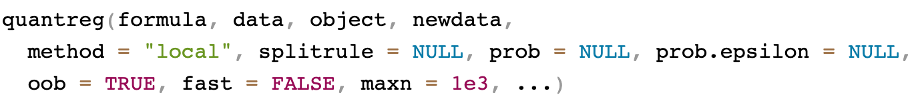{.fragment width="100%"}

## Regression example: Iowa housing {.smaller}

### Quantile regression

``` {.r code-line-numbers="1|2|3"}
o <- quantreg(SalePrice ~ ., housing, splitrule = "mse", ntree = 250)
o <- quantreg(SalePrice ~ ., housing, splitrule = "quantile.regr", ntree = 250)
o <- quantreg(SalePrice ~ ., housing, splitrule = "la.quantile.regr", ntree = 250) # (default)
```

::: columns
::: {.column .fragment width="56%"}
``` r
> o
                         Sample size: 2274
                     Number of trees: 250
           Forest terminal node size: 5
       Average no. of terminal nodes: 263.86
No. of variables tried at each split: 27
              Total no. of variables: 80
       Resampling used to grow trees: swor
    Resample size used to grow trees: 1437
                            Analysis: RF-R
                              Family: regr
                      Splitting rule: la.quantile.regr *random*
       Number of random split points: 10
                     (OOB) R squared: 0.85752024
   (OOB) Requested performance error: 0.02367652
```
:::

::: {.column .fragment width="44%"}
``` r
plot.quantreg(o)
```

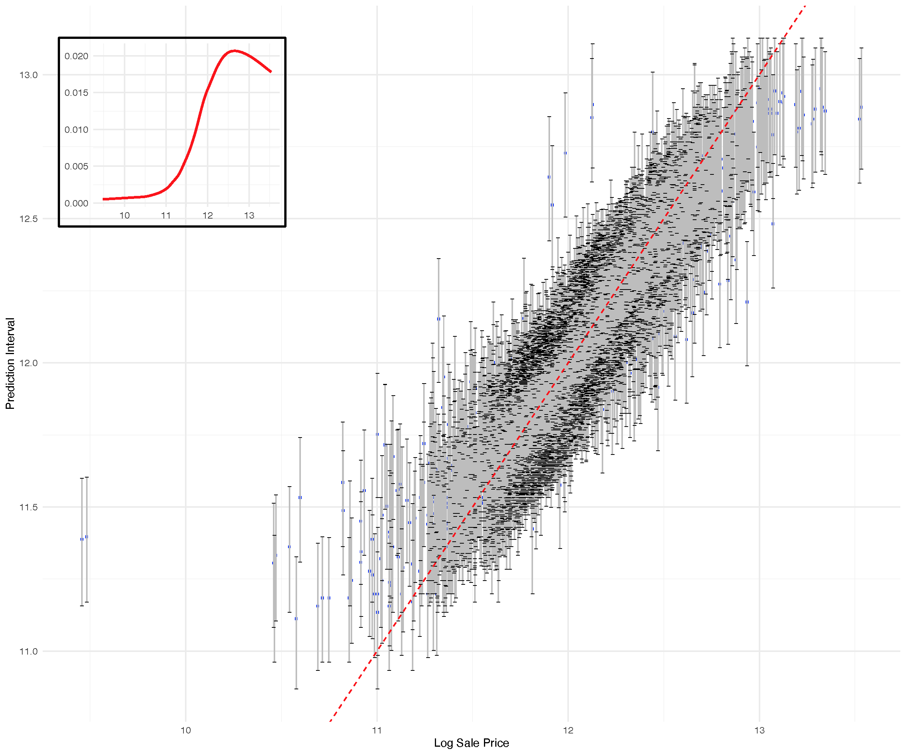{.fragment width="100%"}
:::
:::

## 

<center>
{height=680}
</center>

::: footer

:::

## Regression example: Iowa housing {.smaller}

The key quantities returned by the package are

```{verbatim }
o$quantreg  ---> quantiles for the CDF (extracted by helper function)
```

. . . 

``` {.r code-line-numbers="1-3|5-6|7-8|9-16|17-24|25-32"}
o <- quantreg(SalePrice ~ ., housing)
names(o$quantreg)
> [1] "quantiles" "prob"      "cdf"       "density"   "yunq"     

head(o$quantreg$yunq)
> [1]  9.456341  9.480368 10.463103 10.471950 10.596635 10.714418
head(o$quantreg$prob)
> [1] 0.01 0.02 0.03 0.04 0.05 0.06
head(o$quantreg$cdf[ ,1:5])
>      [,1] [,2]         [,3]         [,4]         [,5]
> [1,]    0    0 0.0008795075 0.0008795075 0.0008795075
> [2,]    0    0 0.0008795075 0.0008795075 0.0008795075
> [3,]    0    0 0.0008795075 0.0008795075 0.0008795075
> [4,]    0    0 0.0008795075 0.0008795075 0.0008795075
> [5,]    0    0 0.0008795075 0.0008795075 0.0008795075
> [6,]    0    0 0.0008795075 0.0008795075 0.0008795075
head(o$quantreg$density[ ,1:5])
>      [,1] [,2]         [,3] [,4] [,5]
> [1,]    0    0 0.0008795075    0    0
> [2,]    0    0 0.0008795075    0    0
> [3,]    0    0 0.0008795075    0    0
> [4,]    0    0 0.0008795075    0    0
> [5,]    0    0 0.0008795075    0    0
> [6,]    0    0 0.0008795075    0    0
head(o$quantreg$quantiles[ ,1:5])
>          [,1]     [,2]     [,3]     [,4]     [,5]
> [1,] 11.53273 11.68658 11.74543 11.77913 11.80560
> [2,] 11.24505 11.40199 11.46163 11.49883 11.52288
> [3,] 11.42954 11.58058 11.64151 11.67844 11.70355
> [4,] 11.81303 11.96285 12.01974 12.05815 12.08108
> [5,] 11.64395 11.79434 11.85296 11.88793 11.91505
> [6,] 11.68856 11.83501 11.89478 11.93164 11.95761
```


## Regression example: Iowa housing {.smaller}

``` {.r code-line-numbers="1-2|3-10|12-17|19-27"}
## (A) extract 25,50,75 quantiles
  quant.dat <- get.quantile(o, c(.25, .50, .75))
  head(quant.dat)
>          q.25     q.50     q.75
> [1,] 12.01673 12.07254 12.13081
> [2,] 11.62536 11.67844 11.73767
> [3,] 11.89341 11.94795 12.00457
> [4,] 12.35017 12.40492 12.46071
> [5,] 12.04614 12.10071 12.15767
> [6,] 12.08954 12.14420 12.20106

## (B) values expected under normality
  quant.stat <- get.quantile.stat(o)
  c.mean <- quant.stat$mean
  c.std <- quant.stat$std
  q.25.est <- c.mean + qnorm(.25) * c.std
  q.75.est <- c.mean + qnorm(.75) * c.std

## compare (A) and (B)
  print(head(data.frame(quant.dat[, -2],  q.25.est, q.75.est)))
>     q.25   q.75 q.25.est q.75.est
> 1 12.01673 12.13081 11.98342 12.15846
> 2 11.62536 11.73767 11.59368 11.76268
> 3 11.89341 12.00457 11.85888 12.03187
> 4 12.35017 12.46071 12.31451 12.49045
> 5 12.04614 12.15767 12.01076 12.18538
> 6 12.08954 12.20106 12.05462 12.22996
```

## Regression example: Iowa housing {.smaller}

### The run.rfsrc function for an overview

Runs rfsrc (`rrfsrc`) on a user's specified data and performs a detailed
analysis including tuning the forests and plotting various quantities
such as performance metrics and variable importance. Applies to
regression, classification, survival, competing risk and multivariate
families

``` {.r }
library(devtools)
devtools::install_github("kogalur/randomForestSRC.run")
```

## Regression example: Iowa housing {.smaller}

``` r
library(randomForestSRC.run)
run.rfsrc(SalePrice ~ ., housing, ntree = 500)
```

. . .

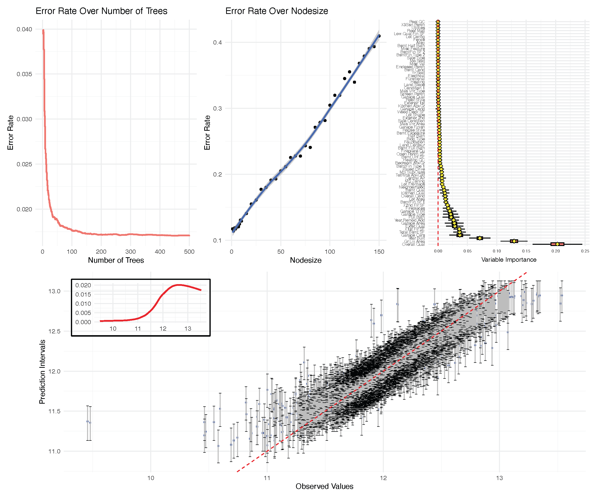{width="60%"}


##

{height=690}

::: footer

::: 

## Classification {.smaller}
<br>

| Family                                                                                                                                       | Example Grow Call with Formula Specification                                                                                                                                                                     |
|--------------------------------------|----------------------------------|
| [Regression]{style="color:#00589b;"} <br> [Quantile Regression]{style="color:#00589b"}                                   | `rfsrc(Ozone~., data = airquality)` <br> `quantreg(mpg~., data = mtcars)`                                                                                |
| [Classification]{.fragment .highlight-blue fragment-index="1"}  <br> Imbalanced Two-Class                                                                                                     | [rfsrc(Species~., data = iris)]{.fragment .highlight-blue fragment-index="1"}  <br> `imbalanced(status~., data = breast)`                                                                                                                                    |
| Survival                                                                                                                                     | `rfsrc(Surv(time, status)~., data = veteran)`                                                                                                                                                                  |
| Competing Risk                                                                                                                               | `rfsrc(Surv(time, status)~., data = wihs)`                                                                                                                                                                     |
| Multivariate Regression <br> Multivariate Mixed Regression <br> Multivariate Quantile Regression <br> Multivariate Mixed Quantile Regression | `rfsrc(Multivar(mpg, cyl)~., data = mtcars)` <br> `rfsrc(cbind(Species,Sepal.Length)~.,data=iris)` <br> `quantreg(cbind(mpg, cyl)~., data = mtcars)` <br> `quantreg(cbind(Species,Sepal.Length)~.,data=iris)` |
| Unsupervised <br> sidClustering <br> Breiman (Shi-Horvath)                                                                                   | `rfsrc(data = mtcars)` <br> `sidClustering(data = mtcars)` <br> `sidClustering(data = mtcars, method = "sh")`                                                                                                    |

: {.striped .border .small}

## Classification {.smaller}
The classification-regression goal is to estimate
$$
F_j(\mathbf{x})=P\{Y=j|\mathbf{X}=\mathbf{x}\}
\hskip10pt \text{for } j=1,\ldots,J
$$
by
minimizing the empirical risk functional, $F=(F_1,\ldots,F_J)$,
$$
R_n(F)=\frac{1}{n}\sum_{i=1}^n L(Y_i, F(\mathbf{x}_i))
$$
using loss functions like Gini impurity, entropy and the Brier
score

## Classification {.smaller}
The classification goal is to classify cases, typically performed
using the Bayes rule (maximal probability)
$$
\delta(\mathbf{x}) = j, \hskip10pt
\text{where } F_j(\mathbf{x})\ge F_{j'},(\mathbf{x})\hskip10pt
j'=1,\ldots,J
$$

The tree node estimator equals the relative frequencies
$$
P\{Y=j|\mathbf{X}\in t\}
=
\dfrac{\text{number of cases in $t$ that are class label $j$}}{\text{number
    of cases in $t$}}
$$

## Key quantities 
The key quantities returned by the package are


```{verbatim }
o$predicted     --->   inbag estimated probabilities
o$predicted.oob --->   OOB estimated probabilities

o$class         --->   inbag class predictions
o$class.oob     --->   OOB class predictions
```


## Classification example: Glioma {.smaller}

Subset of the data used in Ceccarelli et al. (2016) for molecular
profiling of adult diffuse gliomas. It contains 1206 probes from 880
tissues, clinical data and other molecular data. The outcome has class
labels: Classic-like, Codel, G-CIMP-high, G-CIMP-low, LGm6-GBM,
Mesenchymal-like and PA-like [@ceccarelli2016molecular]

```{r}
# install.packages("devtools") # if you have not installed "devtools" package
# devtools::install_github("kogalur/varPro")
data(glioma, package = "varPro") 
gt::gt(head(glioma[1:5,c("y",  "cg23970089","cg25176823", 
                      "cg24576735", "Chr19.20co.gain", "TERT.promoter.status",
                      "SNP6", "U133a","grade","age","gender")]))
```

``` {.r code-line-numbers="1-2|3|4-5"}
# install.packages("devtools") # if you have not installed "devtools" package
devtools::install_github("kogalur/varPro")
data(glioma, package = "varPro") 
dim(glioma)
> [1]  880 1242
```

## Classification example: Glioma {.smaller}

``` {.r code-line-numbers="1|13-14|16-20|22-35"}
o <- rfsrc(y~., data = glioma)
o
                         Sample size: 878
           Frequency of class labels: 148, 174, 249, 25, 41, 215, 26
                     Number of trees: 500
           Forest terminal node size: 1
       Average no. of terminal nodes: 74.302
No. of variables tried at each split: 36
              Total no. of variables: 1241
       Resampling used to grow trees: swor
    Resample size used to grow trees: 555
                            Analysis: RF-C
                              Family: class
                      Splitting rule: gini *random*
       Number of random split points: 10
                   (OOB) Brier score: 0.02333115
        (OOB) Normalized Brier score: 0.19053769
                           (OOB) AUC: 0.99304797
                      (OOB) Log-loss: 0.34115074
   (OOB) Requested performance error: 0.07061503, 0.06756757, 0.01149425, 0.00803213, 0.52, 0.53658537, 0.04651163, 0.11538462

Confusion matrix:

                  predicted
  observed         Classic-like Codel G-CIMP-high G-CIMP-low LGm6-GBM Mesenchymal-like PA-like class.error
  Classic-like              138     0           0          0        0               10       0      0.0676
  Codel                       0   172           2          0        0                0       0      0.0115
  G-CIMP-high                 0     2         247          0        0                0       0      0.0080
  G-CIMP-low                  0     0          13         12        0                0       0      0.5200
  LGm6-GBM                    0     0           1          0       19               21       0      0.5366
  Mesenchymal-like           11     0           0          0        0              204       0      0.0512
  PA-like                     0     0           0          0        0                3      23      0.1154

      (OOB) Misclassification rate: 0.07175399
```

::: callout-tip
## Tip

`rfsrc` recognize classification problem automatically when the outcome
is a factor
:::

::: footer
:::

## Key quantities {.smaller}
The key quantities returned by the package are


```{verbatim }
o$predicted     --->   inbag estimated probabilities
o$predicted.oob --->   OOB estimated probabilities

o$class         --->   inbag class predictions
o$class.oob     --->   OOB class predictions
```

. . . 

``` {.r code-line-numbers="1-7|8-14|16-17|19-20|"}
o$predicted[1:5,]     # --->   inbag estimated probabilities
>      Classic-like Codel G-CIMP-high G-CIMP-low LGm6-GBM Mesenchymal-like PA-like
> [1,]        0.006 0.002       0.000      0.004    0.084            0.892   0.012
> [2,]        0.136 0.008       0.000      0.004    0.014            0.832   0.006
> [3,]        0.064 0.004       0.008      0.010    0.018            0.892   0.004
> [4,]        0.928 0.008       0.004      0.004    0.002            0.054   0.000
> [5,]        0.936 0.000       0.000      0.002    0.000            0.062   0.000
o$predicted.oob[1:5,] # --->   OOB estimated probabilities
>      Classic-like       Codel G-CIMP-high  G-CIMP-low    LGm6-GBM Mesenchymal-like    PA-like
> [1,]   0.01840491 0.006134969  0.00000000 0.012269939 0.257668712        0.6687117 0.03680982
> [2,]   0.38857143 0.022857143  0.00000000 0.011428571 0.040000000        0.5200000 0.01714286
> [3,]   0.17391304 0.010869565  0.02173913 0.027173913 0.048913043        0.7065217 0.01086957
> [4,]   0.81443299 0.020618557  0.01030928 0.010309278 0.005154639        0.1391753 0.00000000
> [5,]   0.82222222 0.000000000  0.00000000 0.005555556 0.000000000        0.1722222 0.00000000

o$class[1:5]       #  --->   inbag class predictions
> [1] Mesenchymal-like Mesenchymal-like Mesenchymal-like Classic-like     Classic-like    

o$class.oob[1:5]   #  --->   OOB class predictions
> [1] Mesenchymal-like Mesenchymal-like Mesenchymal-like Classic-like     Classic-like  
``` 

::: footer

:::


## Classification example: Glioma {.smaller}

### Split rules

| Family                                                                                                                                                                        | `splitrule`                                                                              |
|--------------------------------------|----------------------------------|
| Regression <br> Quantile Regression                                                                                                                                           | `mse` <br> `la.quantile.regr, quantile.regr, mse`                                        |
| [Classification ]{style="color:#00589b; font-weight: bold;"}   <br> Imbalanced Two-Class                                                                                      | [gini, auc, entropy ]{style="color:#00589b; font-weight: bold;"}  <br> `gini, auc, entropy`|
| Survival                                                                                                                                                                      | `logrank, bs.gradient, logrankscore`                                                     |
| Competing Risk                                                                                                                                                                | `logrankCR, logrank`                                                                     |
| Multivariate Regression <br> Multivariate Classification <br> Multivariate Mixed Regression <br> Multivariate Quantile Regression <br> Multivariate Mixed Quantile Regression | `mv.mse, mahalanobis` <br> `mv.gini` <br> `mv.mix` <br> `mv.mse` <br> `mv.mix`           |
| Unsupervised <br> sidClustering <br> Breiman (Shi-Horvath)                                                                                                                    | `unsupv` <br> $\{$`mv.mse, mv.gini, mv.mix`$\}$, `mahalanobis` <br> `gini, auc, entropy` |

: {.striped .border .small}

## Classification example: Glioma {.smaller}

### Split rules: Gini index splitting (default)

``` {.r code-line-numbers="2|14-15|16-21"}
o <- rfsrc(y~., data = glioma,
           splitrule="gini") ## default splitrule as in the previous slide
o
                         Sample size: 878
           Frequency of class labels: 148, 174, 249, 25, 41, 215, 26
                     Number of trees: 500
           Forest terminal node size: 1
       Average no. of terminal nodes: 74.302
No. of variables tried at each split: 36
              Total no. of variables: 1241
       Resampling used to grow trees: swor
    Resample size used to grow trees: 555
                            Analysis: RF-C
                              Family: class
                      Splitting rule: gini *random*
       Number of random split points: 10
                   (OOB) Brier score: 0.02333115
        (OOB) Normalized Brier score: 0.19053769
                           (OOB) AUC: 0.99304797
                      (OOB) Log-loss: 0.34115074
   (OOB) Requested performance error: 0.07061503, 0.06756757, 0.01149425, 0.00803213, 0.52, 0.53658537, 0.04651163, 0.11538462
```

See Chapter 4.3 in Breiman et al. 1984 [@Breiman1984]

## Classification example: Glioma {.smaller}

### Split rules: AUC (area under the ROC curve)

``` {.r code-line-numbers="2|14-15|16-21"}
o <- rfsrc(y~., data = glioma,
           splitrule="auc")
o
                         Sample size: 878
           Frequency of class labels: 148, 174, 249, 25, 41, 215, 26
                     Number of trees: 500
           Forest terminal node size: 1
       Average no. of terminal nodes: 434.522
No. of variables tried at each split: 36
              Total no. of variables: 1241
       Resampling used to grow trees: swor
    Resample size used to grow trees: 555
                            Analysis: RF-C
                              Family: class
                      Splitting rule: auc *random*
       Number of random split points: 10
                   (OOB) Brier score: 0.04799401
        (OOB) Normalized Brier score: 0.39195105
                           (OOB) AUC: 0.97510083
                      (OOB) Log-loss: 0.62743109
   (OOB) Requested performance error: 0.16514806, 0.25675676, 0.09770115, 0.01606426, 0.84, 0.97560976, 0.04651163, 0.57692308
```

::: {.callout-tip .fragment .fade-up}
## Tip

AUC splitting is appropriate for imbalanced data
:::

::: footer
:::

## Classification example: Glioma {.smaller}

### Split rules: entropy splitting

``` {.r code-line-numbers="2|14-15|16-21"}
o <- rfsrc(y~., data = glioma,
           splitrule="entropy")
o
                         Sample size: 878
           Frequency of class labels: 148, 174, 249, 25, 41, 215, 26
                     Number of trees: 500
           Forest terminal node size: 1
       Average no. of terminal nodes: 287.266
No. of variables tried at each split: 36
              Total no. of variables: 1241
       Resampling used to grow trees: swor
    Resample size used to grow trees: 555
                            Analysis: RF-C
                              Family: class
                      Splitting rule: entropy *random*
       Number of random split points: 10
                   (OOB) Brier score: 0.04504941
        (OOB) Normalized Brier score: 0.36790354
                           (OOB) AUC: 0.96636193
                      (OOB) Log-loss: 0.64571496
   (OOB) Requested performance error: 0.15148064, 0.16216216, 0.04022989, 0.01204819, 0.72, 1, 0.10232558, 0.69230769
```

See Chapters 2.5 and 4.3 in Breiman et al. 1984 [@Breiman1984]

## The run.rfsrc function for an overview {.smaller}

``` r
run.rfsrc(y~., data = glioma)
```

. . .

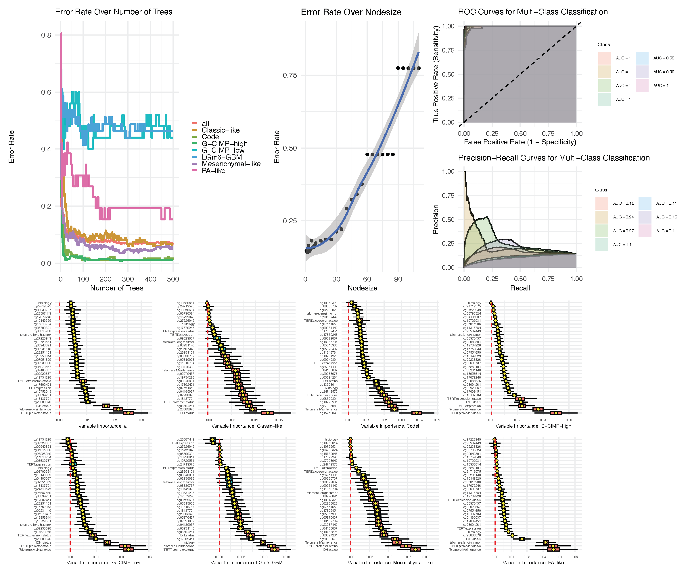{width="60%"}


##

{height=690}

::: footer

:::


## Survival {.smaller}

| Family                                                                                                                                       | Example Grow Call with Formula Specification                                                                                                                                                                     |
|--------------------------------------|----------------------------------|
| [Regression]{style="color:#00589b"}  <br> [Quantile Regression]{style="color:#00589b"}                                                                                                             | `rfsrc(Ozone~., data = airquality)` <br> `quantreg(mpg~., data = mtcars)`                                                                                                                                     |
| [Classification]{style="color:#00589b"}  <br> Imbalanced Two-Class                                                                                                     | `rfsrc(Species~., data = iris)` <br> `imbalanced(status~., data = breast)`                                                                                                                                    |
| [Survival]{.fragment .highlight-blue fragment-index="1"}                                                                                         | [rfsrc(Surv(time, status)~., data = veteran)]{.fragment .highlight-blue fragment-index="1"}                                                                                                                                       |
| Competing Risk                                                                                                                               | `rfsrc(Surv(time, status)~., data = wihs)`                                                                                                                                                                     |
| Multivariate Regression <br> Multivariate Mixed Regression <br> Multivariate Quantile Regression <br> Multivariate Mixed Quantile Regression | `rfsrc(Multivar(mpg, cyl)~., data = mtcars)` <br> `rfsrc(cbind(Species,Sepal.Length)~.,data=iris)` <br> `quantreg(cbind(mpg, cyl)~., data = mtcars)` <br> `quantreg(cbind(Species,Sepal.Length)~.,data=iris)` |
| Unsupervised <br> sidClustering <br> Breiman (Shi-Horvath)                                                                                   | `rfsrc(data = mtcars)` <br> `sidClustering(data = mtcars)` <br> `sidClustering(data = mtcars, method = "sh")`                                                                                                    |

: {.striped .border .small}


## Survival {.smaller}
In survival one of the primary goals is estimating the survival
function
$$
S(t|\mathbf{X}=\mathbf{x}) = P\{T^o\ge t|\mathbf{X}=\mathbf{x}\}
$$
where $T^o$ is the survival time

Random survival forests [@Ishwaran2008] uses the KM (Kaplan-Meier) estimator
with the general estimation strategy (product limit estimator)
$$
S(t)
= S(t_1) \times S(t_2|t_1) \times \cdots \times S(t_M|t_{M-1})
$$
with
$$
S(t_j|t_{j-1}) =
\frac{\text{number surviving beyond $t=t_j$}}{\text{number surviving beyond $t>t_{j-1}$}}.
$$

## Survival {.smaller}
This deals with *generalized Type-I censoring* where
patients enter a study at different times and 
length of follow-up time varies for each patient and where
time of event is unobserved for some patients due to the study ending

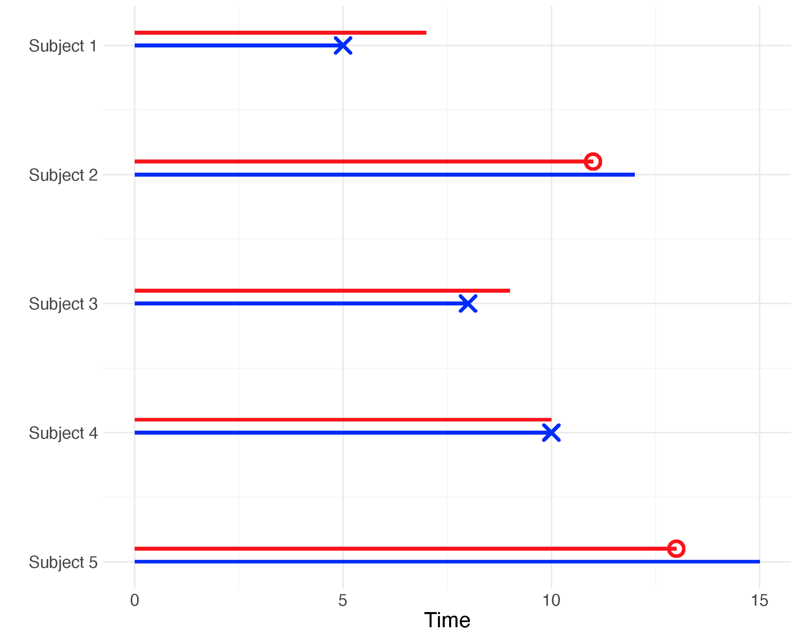{width="60%"}

## Survival {.smaller}

The tree node estimator is the KM estimator.  Tree nodes are split
using the log-rank statistic

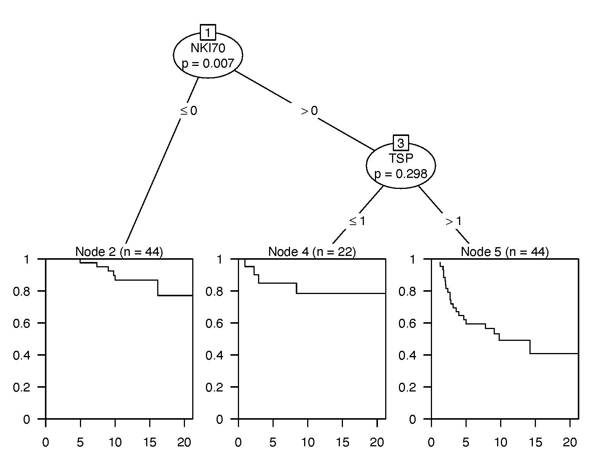{width="60%"}

## Key quantities 

The key quantities returned by the package are

```{verbatim }
o$time.interest --->   event times (everything keys off this)

o$predicted     --->   inbag estimated mortality
o$predicted.oob --->   OOB estimated mortality

o$survival      --->   inbag survival estimator for each case
o$survival.oob  --->   OOB survival estimator for each case

o$chf          --->    inbag CHF estimator for each case
o$chf.oob      --->    OOB CHF estimator for each case
```


## Survival example: PBC Mayo Clinic {.smaller}

This data is from the Mayo Clinic trial in Primary Biliary Cirrhosis 
(PBC) conducted between 1974 and 1984. Among the total 424 PBC patients,
the first 312 cases participated in a randomized placebo controlled
trial of the drug D-penicillamine with largely complete data. The
additional 112 cases did not participate in the clinical trial, but
consented to have basic measurements and to be followed for survival
[@Therneau2000modeling]

```{r}
data(pbc, package = "survival")  
gt::gt(head(pbc))
```

``` {.r code-line-numbers="1|2-3"}
data(pbc, package = "survival")  
dim(pbc)
> [1] 418  20
```

## Survival example: PBC Mayo Clinic {.smaller}

``` {.r code-line-numbers="1-4|6-8|20-21"}
pbc$id <- NULL ## remove the ID
## keep the original competing risk framework for later
## status at endpoint, 0/1/2 for censored, transplant, dead
pbc.cr <- pbc

## convert to right-censoring with death as the event
pbc$status[pbc$status > 0] <- 1
o <- rfsrc(Surv(time, status) ~ ., data = pbc)
o
                         Sample size: 276
                    Number of deaths: 129
                     Number of trees: 500
           Forest terminal node size: 15
       Average no. of terminal nodes: 14.326
No. of variables tried at each split: 5
              Total no. of variables: 17
       Resampling used to grow trees: swor
    Resample size used to grow trees: 174
                            Analysis: RSF
                              Family: surv
                      Splitting rule: logrank *random*
       Number of random split points: 10
                          (OOB) CRPS: 553.15107271
                   (OOB) stand. CRPS: 0.13198546
   (OOB) Requested performance error: 0.18814768
```


## Key quantities {.smaller}
```{verbatim }
o$time.interest --->   event times (everything keys off this)
```
. . .

``` {.r}
o$time.interest[1:5]
> [1]  41  51  71  77 110
``` 

. . .

<br>

```{verbatim }
o$predicted     --->   inbag estimated mortality
o$predicted.oob --->   OOB estimated mortality
```

. . .

``` {.r code-line-numbers="1-2|4-5"}
o$predicted[1:5]
> [1] 200.83450  17.07501  76.31131  57.77577  79.27206

o$predicted.oob[1:5]
> [1] 190.04590  28.05044  66.25447  55.03181  72.55308
``` 

. . .

<br>

```{verbatim }
o$survival      --->   inbag survival estimator for each case
o$survival.oob  --->   OOB survival estimator for each case
```

. . .

``` {.r code-line-numbers="1-4|5-8"}
dim(o$yvar) ## sample size (complete cases) n = 276
> [1] 276   2
length(o$time.interest)
> [1] 127
dim(o$survival)      # --->   inbag survival estimator for each case
> [1] 276 127
dim(o$survival.oob)  # --->   OOB survival estimator for each case
> [1] 276 127
```

::: footer

:::

## Key quantities {.smaller}
```{verbatim }
o$survival      --->   inbag survival estimator for each case
o$survival.oob  --->   OOB survival estimator for each case
```

::: columns
::: {.column width="50%"}

``` {.r code-line-numbers="6-19"}
dim(o$survival)      # --->   inbag survival estimator for each case
> [1] 276 127
dim(o$survival.oob)  # --->   OOB survival estimator for each case
> [1] 276 127

o$survival[1:5, 1:5]
>           [,1]      [,2]      [,3]      [,4]      [,5]
> [1,] 0.9600951 0.9125329 0.9002843 0.8725504 0.8423145
> [2,] 1.0000000 0.9999167 0.9997543 0.9996710 0.9995136
> [3,] 0.9959351 0.9921702 0.9877700 0.9782302 0.9768478
> [4,] 0.9954334 0.9906795 0.9871662 0.9857532 0.9841598
> [5,] 1.0000000 0.9998401 0.9967281 0.9947621 0.9946241
o$survival.oob[1:5, 1:5]
>           [,1]      [,2]      [,3]      [,4]      [,5]
> [1,] 0.9655403 0.9160407 0.9050698 0.8755058 0.8428749
> [2,] 1.0000000 1.0000000 0.9995281 0.9995281 0.9995281
> [3,] 0.9957842 0.9926934 0.9881592 0.9768084 0.9752430
> [4,] 0.9942668 0.9873056 0.9850606 0.9838238 0.9819504
> [5,] 1.0000000 1.0000000 0.9962979 0.9942830 0.9939347
``` 
:::
::: {.column width="50%" .fragment}
``` {.r}
## plot survival curves for first 10 individuals 
matplot(o$time.interest, 
        100 * t(o$survival.oob[1:10, ]),
        xlab = "Time", ylab = "Survival", type = "l", lty = 1)
``` 
<center>
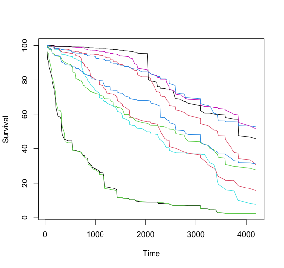{width="80%" .fragment}
</center>
:::
:::

## Key quantities {.smaller}
```{verbatim }
o$chf          --->    inbag CHF estimator for each case
o$chf.oob      --->    OOB CHF estimator for each case
```

::: columns
::: {.column width="50%"}

``` {.r code-line-numbers="1-4|6-19"}
dim(o$chf) 
> [1] 276 127
dim(o$chf.oob) 
> [1] 276 127
o$chf[1:5, 1:5]
>             [,1]         [,2]        [,3]         [,4]         [,5]
> [1,] 0.039904941 8.981063e-02 0.103197429 0.1338071668 0.1686493781
> [2,] 0.000000000 8.333333e-05 0.000245671 0.0003326275 0.0004976107
> [3,] 0.004064919 7.977572e-03 0.012491370 0.0227012085 0.0244150195
> [4,] 0.004566626 9.643876e-03 0.013209059 0.0146954141 0.0163487486
> [5,] 0.000000000 1.598746e-04 0.003271896 0.0052661647 0.0054040957
o$chf.oob[1:5, 1:5]
>             [,1]        [,2]         [,3]         [,4]         [,5]
> [1,] 0.034459694 0.085894243 0.0978252512 0.1301985027 0.1682733452
> [2,] 0.000000000 0.000000000 0.0004719118 0.0004719118 0.0004719118
> [3,] 0.004215783 0.007519603 0.0122166452 0.0244321624 0.0264688132
> [4,] 0.005733225 0.013259881 0.0155376855 0.0168153866 0.0187680623
> [5,] 0.000000000 0.000000000 0.0037021133 0.0057619372 0.0061102479
``` 
:::
::: {.column width="50%" .fragment}
``` {.r}
## plot survival curves for first 10 individuals 
matplot(o$time.interest, 
        100 * t(o$survival.oob[1:10, ]),
        xlab = "Time", ylab = "Survival", type = "l", lty = 1)
``` 
<center>
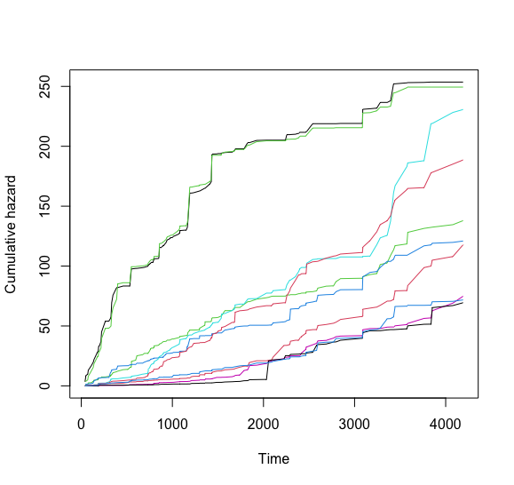{width="80%" .fragment}
</center>
:::
:::


## Survival example: PBC Mayo Clinic {.smaller}

### Split rules

| Family                                                                                                                                                                        | `splitrule`                                                                              |
|--------------------------------------|----------------------------------|
| Regression <br> Quantile Regression                                                                                                                                           | `mse` <br> `la.quantile.regr, quantile.regr, mse`                                        |
| Classification <br> Imbalanced Two-Class                                                                                                                                      | gini, auc, entropy <br> gini, auc, entropy                                               |
| [Survival]{style="color:#00589b; font-weight: bold;"}                                                                                                                         | [logrank, bs.gradient, logrankscore]{style="color:#00589b; font-weight: bold;"}          |
| Competing Risk                                                                                                                                                                | `logrankCR, logrank`                                                                     |
| Multivariate Regression <br> Multivariate Classification <br> Multivariate Mixed Regression <br> Multivariate Quantile Regression <br> Multivariate Mixed Quantile Regression | `mv.mse, mahalanobis` <br> `mv.gini` <br> `mv.mix` <br> `mv.mse` <br> `mv.mix`           |
| Unsupervised <br> sidClustering <br> Breiman (Shi-Horvath)                                                                                                                    | `unsupv` <br> $\{$`mv.mse, mv.gini, mv.mix`$\}$, `mahalanobis` <br> `gini, auc, entropy` |

: {.striped .border .small}

## Split rules {.smaller}

#### log-rank splitting [@Segal1988] (default)

``` {.r code-line-numbers="2|15|17-19"}
o <- rfsrc(Surv(time, status) ~ ., data = pbc, 
                  splitrule="logrank") ## default splitrule
o
                         Sample size: 276
                    Number of deaths: 129
                     Number of trees: 500
           Forest terminal node size: 15
       Average no. of terminal nodes: 14.326
No. of variables tried at each split: 5
              Total no. of variables: 17
       Resampling used to grow trees: swor
    Resample size used to grow trees: 174
                            Analysis: RSF
                              Family: surv
                      Splitting rule: logrank *random*
       Number of random split points: 10
                          (OOB) CRPS: 553.15107271
                   (OOB) stand. CRPS: 0.13198546
   (OOB) Requested performance error: 0.18814768
```


## Split rules {.smaller}

#### Gradient-based brier score splitting

``` {.r code-line-numbers="2|15|17-19"}
o <- rfsrc(Surv(time, status) ~ ., data = pbc, 
                  splitrule="bs.gradient")
o
                         Sample size: 276
                    Number of deaths: 129
                     Number of trees: 500
           Forest terminal node size: 15
       Average no. of terminal nodes: 13.226
No. of variables tried at each split: 5
              Total no. of variables: 17
       Resampling used to grow trees: swor
    Resample size used to grow trees: 174
                            Analysis: RSF
                              Family: surv
                      Splitting rule: bs.gradient *random*
       Number of random split points: 10
                          (OOB) CRPS: 570.11311519
                   (OOB) stand. CRPS: 0.13603272
   (OOB) Requested performance error: 0.19299269
```

::: {.callout-tip .fragment .fade-up}
## Tip

The time horizon used for the Brier score is set to the 90th percentile of the observed event times. This can be over-ridden by the option prob, which must be a value between 0 and 1 (set to .90 by default)
:::

::: footer
:::

## Split rules {.smaller}

#### log-rank score splitting [@hothorn2003exact]

``` {.r code-line-numbers="2|15|17-19"}
o <- rfsrc(Surv(time, status) ~ ., data = pbc, 
                  splitrule="logrankscore")
o
                         Sample size: 276
                    Number of deaths: 129
                     Number of trees: 500
           Forest terminal node size: 15
       Average no. of terminal nodes: 13.46
No. of variables tried at each split: 5
              Total no. of variables: 17
       Resampling used to grow trees: swor
    Resample size used to grow trees: 174
                            Analysis: RSF
                              Family: surv
                      Splitting rule: logrankscore *random*
       Number of random split points: 10
                          (OOB) CRPS: 626.32256755
                   (OOB) stand. CRPS: 0.14944466
   (OOB) Requested performance error: 0.19231977
```


## The run.rfsrc function for an overview {.smaller}

``` r
run.rfsrc(Surv(time, status) ~ ., data = pbc)
```

. . .

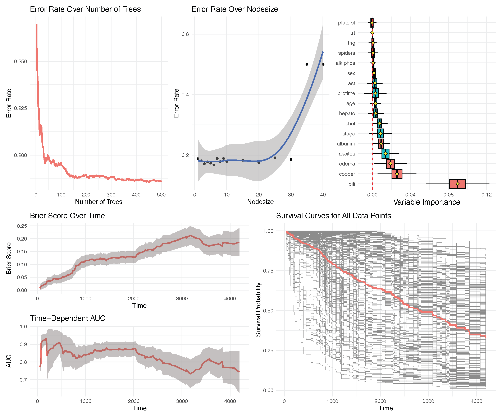{width="60%"}


##

{height=690}

::: footer

:::

## Outline  { .smaller background-color="azure"}

::: columns

::: {.column width="47.5%"}
#### [Part I: Training](https://luminwin.github.io/shortCourse/presentationPartI.html)

1.	Quick start
2.	Data structures allowed
3.	Training (grow) with examples <br>(regression, classification, survival)

#### [Part II:  Inference and Prediction](https://luminwin.github.io/shortCourse/presentationPartII.html)

1.	Inference (OOB)
2.	Prediction Error
3.	Prediction
4.	Restore
5.	Partial Plots
:::

::: {.column width="5%"}

:::

::: {.column width="47.5%" }
#### [Part III: Variable Selection](https://luminwin.github.io/shortCourse/presentationPartIII.html)

1.	VIMP
2.	Subsampling (Confidence Intervals)
3.	Minimal Depth
4.	VarPro

#### [Part IV:  Advanced Examples](https://luminwin.github.io/shortCourse/presentationPartIV.html)

1.	Class Imbalanced Data
2.	Competing Risks
3.	Multivariate Forests
:::
:::

## References
