## Inference {.smaller}

Family | Terminal Node Statistics, *Prediction*|
|---------------|-------------|
|Regression  <br> Quantile Regression       | mean, *mean* <br> quantiles, moments, *mean*|
|Classification <br> Imbalanced Two-Class | class proportions, *class proportions*, *Bayes classifier* <br> class proportions, *class proportions, q-classifier*|
|Survival | Kaplan-Meier survival, Nelson-Aalen CHF, *mortality*|
|Competing Risk |  cause-specific CHF, cause-specific CIF, <br>  *event-specific expected number of years lost*|
|Multivariate Regression <br> Multivariate Classification <br> $\quad$ <br> Multivariate Mixed Regression <br> Multivariate Quantile Regression| per response: mean, *mean* <br> per response: class proportions,<br> *class proportions, Bayes classifier* <br> same as above for Regression, Classification <br> per response: quantiles, *mean*|
|Unsupervised <br> sidClustering <br> Breiman (Shi-Horvath)| none <br> same as Multivariate Mixed Regression <br> same as Classification|

: {.striped .border .small}


## Inference {.smaller}
RF actually produces two ensembles!

The inbag ensemble is the averaged ensemble over the trained trees,
where each tree is trained by a subsampled (bootstrap data)
$$
F_{\!\text{ens}}(\mathbf{x})
=\frac{1}{B}\sum_{b=1}^B h^*_b(\mathbf{x})
$$

The out-of-bag (OOB) ensemble is case-specific.  For case $i$, the
average is taken over trees where $i$ is OOB
$$
F_{\!\text{ens}}^{(i)}
=\frac{1}{\#O_i}\sum_{b\in O_i} h^*_b(\mathbf{x}_i),\hskip10pt
\#O_i\approx .368 B
$$

. . . 

The inbag ensemble is used for prediction on test data.  The OOB ensemble is used
for inference

## OOB ensemble {.smaller}

1. Equivalent to a leave-one-out (loo) bootstrap estimator [@efron1997improvements].  Therefore
it can be used for estimating generalization error
$$
\text{Err}
= \frac{1}{n}\sum_{i=1}^n L(Y_i, F_{\!\text{ens}}^{(i)})
$$
For example, for regression
$$
\text{Prediction Error}
= \frac{1}{n}\sum_{i=1}^n (Y_i-F_{\!\text{ens}}^{(i)})^2
$$

. . . 

2. Avoids the need for cross-validation.  Very convenienty for prediction error
and for tuning the forest.

. . . 

3. Provides cross-validated estimator for model -- a unique feature not seen
with other ML methods

::: footer

:::


## OOB classification example: Glioma {.smaller}

```{r}
data(glioma, package = "varPro") 
gt::tab_style_body(data = gt::gt(glioma[c(1:2,5:7),c("y", "cg11012046", "cg21859434","cg23970089","cg25176823", 
               "cg24576735", "age","cg19099850", "cg17403875", "cg24078828")]),
                   fn = function(x) is.factor(x),
                   style = gt::cell_fill(color = "lightblue")
               )
```

#### The key quantities returned by the package are
```{verbatim }
o$predicted     --->   inbag estimated probabilities
o$predicted.oob --->   OOB estimated probabilities

o$class         --->   inbag class predictions
o$class.oob     --->   OOB class predictions
```
<br>

::: {.fragment .fade-left}
``` {.r code-line-numbers="1-2|3-4|5-6"}
o <- rfsrc(y~., data = glioma)
mean(o$class!=o$yvar)
> [1] 0
# inbag misclassification is zero!
mean(o$class.oob!=o$yvar)
> [1] 0.0671982
``` 
::: 

## OOB classification example: Glioma {.smaller}

[Tune [nodesize]{.fragment
.highlight-blue fragment-index="1"}
]{style="color:#00589b; font-size:50px;font-weight: bold;"}

::: columns
::: {.column width="5%"}
rfsrc(
:::

::: {.column width="95%"}
formula, data, ntree = 500, mtry = NULL, ytry = NULL, [nodesize =
NULL]{.fragment .highlight-blue fragment-index="1"}, ...)
:::
:::

::: columns
::: {.column width="60%"}
::: {.fragment .fade-in-then-semi-out fragment-index="2"}
`nodesize` sets the minumum size of terminal, default values are:

<hr style="margin: 2px; visibility:hidden;" />

  15 for survival<br>   15 for competing risk<br>   5 for regression<br>
  1 for classification<br>   3 for mixed outcomes<br>   3 for
unsupervised

<hr style="margin: 2px; visibility:hidden;" />

We can use `tune.nodesize()`
:::

::: {.fragment .fade-up fragment-index="3"}
``` {.r }
o <- tune.nodesize(y~., data = glioma)
o$nsize.opt
> [1] 3
```
:::
:::

::: {.column .fragment .fade-up width="40%" fragment-index="3"}
``` {.r code-line-numbers="1-24|8-31"}
nodesize =  1    error = 11.95% 
nodesize =  2    error = 8.85% 
nodesize =  3    error = 8.41% 
nodesize =  4    error = 12.83% 
nodesize =  5    error = 11.5% 
nodesize =  6    error = 14.6% 
nodesize =  7    error = 12.83% 
nodesize =  8    error = 15.49% 
nodesize =  9    error = 14.6% 
nodesize =  10    error = 17.26% 
nodesize =  15    error = 15.04% 
nodesize =  20    error = 18.14% 
nodesize =  25    error = 18.14% 
nodesize =  30    error = 22.57% 
nodesize =  35    error = 27.43% 
nodesize =  40    error = 28.32% 
nodesize =  45    error = 32.3% 
nodesize =  50    error = 34.51% 
nodesize =  55    error = 50.88% 
nodesize =  60    error = 50.88% 
nodesize =  65    error = 50.88% 
nodesize =  70    error = 50.88% 
nodesize =  75    error = 50.88% 
nodesize =  80    error = 50.88% 
nodesize =  85    error = 50.88% 
nodesize =  90    error = 74.34% 
nodesize =  95    error = 74.34% 
nodesize =  100    error = 74.34% 
nodesize =  105    error = 74.34% 
nodesize =  110    error = 74.34% 
optimal nodesize: 3 
```
:::
:::

::: footer

:::

## OOB survival example: PBC Mayo Clinic {.smaller}

::: {.fragment .fade-left}
```{verbatim}
o$survival      --->   inbag survival estimator for each case
o$survival.oob  --->   OOB survival estimator for each case
```
:::

::: columns
::: {.column width="40%" .fragment .fade-left}
``` {.r code-line-numbers="14,18,21"}
## load the PBC data
data(pbc, package="survival")

## remove the ID
pbc$id <- NULL

## convert to right-censoring with death as the event
pbc$status[pbc$status > 0] <- 1

## default RSF call
o <- rfsrc(Surv(time, status)~., pbc)

## choose some cases
idx <- c(11,34,60)

## plot the curves
matplot(o$time.interest, 
        t(o$survival[idx,]), type = "l", col=4, lwd=3,
        xlab = "Days", ylab = "Survival")
matlines(o$time.interest, 
        t(o$survival.oob[idx,]), type = "l", col=2, lwd=3)
legend("bottomleft", legend = c("inbag", "oob"), fill = c(4,2))
```
:::
::: {.column width="60%" .fragment .fade-left}
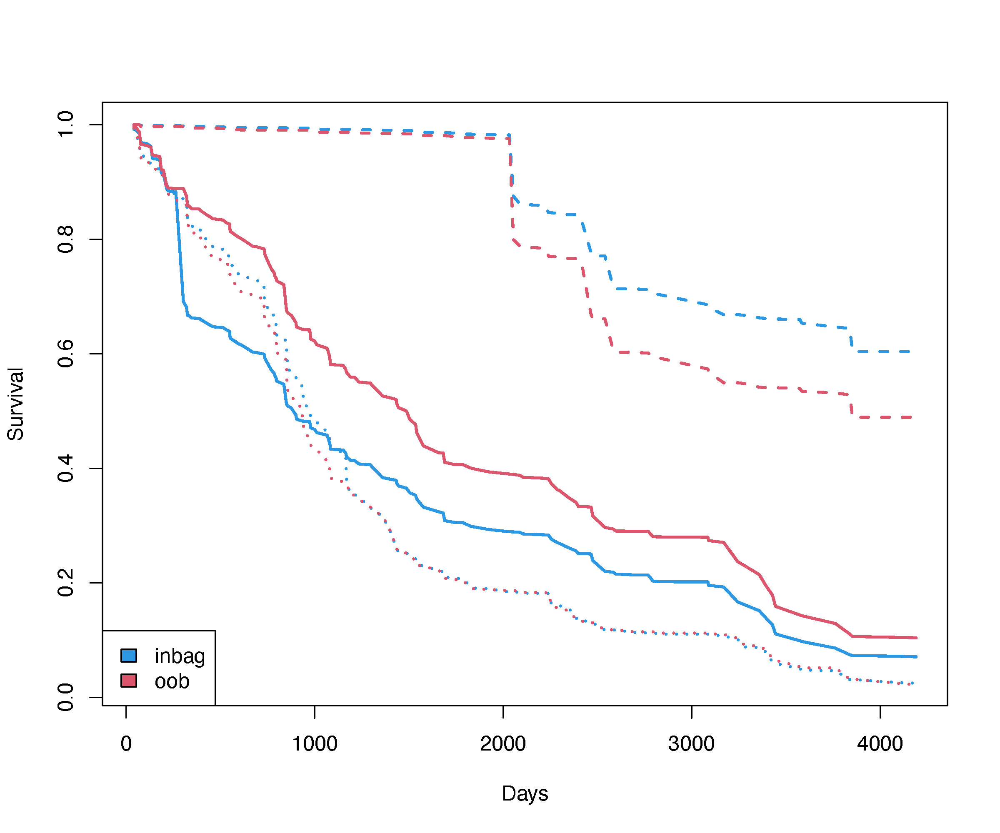{width="105%"}
:::
:::

::: footer
:::

## Prediction error {.smaller}

<hr style="margin: 10px; visibility:hidden;" />

Family | Prediction Error |
|------|-------------|
|Regression  <br>   Quantile Regression      |  mean-squared error <br> mean-squared error| 
|Classification  <br> Imbalanced Two-Class |  misclassification, Brier score <br> G-mean, misclassification, Brier score| 
|Survival  |   Harrell's C-index (1 minus concordance) | 
|Competing Risk  |   Harrell's C-index (1 minus concordance) | 
|Multivariate Regression <br> Multivariate Classification <br> Multivariate Mixed Regression <br> Multivariate Quantile Regression |  per response: same as above for Regression <br> per response: same as above for Classification <br> per response: same as above for Regression, Classification <br> same as Multivariate Regression| 
|Unsupervised <br> sidClustering <br> Breiman (Shi-Horvath) | none <br> same as Multivariate Mixed Regression <br> same as Classification| 

: {.striped .border .small}

## Prediction error for classification

Error rate for the chosen performance metric is always available in
`obj$err.rate`, however any error rate can be calculated using
`obj$yvar` with `obj$predicted.oob` or `obj$class.oob`


1. Misclassification error: `get.misclass.error`
2. Brier error: `get.brier.error`
3. Log-loss (cross-entropy loss) `:::get.logloss`
4. AUC: `get.auc`


## Classification example: Glioma {.smaller}

#### Different prediction measures

``` {.r code-line-numbers="5"}
                   (OOB) Brier score: 0.02333115
        (OOB) Normalized Brier score: 0.19053769
                           (OOB) AUC: 0.99304797
                      (OOB) Log-loss: 0.34115074
   (OOB) Requested performance error: 0.07061503, 0.06756757, 0.01149425, 0.00803213, 0.52, 0.53658537, 0.04651163, 0.11538462
```

``` {.r .fragment}
tail(o$err.rate, 1)

>               all Classic-like      Codel G-CIMP-high G-CIMP-low  LGm6-GBM Mesenchymal-like   PA-like
> [500,] 0.07403189   0.05405405 0.01149425 0.008032129       0.56 0.4878049        0.0744186 0.1153846
```

## Classification example: Glioma {.smaller}

#### Different prediction measures
::: {.r-stack}

```{r}
# install.packages("devtools") # if you have not installed "devtools" package
# devtools::install_github("kogalur/varPro")
data(glioma, package = "varPro") 
gt::gt(head(glioma[1:5,c("y",  "cg23970089","cg25176823", 
                      "cg24576735", "Chr19.20co.gain", "TERT.promoter.status",
                      "SNP6", "U133a","grade","age","gender")]))
```

``` {.r code-line-numbers="2,21" .fragment}
o <- rfsrc(y~., data = glioma,
           perf.type = "misclass") ## default
o
                         Sample size: 878
           Frequency of class labels: 148, 174, 249, 25, 41, 215, 26
                     Number of trees: 500
           Forest terminal node size: 1
       Average no. of terminal nodes: 74.302
No. of variables tried at each split: 36
              Total no. of variables: 1241
       Resampling used to grow trees: swor
    Resample size used to grow trees: 555
                            Analysis: RF-C
                              Family: class
                      Splitting rule: gini *random*
       Number of random split points: 10
                   (OOB) Brier score: 0.02333115
        (OOB) Normalized Brier score: 0.19053769
                           (OOB) AUC: 0.99304797
                      (OOB) Log-loss: 0.34115074
   (OOB) Requested performance error: 0.07061503, 0.06756757, 0.01149425, 0.00803213, 0.52, 0.53658537, 0.04651163, 0.11538462
```

``` {.r code-line-numbers="2,21" .fragment}
o <- rfsrc(y~., data = glioma,
           perf.type = "brier") 
o
                         Sample size: 878
           Frequency of class labels: 148, 174, 249, 25, 41, 215, 26
                     Number of trees: 500
           Forest terminal node size: 1
       Average no. of terminal nodes: 74.302
No. of variables tried at each split: 36
              Total no. of variables: 1241
       Resampling used to grow trees: swor
    Resample size used to grow trees: 555
                            Analysis: RF-C
                              Family: class
                      Splitting rule: gini *random*
       Number of random split points: 10
                   (OOB) Brier score: 0.02333115
        (OOB) Normalized Brier score: 0.19053769
                           (OOB) AUC: 0.99304797
                      (OOB) Log-loss: 0.34115074
   (OOB) Requested performance error: 0.18688257, 0.03438887, 0.01210945, 0.02103588, 0.01195455, 0.01952019, 0.05238402, 0.0087921
```

:::

## Classification example: Glioma {.smaller}

#### Different prediction measures

```{r}
err <- data.frame(brier = 0.023,      
                  brier.norm = 0.187,    
                  log.loss = 0.337, 
                  auc=0.995,   
                  misclass=0.187)
gt::gt(err)
err <- data.frame(metric = c("brier.norm","misclass"),
                  err.all=c(0.187,0.187),            
                  err.Classic.like=c(0.005,0.034),     
                  err.Codel=c(0.002,0.012),           
                  err.G.CIMP.high=c(0.003,0.021),          
                  err.G.CIMP.low=c(0.002,0.012),         
                  err.LGm6.GBM=c(0.003,0.020),                
                  err.Mesenchymal.like=c(0.007,0.052),       
                  err.PA.like=c(0.001,0.009))
gt::gt(err)
```

::: {.callout-tip .fragment .fade-left}
## Tip: hidden functions to obtain prediction errors

`get.brier.error()`, `get.logloss()`, `get.auc()`, `get.pr.auc()`, `get.misclass.error()` are useful to obtain prediction
errors
:::

::: footer
:::

## Classification example: Glioma {.smaller}

We can use the OOB ensemble to construct different kind of prediction error

``` {.r code-line-numbers="1-5,8"}
err <- data.frame(brier=get.brier.error(o$yvar,o$predicted.oob,FALSE),
                  brier.norm=get.brier.error(o$yvar,o$predicted.oob),
                  log.loss=randomForestSRC:::get.logloss(o$yvar,o$predicted.oob),
                  auc=get.auc(o$yvar,o$predicted.oob),
                  misclass=tail(o$err.rate, 1)[1])
rownames(err) <- "error"

err.cond <- data.frame(rbind(
  c(err$brier.norm, get.brier.error(o$yvar,o$predicted.oob,FALSE,TRUE)),
  tail(o$err.rate, 1)))
colnames(err.cond) <- paste0("err.", colnames(o$err.rate))
err.cond <- data.frame(metric=c("brier.norm", "misclass"), err.cond)
rownames(err.cond) <- NULL
``` 

::: {.fragment}
``` {.r }
print(t(err))
           error
brier      0.023
brier.norm 0.187
log.loss   0.337
auc        0.995
misclass   0.187

print(err.cond)
      metric err.all err.Classic.like err.Codel err.G.CIMP.high err.G.CIMP.low err.LGm6.GBM err.Mesenchymal.like err.PA.like
1 brier.norm   0.187            0.005     0.002           0.003          0.002        0.003                0.007       0.001
2   misclass   0.187            0.034     0.012           0.021          0.012        0.020                0.052       0.009
``` 
::: 


## Prediction error for survival {.smaller}
#### 1. Harrell's C-error rate

a) Extract using `obj$err.rate` or `get.cindex`

b) Easy to understand

c) Computationally expensive

d) Biased in the presence of heavy censoring

#### 2. Time-varying Brier score

a) Not intuitive
b) Computationally inexpensive: `get.brier.survival`
c) Unbiased and robust

#### 3. Time-varying AUC (AUC-t)
a) Easy to understand
b) In principle robust
c) Requires sophisticated methods for calculating  (see `riskRegression` pagkage)

::: footer

:::

## Prediction error for survival {.smaller}

#### Time-varying brier score and AUC-t for the PBC dataset

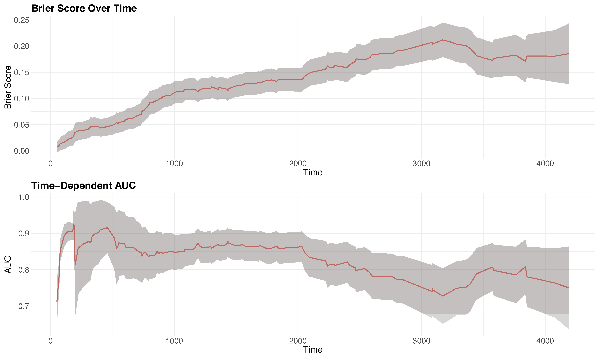{width="70%"}

::: {.callout-tip}
## Tip: 
Code generated using `plot.brier.auc` 
:::

::: footer

:::

## Prediction {.smaller}

4 major ways prediction can be used

1. Prediction on test data: `predict(object, testdata)`

2. Prediction on "artificial data" for partial plots:
`plot.variable`, `partial`

3. Prediction where a new data is substituted into the trained forest:
`predict(object, testdata, outcome = "test")`  

4. Restoring the forest: `predict(object, ...)`

## General call to predict

::: {.fragment .fade-left}
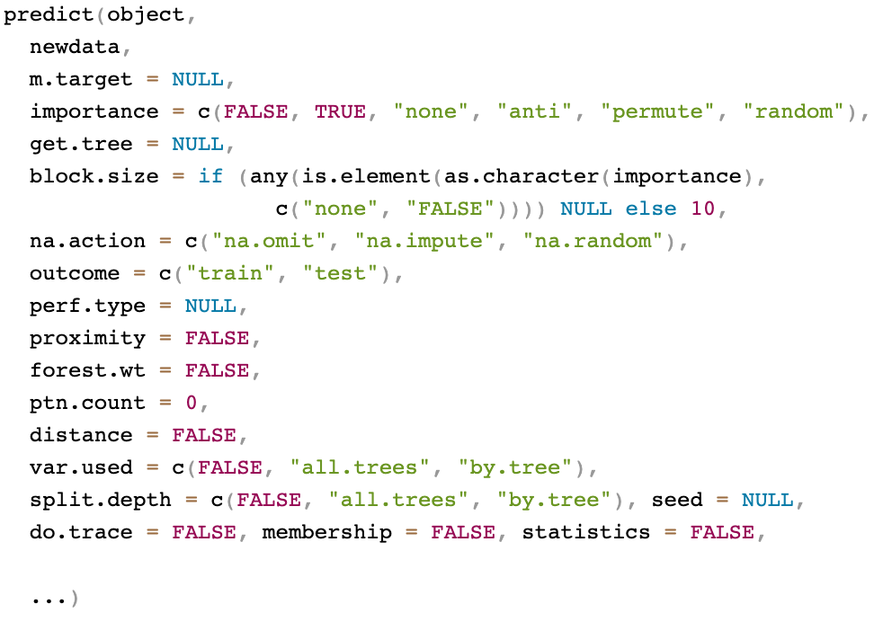{width="80%"}
:::

## Prediction: canonical example {.smaller}
#### Veteran's Administration Lung Cancer Trial
Randomized trial of two treatment regimens for lung cancer [@kalbfleisch2011statistical]

```{r}
data(veteran, package = "randomForestSRC")
gt::gt(veteran[1:10,])
```

``` {.r code-line-numbers="1|2-3"}
data(veteran, package = "randomForestSRC")
dim(veteran)
> [1]  137   8
```

## Prediction: canonical example {.smaller}

``` {.r code-line-numbers="1-5|7-9"}
## veteran data (with factors)
data(veteran, package = "randomForestSRC")
veteran2 <- data.frame(lapply(veteran, factor))
veteran2$time <- veteran$time
veteran2$status <- veteran$status

## split the data into unbalanced train/test data (25/75)
## the train/test data have the same levels, but different labels
train <- sample(1:nrow(veteran2), round(nrow(veteran2) * .25))
```

``` {.r .fragment}
> summary(veteran2[train,])
 trt    celltype      time            status           karno      diagtime       age     prior  
 1:18   1: 8     Min.   :  3.00   Min.   :0.0000   60     :7   3      : 7   60     : 3   0 :27  
 2:16   2:10     1st Qu.: 29.25   1st Qu.:1.0000   40     :6   2      : 6   66     : 3   10: 7  
        3: 9     Median : 53.50   Median :1.0000   80     :6   5      : 3   67     : 3          
        4: 7     Mean   :104.29   Mean   :0.9412   70     :4   8      : 3   69     : 3          
                 3rd Qu.:140.25   3rd Qu.:1.0000   90     :4   1      : 2   38     : 2          
                 Max.   :389.00   Max.   :1.0000   30     :3   4      : 2   48     : 2          
                                                   (Other):4   (Other):11   (Other):18   
``` 

``` {.r .fragment}
> summary(veteran2[-train,])
 trt    celltype      time           status          karno       diagtime       age     prior  
 1:51   1:27     Min.   :  1.0   Min.   :0.000   60     :20   4      :17   63     :10   0 :70  
 2:52   2:38     1st Qu.: 21.5   1st Qu.:1.000   70     :19   2      :13   62     : 8   10:33  
        3:18     Median : 83.0   Median :1.000   80     :18   3      :11   64     : 7          
        4:20     Mean   :127.3   Mean   :0.932   30     :11   5      :11   65     : 7          
                 3rd Qu.:147.5   3rd Qu.:1.000   50     :11   11     : 5   68     : 5          
                 Max.   :999.0   Max.   :1.000   40     :10   12     : 5   70     : 5          
                                                 (Other):14   (Other):41   (Other):61  
``` 

## Prediction: canonical example {.smaller}

``` {.r }
## train the forest and use this to predict on test data
o <- rfsrc(Surv(time, status) ~ ., veteran2[train, ]) 
pred <- predict(o, veteran2[-train , ])
```

::: columns
::: {.column width="50%".fragment}
``` {.r}
> print(o)
                         Sample size: 34
                    Number of deaths: 32
                     Number of trees: 500
           Forest terminal node size: 15
       Average no. of terminal nodes: 1
No. of variables tried at each split: 3
              Total no. of variables: 6
       Resampling used to grow trees: swor
    Resample size used to grow trees: 21
                            Analysis: RSF
                              Family: surv
                      Splitting rule: logrank *random*
       Number of random split points: 10
                          (OOB) CRPS: 57.73879973
                   (OOB) stand. CRPS: 0.14842879
   (OOB) Requested performance error: 0.88246269
``` 

:::
::: {.column width="50%".fragment}

``` {.r }
> print(pred)
  Sample size of test (predict) data: 103
                Number of grow trees: 500
  Average no. of grow terminal nodes: 1
         Total no. of grow variables: 6
       Resampling used to grow trees: swor
    Resample size used to grow trees: 21
                            Analysis: RSF
                              Family: surv
                                CRPS: 54.3104615
                         stand. CRPS: 0.13961558
         Requested performance error: 0.49749046
``` 

:::
:::

## Prediction: canonical example {.smaller}

``` {.r code-line-numbers="1-3|4|5-16|18-23" .fragment}
## even harder ... factor level not previously encountered in training
veteran3 <- veteran2[1:3, ]
veteran3$celltype <- factor(c("newlevel", "1", "3"))
pred2 <- predict(o, veteran3)
print(pred2)
>   Sample size of test (predict) data: 3
>                 Number of grow trees: 500
>   Average no. of grow terminal nodes: 1
>          Total no. of grow variables: 6
>        Resampling used to grow trees: swor
>     Resample size used to grow trees: 21
>                             Analysis: RSF
>                               Family: surv
>                                 CRPS: 60.6330452
>                          stand. CRPS: 0.15586901
>          Requested performance error: 0.5

## the unusual level is treated like a missing value but is not removed
print(pred2$xvar)
>   trt celltype karno diagtime age prior
> 1   1     <NA>    60        7  69     0
> 2   1        1    70        5  64    10
> 3   1        3    60        3  38     0
``` 

## Restore {.smaller}

```{verbatim}
predict(object, testdata) 
```

Useful feature of `predict` making it possible
to restore the original training forest

After tuning the forest, you can use `predict` to obtain:
$$
\begin{array}{ll}
 \texttt{importance}      &      \text{Variable Importance (VIMP)} \\
 \texttt{forest.wt}       &      \text{Construct your own estimator} \\
 \texttt{proximity}       &      \text{RF proximity} \\
 \texttt{distance}        &      \text{RF distance} \\
 \texttt{get.tree}        &      \text{Plot a tree on your browser} \\
 \texttt{var.used, split.depth} & \text{Statistics summarizing variable and tree splitting} \\
\end{array}
$$


## Restore {.smaller}

::: callout-tip
## Tip
`predict()` can restore an object from `rfsrc()` with a new specification
:::

::: {.r-stack}

```{r}
# install.packages("devtools") # if you have not installed "devtools" package
# devtools::install_github("kogalur/varPro")
data(glioma, package = "varPro") 
gt::gt(head(glioma[1:5,c("y",  "cg23970089","cg25176823", 
                      "cg24576735", "Chr19.20co.gain", "TERT.promoter.status",
                      "SNP6", "U133a","grade","age","gender")]))
```

``` {.r .fragment}
o <- rfsrc(y~., data = glioma) 
o
                         Sample size: 878
           Frequency of class labels: 148, 174, 249, 25, 41, 215, 26
                     Number of trees: 500
           Forest terminal node size: 1
       Average no. of terminal nodes: 74.302
No. of variables tried at each split: 36
              Total no. of variables: 1241
       Resampling used to grow trees: swor
    Resample size used to grow trees: 555
                            Analysis: RF-C
                              Family: class
                      Splitting rule: gini *random*
       Number of random split points: 10
                   (OOB) Brier score: 0.02333115
        (OOB) Normalized Brier score: 0.19053769
                           (OOB) AUC: 0.99304797
                      (OOB) Log-loss: 0.34115074
   (OOB) Requested performance error: 0.07061503, 0.06756757, 0.01149425, 0.00803213, 0.52, 0.53658537, 0.04651163, 0.11538462
```

``` {.r code-line-numbers="1|20" .fragment}
p <- predict(o, perf.type = "brier") 
p
                         Sample size: 878
           Frequency of class labels: 148, 174, 249, 25, 41, 215, 26
                     Number of trees: 500
           Forest terminal node size: 1
       Average no. of terminal nodes: 74.302
No. of variables tried at each split: 36
              Total no. of variables: 1241
       Resampling used to grow trees: swor
    Resample size used to grow trees: 555
                            Analysis: RF-C
                              Family: class
                      Splitting rule: gini *random*
       Number of random split points: 10
                   (OOB) Brier score: 0.02333115
        (OOB) Normalized Brier score: 0.19053769
                           (OOB) AUC: 0.99304797
                      (OOB) Log-loss: 0.34115074
   (OOB) Requested performance error: 0.18688257, 0.03438887, 0.01210945, 0.02103588, 0.01195455, 0.01952019, 0.05238402, 0.0087921
```

:::

::: footer

:::

## Restore {.smaller}
### Create your own estimator for regression

``` {.r code-line-numbers="1-4|6-9|11-27|29-30" .fragment }
## create your own estimator for regression
o <- rfsrc(mpg~.,mtcars)
fwt <- predict(o, forest.wt="oob")$forest.wt
yhat <- c(fwt %*% o$yvar)

## compare to the OOB ensemble
print(summary(yhat - o$predicted.oob))
      Min.    1st Qu.     Median       Mean    3rd Qu.       Max. 
-3.908e-14 -1.643e-14 -1.066e-14 -1.060e-14 -3.553e-15  1.066e-14
      
## compare prediction error to OOB ensemble
print(o)

                        Sample size: 32
                     Number of trees: 500
           Forest terminal node size: 5
       Average no. of terminal nodes: 3.476
No. of variables tried at each split: 4
              Total no. of variables: 10
       Resampling used to grow trees: swor
    Resample size used to grow trees: 20
                            Analysis: RF-R
                              Family: regr
                      Splitting rule: mse *random*
       Number of random split points: 10
                     (OOB) R squared: 0.76585425
   (OOB) Requested performance error: 8.50513415

print(mean((yhat - o$yvar)^2))
8.505134
``` 

::: footer
Learn more:  [https://www.randomforestsrc.org/articles/forestWgt.html](https://www.randomforestsrc.org/articles/forestWgt.html)
:::


## Partial plots {.smaller background-color="white"}

Partial plots are used to understand the effect of
a feature on the outcome and are essentially prediction tools


Consider the target in nonparametric regression
$$
F(x_1,\ldots,x_p) = E[Y|(x_1,\ldots,x_p)]
$$ 
To study variable $j$ we plot $F_j(x)$ over $x$ where
$$
F_j(x)
= \frac{1}{n}\sum_{i=1}^nF_{\!\text{ens}}(x_1=x_{i1},\ldots,\color{red}{x_j=x},\color{black}\ldots,x_p=x_{ip})
$$
and
$$
\Bigg\{\Big(x_1=x_{i1},\ldots,\color{red}{x_j=x}\color{black},\ldots,x_p=x_{ip}\Big):\hskip10pt
i=1,\ldots,n\Bigg\}
$$
are "test" data values equal to the training data but where
coordinate $j$ is set to $x$

::: footer

:::

## General call to plot.variable

::: {.fragment .fade-left}
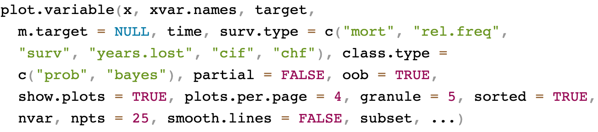{width="100%"}
:::

## Regression example: Iowa housing {.smaller}
We can use `plot.variable` to visualize $F_j(x)$ 

``` {.r code-line-numbers="3" .fragment .fade-in-then-semi-out}
o <- rfsrc(SalePrice~., data = housing)
## partial effect for MS.Zoning
plot.variable(o, xvar.names = "MS.Zoning", partial = TRUE,
              ylab = "partial effect of MS.Zoning")
```

::: {.fragment .fade-left}
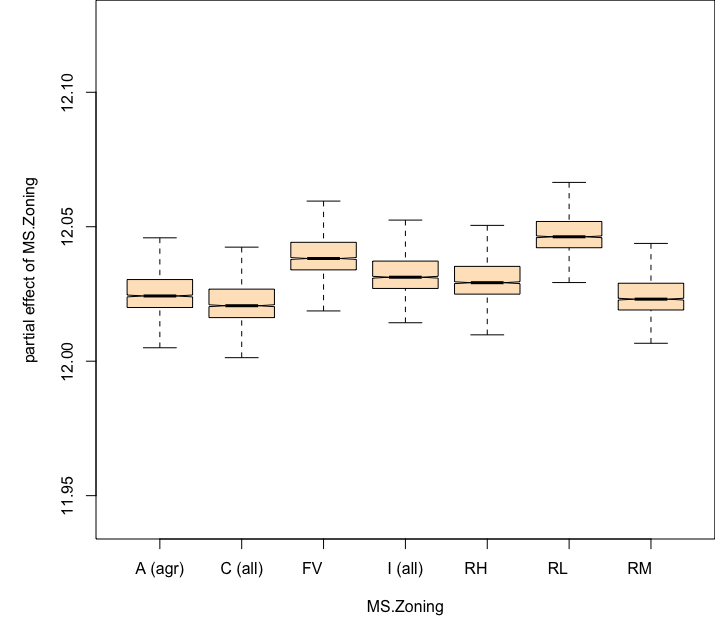{width="50%"}
::: 

## Regression example: Iowa housing {.smaller}
``` {.r code-line-numbers="2"}
## partial effect for Overall.Qual
plot.variable(o, xvar.names = "Overall.Qual", partial = TRUE,
              ylab = "partial effect of Overall.Qual")
```

::: {.fragment .fade-left}
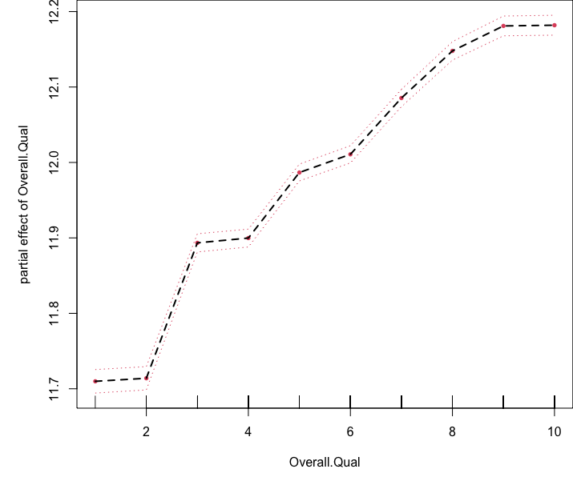{width="50%"}
::: 

## Regression example: Iowa housing {.smaller}
``` {.r code-line-numbers="3"}
## partial effect for Overall.Qual
plot.variable(o, xvar.names = "Overall.Qual", partial = TRUE,
              smooth.lines = TRUE,
              ylab = "partial effect of Overall.Qual")
```

::: {.fragment .fade-left}
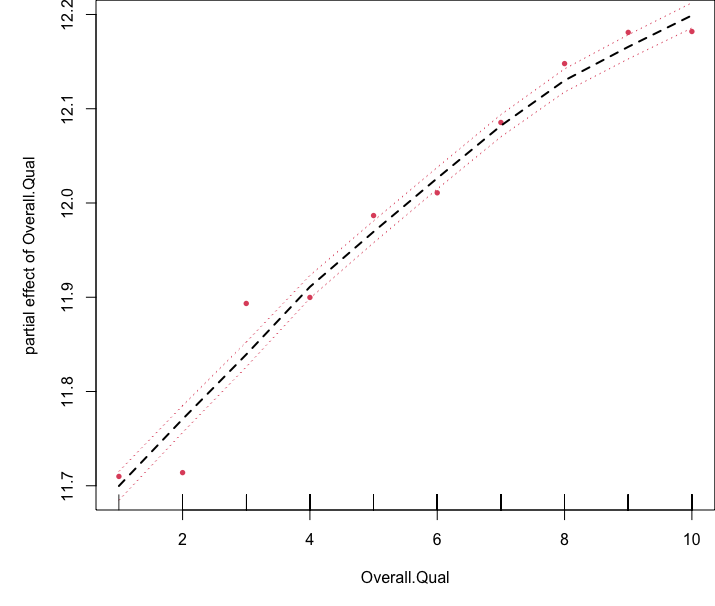{width="50%"}
::: 

## Regression example: Iowa housing {.smaller}
``` {.r code-line-numbers="4"}
## subset of Lot.Frontage>100
plot.variable(o, xvar.names = "Overall.Qual", partial = TRUE,
              smooth.lines = TRUE,
              subset = o$xvar$Lot.Frontage>100,
              ylab = "partial effect of Overall.Qual", main = "Lot Frontage > 100")
```

::: {.fragment .fade-left}
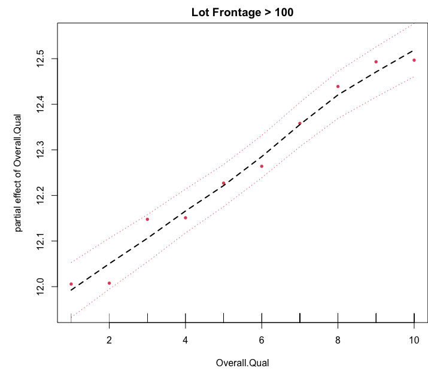{width="50%"}
::: 

## Regression example: Iowa housing {.smaller}
We can use `plot.variable` to visualize multiple variables simultaneously
``` {.r code-line-numbers="2-3"}
## multiple partial effects
plot.variable(o, xvar.names = c("MS.Zoning", "Overall.Qual"), 
              plots.per.page = 2,
              partial = TRUE)
```

::: {.fragment .fade-left}
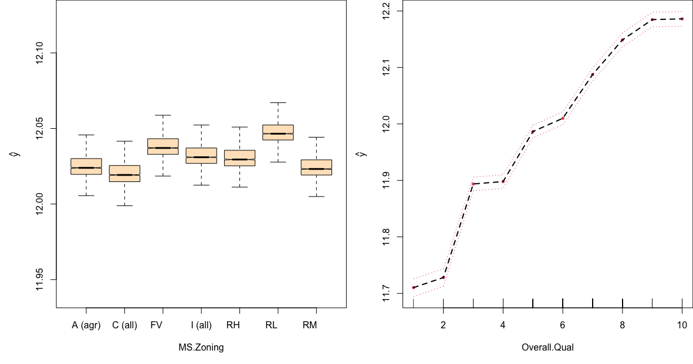{width="70%"}
::: 

## Regression example: Iowa housing {.smaller}
We can make changes to a pre-processed `plot.variable` object 

::: columns
::: {.column width="50%"}
``` {.r code-line-numbers="1,5,6"  }
p.v <- plot.variable(o, 
               xvar.names = c("MS.Zoning",
                               "Overall.Qual"), 
                     partial = TRUE, 
                     show.plots = FALSE)
plot.variable(p.v)
```
{width="100%"}
:::
::: {.column width="50%" .fragment .fade-left}

``` {.r code-line-numbers="3,4,6" }
plotthis <- p.v$plotthis
plot(plotthis[["MS.Zoning"]], 
     ylab = "partial effect", 
     type = "b")
plot(plotthis[["Overall.Qual"]], 
     ylab = "partial effect")
```
::: {.fragment .fade-left}
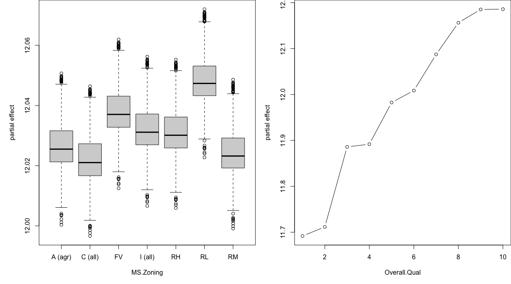{width="90%"}
:::
:::
:::


## General call to partial

::: {.fragment .fade-left}
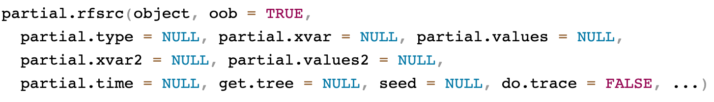{width="100%"}
:::

## Regression example: Iowa housing {.smaller}
We can use `partial` and `get.partial.plot.data` to obtain values of $F_j(x)$ 
``` {.r code-line-numbers="1,4|5"}
partial.obj <- partial(o,
                       partial.xvar = "Overall.Qual",
                       partial.values = o$xvar$Overall.Qual)
pdta <- get.partial.plot.data(partial.obj, granule = TRUE)
boxplot(pdta$yhat ~ pdta$x, xlab = "Overall.Qual", ylab = "partial effect")
```

::: {.fragment}
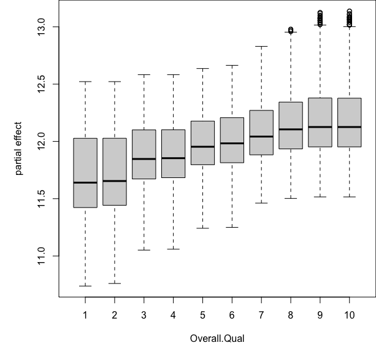{width="40%"}
:::

## Regression example: Iowa housing {.smaller}
We can use `partial` and `get.partial.plot.data` to obtain values of $F_j(x)$ 
``` {.r code-line-numbers="4-6|10"}
## specify two variables of interest
Overall.Qual <- sort(unique(o$xvar$Overall.Qual)); Gr.Liv.Area <- sort(unique(o$xvar$Gr.Liv.Area))
pdta <- do.call(rbind, lapply(Gr.Liv.Area, function(x2) {
  o <- partial(o,
               partial.xvar = "Overall.Qual", partial.xvar2 = "Gr.Liv.Area",
               partial.values = Overall.Qual, partial.values2 = x2)
  cbind(Overall.Qual, x2, get.partial.plot.data(o)$yhat)
}))
pdta <- data.frame(pdta); colnames(pdta) <- c("Overall.Qual", "Gr.Liv.Area", "effectSize")
coplot(effectSize ~ Overall.Qual|Gr.Liv.Area, pdta, pch = 16, overlap = 0)
```

::: {.fragment}
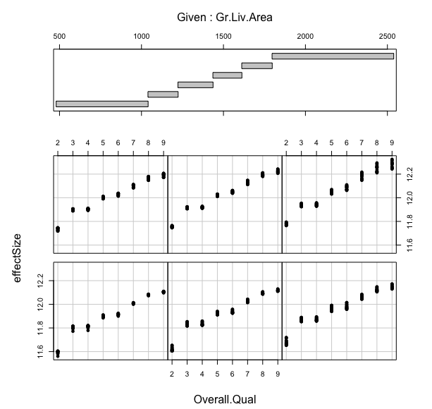{width="34%"}
::: 

::: footer

:::

## Classification example: Glioma {.smaller}
We can use `plot.variable` to visualize $F_j(x)$ 

``` {.r code-line-numbers="3" .fragment .fade-in-then-semi-out}
o <- rfsrc(y~., data = glioma)
## partial effect for TERT.promoter.status; defaults to focus on the first class
plot.variable(o, xvar.names = "TERT.promoter.status", 
              partial = TRUE)
```

::: {.fragment .fade-left}
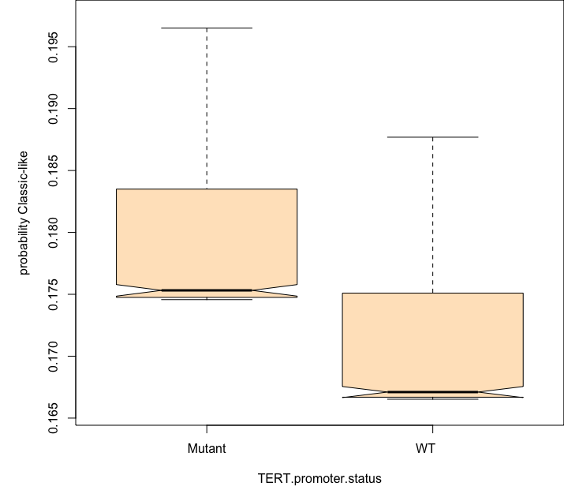{width="50%"}
::: 

## Classification example: Glioma {.smaller}
``` {.r code-line-numbers="4"}
# specifying the class label to focus on using "target"
plot.variable(o, 
              xvar.names = "TERT.promoter.status", 
              target = c("Codel"),
              partial = TRUE)
```

::: {.fragment .fade-left}
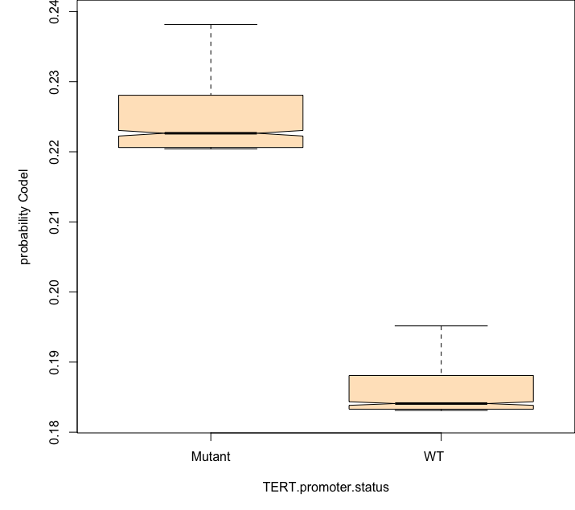{width="50%"}
::: 

## Classification example: Glioma {.smaller}
We can use `partial` and `get.partial.plot.data` to obtain values of $F_j(x)$ 

::: {.r-stack}
```{r}
data(housing, package = "randomForestSRC")  
gt::gt(housing[1:3,c(1:9,4,60)])
```

``` {.r code-line-numbers="1,5" .fragment}
partial.obj <- partial(o, partial.xvar = "TERT.promoter.status", partial.values = o$xvar$TERT.promoter.status)
## extract partial effects for each species outcome
pdta <- list(); ylim <- c(); lvls <- levels(o$yvar)
for (i in 1:length(lvls)){
pdta[[i]] <- get.partial.plot.data(partial.obj, target = lvls[i])
ylim <- c(ylim, range(pdta[[i]]$yhat))
}
```

``` {.r code-line-numbers="5" .fragment}
plot(pdta[[1]]$x, rep(NA, length(pdta[[1]]$x)), 
     xlab = "TERT.promoter.status", ylab = "adjusted probability", 
     ylim = range(ylim))
for (i in 1:length(lvls)){
points(pdta[[i]]$x, pdta[[i]]$yhat, col = i, type = "b", pch = 16)
}
legend("topleft", legend=levels(o$yvar), fill = 1:length(lvls))
```
:::

::: {.fragment}
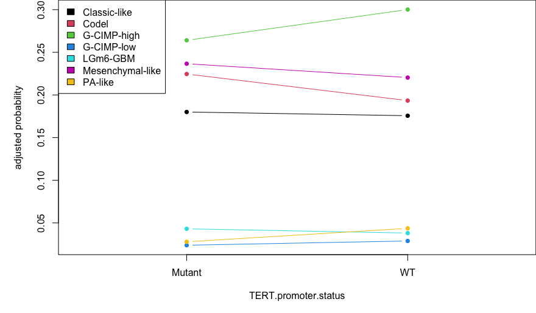{width="60%"}
::: 

::: footer

:::

## Survival example: peakVO2 {.smaller}

The data involve 2231 patients with systolic heart failure who underwent cardiopulmonary stress testing at the Cleveland Clinic. The primary end point was all-cause death. In total, 39 variables were measured for each patient, including baseline clinical values and exercise stress test results. A key variable of interest is peak VO2 (mL/kg per min), the peak respiratory exchange ratio [@hsich2011identifying]

```{r}
data(peakVO2, package = "randomForestSRC") 
gt::gt(peakVO2[1:5,c(34,33,35:41,1:10)])
```

``` {.r code-line-numbers="1|2-3"}
data(peakVO2, package = "randomForestSRC") 
dim(peakVO2)
> [1]  2231   41
```

## Survival example: peakVO2 {.smaller}
We can use `plot.variable` to visualize $F_j(x)$ 

``` {.r code-line-numbers="3" .fragment .fade-in-then-semi-out}
o <- rfsrc(Surv(ttodead,died)~., peakVO2)
## partial effect for age
plot.variable(o, surv.type = "surv", xvar.names = "age", 
              time = 200, partial = TRUE)
```

::: {.fragment .fade-left}
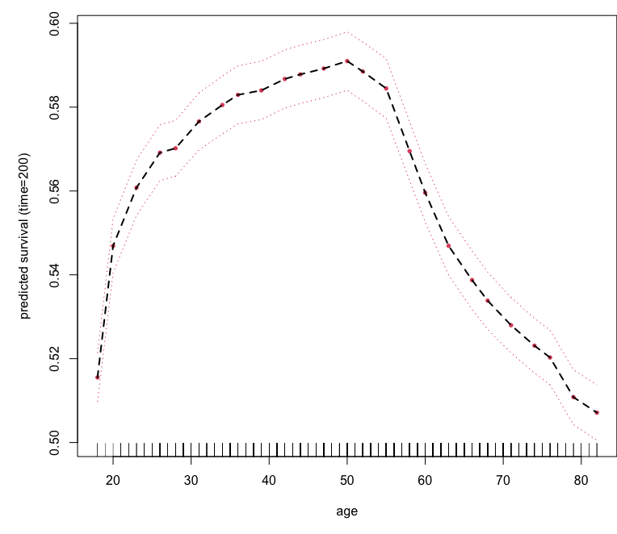{width="50%"}
::: 

## Survival example: peakVO2 {.smaller}

``` {.r code-line-numbers="4" }

## partial effect for age
plot.variable(o, surv.type = "surv", xvar.names = "age", 
              smooth.lines = TRUE,
              time = 200, partial = TRUE)
```

::: {.fragment .fade-left}
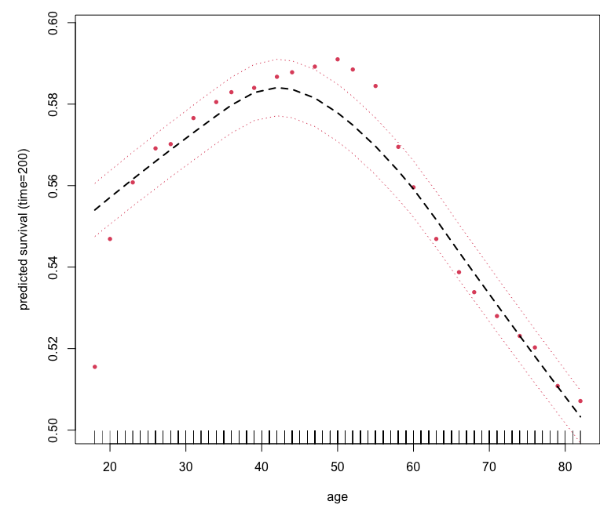{width="50%"}
::: 

## Survival example: peakVO2 {.smaller}

``` {.r code-line-numbers="3" }

## partial effect for age
plot.variable(o, surv.type = "rel.freq", xvar.names = "age", 
              smooth.lines = TRUE,
              partial = TRUE)
```

::: {.fragment .fade-left}
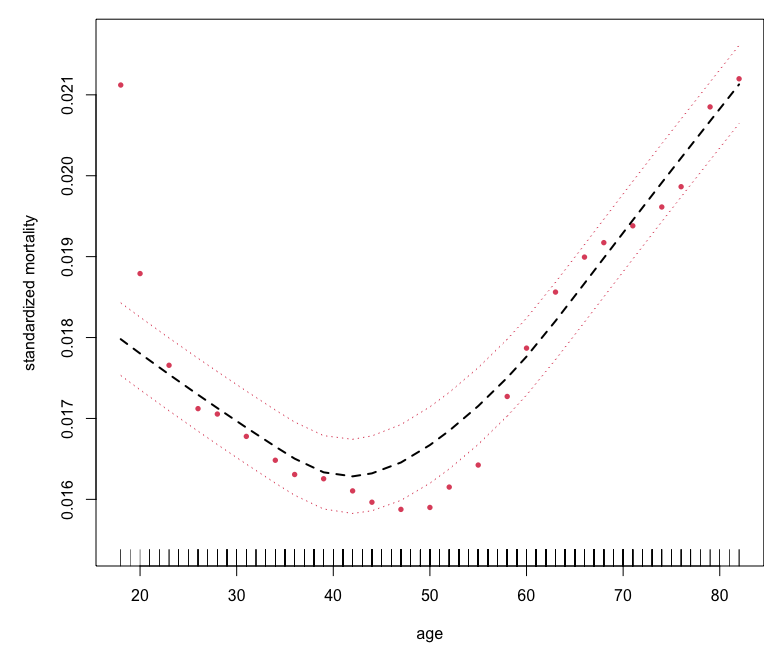{width="50%"}
::: 


## Survival example: peakVO2 {.smaller}
We can use `partial` and `get.partial.plot.data` to obtain values of $F_j(x)$ 

::: columns
::: {.column width="50%"}
``` {.r code-line-numbers="1-3|8"}
## partial effect of peak V02 on mortality

partial.o <- partial(o,
                     partial.type = "mort",
                     partial.xvar = "peak.vo2",
                     partial.values = o$xvar$peak.vo2,
                     partial.time = o$time.interest)
pdta.m <- get.partial.plot.data(partial.o)
```
:::
::: {.column width="50%" .fragment}
``` {.r code-line-numbers="1-2|3|8"}
## partial effect of peak V02 on survival
pvo2 <- quantile(o$xvar$peak.vo2)
partial.o <- partial(o,
                     partial.type = "surv",
                     partial.xvar = "peak.vo2",
                     partial.values = pvo2,
                     partial.time = o$time.interest)
pdta.s <- get.partial.plot.data(partial.o)
```
:::
:::
<br>

::: columns
::: {.column width="45%" .fragment .fade-left}
``` {.r code-line-numbers="4,8"}
## compare the two plots
par(mfrow=c(1,2))    

plot(lowess(pdta.m$x, pdta.m$yhat, f = 2/3),
     type = "l", xlab = "peak VO2", ylab = "adjusted mortality")
rug(o$xvar$peak.vo2)

matplot(pdta.s$partial.time, t(pdta.s$yhat), type = "l", lty = 1,
        xlab = "years", ylab = "peak VO2 adjusted survival")
legend("bottomleft", legend = paste0("peak VO2 = ", pvo2),
       bty = "n", cex = .75, fill = 1:5)
```
:::
::: {.column width="55%" .fragment .fade-left}

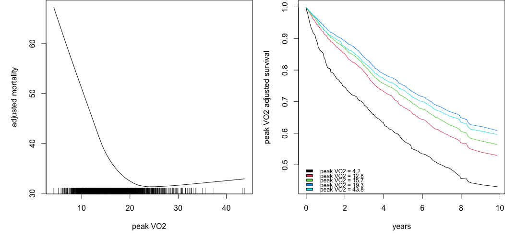{width="105%"}

:::
:::


::: footer

:::

## Outline  { .smaller background-color="azure"}

::: columns

::: {.column width="47.5%"}
#### [Part I: Training](https://luminwin.github.io/shortCourse/presentationPartI.html)

1.	Quick start
2.	Data structures allowed
3.	Training (grow) with examples <br>(regression, classification, survival)

#### [Part II:  Inference and Prediction](https://luminwin.github.io/shortCourse/presentationPartII.html)

1.	Inference (OOB)
2.	Prediction Error
3.	Prediction
4.	Restore
5.	Partial Plots
:::

::: {.column width="5%"}

:::

::: {.column width="47.5%" }
#### [Part III: Variable Selection](https://luminwin.github.io/shortCourse/presentationPartIII.html)

1.	VIMP
2.	Subsampling (Confidence Intervals)
3.	Minimal Depth
4.	VarPro

#### [Part IV:  Advanced Examples](https://luminwin.github.io/shortCourse/presentationPartIV.html)

1.	Class Imbalanced Data
2.	Competing Risks
3.	Multivariate Forests
:::
:::


## References
