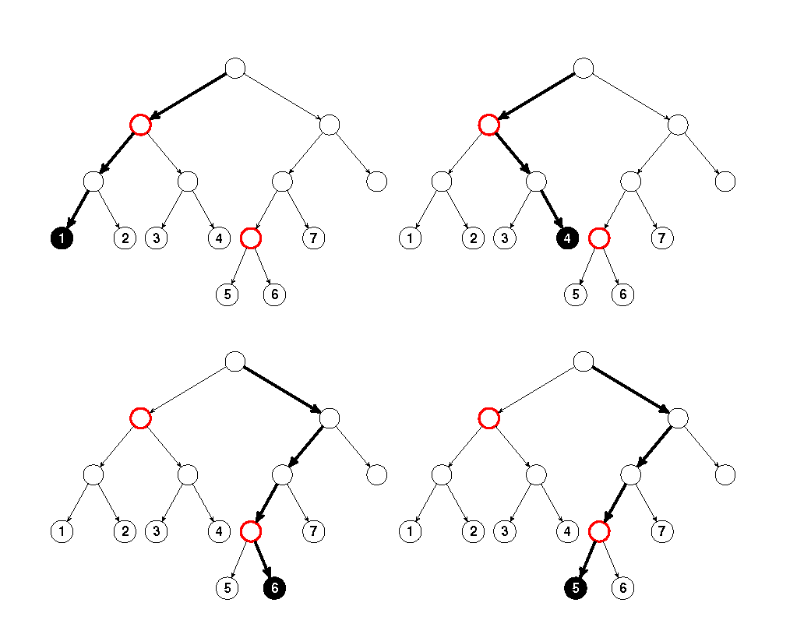
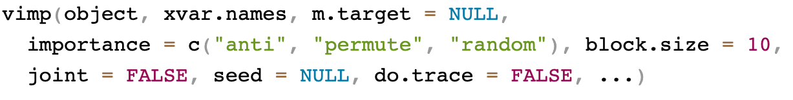
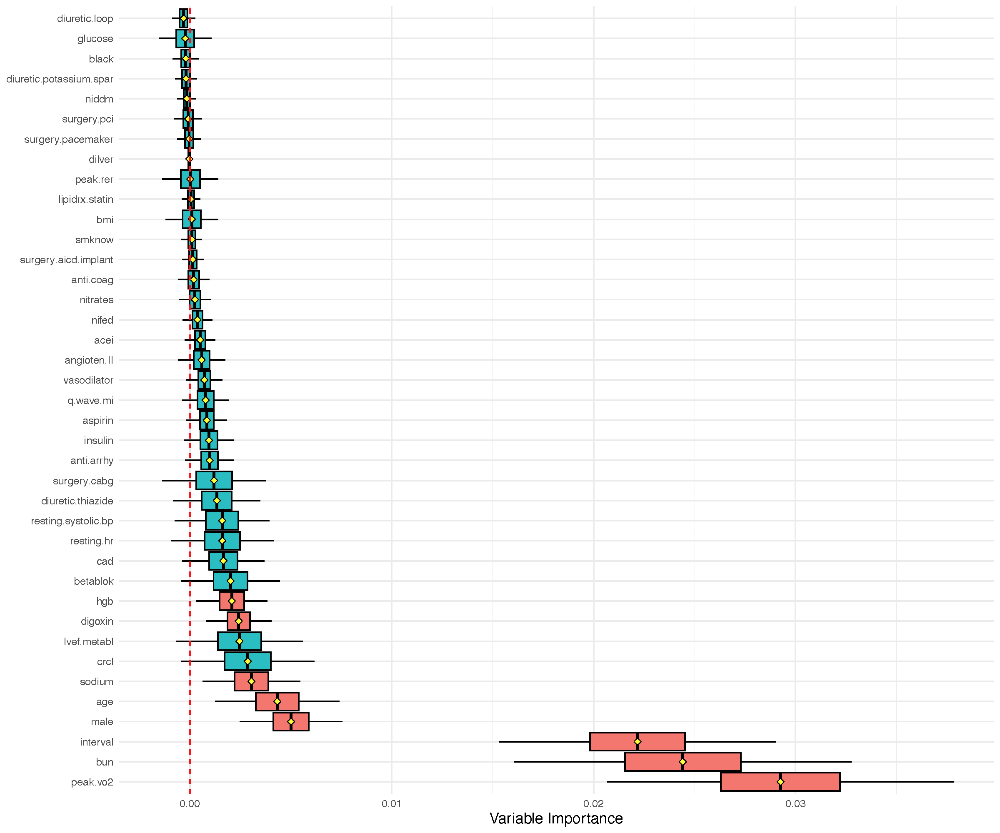
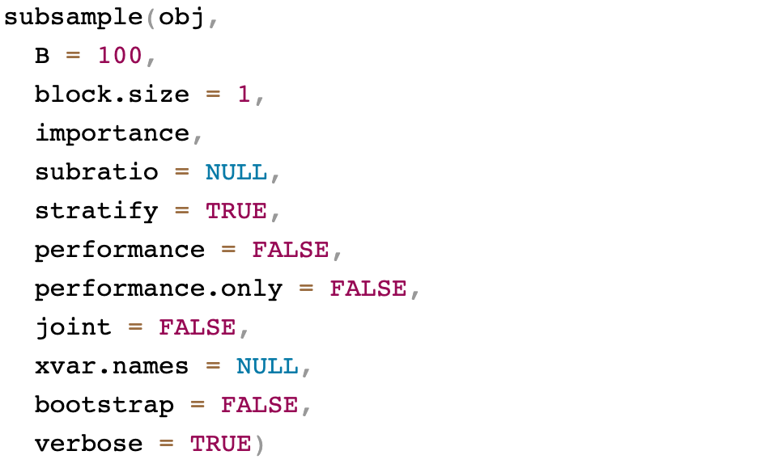
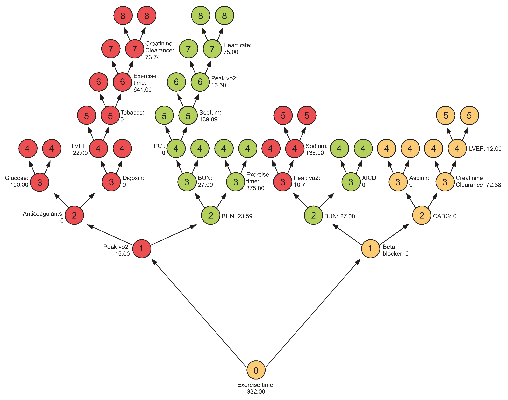
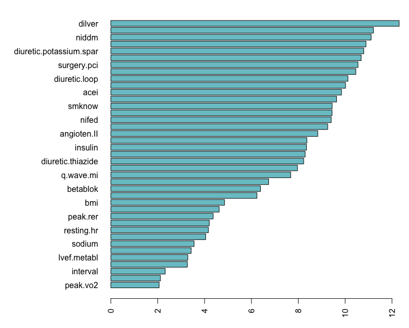
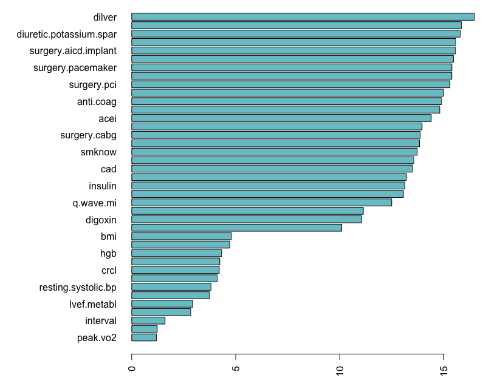
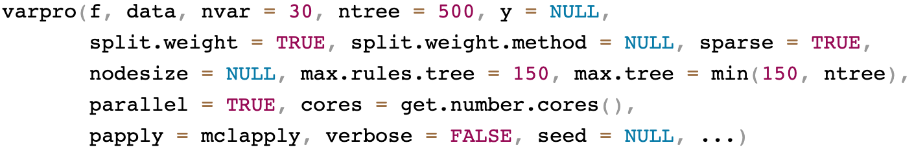
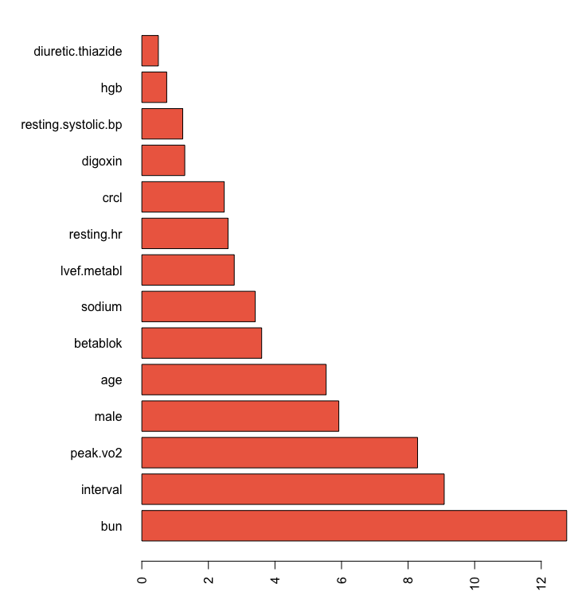
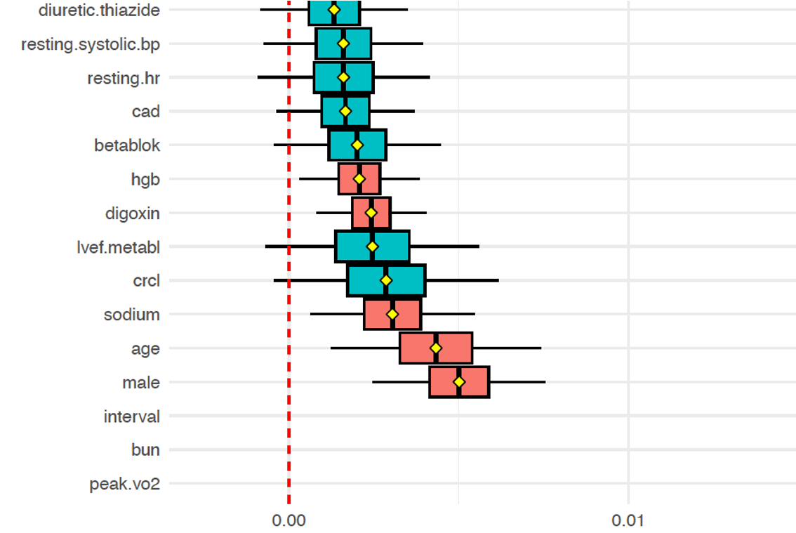

## Variable selection

We will discuss 4 different methods

1. Permutation Variable Importance (VIMP)
2. Subsampling for Confidence Intervals
3. Minimal Depth
4. VarPro

## Permutation importance {.smaller}

:::{.goals}
::::{.goals-header}
Idea
::::
::::{.goals-container}
In the OOB cases for a tree, randomly permute all values of the $j$th
variable. Put these new covariate values down the tree and compute a
new internal error rate. The amount by which this new error exceeds
the original OOB error is defined as the importance of the $j$th
variable for the tree. Averaging over the forest yields VIMP.
<br> <br>

::: {style="text-align: right; font-size: 80%"  }
 --- Measure 1 (Manual On Setting Up, Using, And Understanding Random Forests V3.1
:::
::::
:::

## OOB explanation {.smaller}

The tree OOB error rate is 
$$
\frac{1}{\# O_{ib}}\sum_{i\in O_{ib}} L(Y_i,h^*_b(\mathbf{x}_i))
$$

Permute (perturb) the $j$ covariate feature for $i$ to obtain
$\mathbf{x}^{*(j)}_i$

The tree VIMP is therefore
$$
\frac{1}{\# O_{ib}}\sum_{i\in O_{ib}} L(Y_i,h^*_b(\mathbf{x}^{*(j)}_i))
-
\frac{1}{\# O_{ib}}\sum_{i\in O_{ib}} L(Y_i,h^*_b(\mathbf{x}_i))
$$

Averaging over trees gives VIMP.  Large values identify important
variables (negative values can occur!)

## OOB explanation 
<center>
{width="70%"}
</center>

## Different  VIMP in the package

```{.verbatim}
importance = c("anti", "permute", "random")


importance = TRUE       -->   anti-VIMP
importance = "permute"  -->   Breiman-Cutler
importance = "random"   -->   random-VIMP
```

## Obtaining VIMP using the package {.small}

During training:

```{.verbatim .fragment}
rfsrc(mpg~., importance="permute")$importance 
rfsrc(mpg~., importance="permute", block.size=10)$importance 
```

Using restore:

```{.verbatim .fragment}
predict(obj, importance="permute")$importance 
predict(obj, importance="permute", block.size=10)$importance  
```

Using `vimp`:
```{.verbatim .fragment}
vimp(obj, importance="permute") 
vimp(obj, importance="permute", block.size=10)$importance  
```

`vimp` also permits joint VIMP
```{.verbatim .fragment}
## paired permutation vimp
obj <- rfsrc(Species~., data=iris)
vimp(iris.obj, obj.xvar.names[1:2], importance="permute", joint=TRUE)$importance
vimp(iris.obj, obj.xvar.names[3:4], importance="permute", joint=TRUE)$importance
```


## General call to vimp {.smaller}
::: {.fragment .fade-left}
{width="100%"}
:::

::: {.fragment .fade-left}
```{.r}
## VIMP for all variables 
iris.obj <- rfsrc(Species ~ ., data = iris)
print(vimp(iris.obj)$importance)
>                     all     setosa versicolor   virginica
> Sepal.Length 0.06857263 0.09785815 0.42079003 0.034794007
> Sepal.Width  0.02520082 0.11525515 0.08481039 0.003261938
> Petal.Length 0.55673198 1.44395131 1.80602645 1.241711139
> Petal.Width  0.60811332 1.75601006 2.00391736 1.144940306
```
:::
<hr style="margin: 2px; visibility:hidden;" />

::: {.fragment .fade-left}
```{.r}
## joint VIMP 
print(vimp(iris.obj, c("Petal.Length", "Petal.Width"), joint = TRUE)$importance)
>             all   setosa versicolor virginica
> joint 0.9336724 2.593241   2.447541  2.489946
```
:::


## VIMP illustration using peakVO2 {.smaller}

We have $n=2231$ cardiovascular patients with systolic heart failure
and all underwent cardiopulmonary stress testing.  The outcome is all
cause mortality (mean follow-up of 5 years, 742 patients
died). Baseline characteristics and
exercise stress test results were recorded ($p=39$).

<center>
{width="53%"}
</center>

::: footer

:::

## VIMP illustration using peakVO2 {.smaller}
<center>
{width="73%"}
</center>

::: footer

:::


## Confidence intervals for VIMP {.smaller}


VIMP standard error and CI are obtained using subsampling

Subsampling samples data *without replacement* where the subsample
size $m$ is substantially smaller than $n$; eg:
$$
m=\sqrt{n}=\sqrt{2231}\approx 48\ll n=2231
$$

CI are obtained using normal approximations
$$
\texttt{vimp} \pm z_{\alpha/2} \hat{\sigma} 
$$
where $\hat{\sigma}$ is the subsampled standard error estimator

```{.r}
## example using peakVO2
data(peakVO2, package = "randomForestSRC")
o <- rfsrc(Surv(ttodead, died)~., peakVO2, importance="permute")
oo <- subsample(o)
plot.vimp.ci(oo, alpha=.05)
```

## General call to subsample
::: {.fragment .fade-left}
{width="100%"}
:::

## Minimal depth {.smaller}

Measures importance of a variable by how close it splits to the root

Pros:

1. Much faster
2. Works in all settings for any type of tree 
3. Doesn't depend on prediction error

Cons:

1. Threshold value can be sensitive and relies on assumptions

## Minimal depth

<center>
{width="70%"}

## General call to max.subtree

::: {.fragment .fade-left}
{width="100%"}
:::

## Minimal depth illustration using peakVO2 {.smaller}
```{.r code-line-numbers="1|2-3"}
md <- max.subtree(o)$order[, 1]
barplot(sort(md), 
        las=2, horiz = TRUE, col = "cadetblue3")
```

::: {.fragment .fade-left}
<center>
{width="60%"}
</center>
:::


## Minimal depth illustration using peakVO2 {.smaller}

::: columns
::: {.column width="50%"}
```{.r}
md <- max.subtree(o)$order[, 1]
barplot(sort(md), 
        las=2, horiz = TRUE, col = "cadetblue3")
```
<br><br>
<center>
{width="90%"}
</center>

:::
::: {.column width="50%" .fragment .fade-left}
```{.r code-line-numbers="1-4|5-7"}
## guide random feature selection with number of times variable splits
xvar.used <- predict(o, nodedepth = 6, var.used="all.trees", mtry = Inf, 
                nsplit = 100)$var.used
os <- rfsrc(Surv(ttodead, died)~., peakVO2, xvar.wt = xvar.used)
mds <- max.subtree(os)$order[, 1]
barplot(sort(mds), 
        las=2, horiz = TRUE, col = "cadetblue3")
```

::: {.fragment .fade-left}
<center>
{width="90%"}
</center>
:::
:::
:::

::: footer

:::

## VarPro 
Permutation VIMP creates "artificial" data which can impact
performance in correlated settings

## VarPro {.small}
Permutation VIMP creates "artificial" data which can impact
performance in correlated settings


#### Consider a patient in the peakVO2 dataset


::: columns
::: {.column width="80%"}
```{r}
data(peakVO2, package = "randomForestSRC") 
gt::tab_style_body(data = gt::gt(peakVO2[2091,]),
                   fn = function(x) x==4.2,
                   style = gt::cell_fill(color = "lightblue")
               )
```
:::
::: {.column width="20%"}
```{r}
data(peakVO2, package = "randomForestSRC") 
gt::tab_style_body(data = gt::gt(peakVO2[2091,c("bun","interval", "peak.vo2")]),
                   fn = function(x) x==4.2,
                   style = gt::cell_fill(color = "lightblue")
               )
```
:::
:::


::: {.fragment}


####  Suppose peak.vo2 is permuted for calculating VIMP

::: columns
::: {.column width="80%"}
```{r}
data(peakVO2, package = "randomForestSRC") 
peakVO2[2091,"peak.vo2"] <- 43.8

gt::tab_style_body(data = gt::gt(peakVO2[2091,]),
                   fn = function(x) x==43.8,
                   style = gt::cell_fill(color = "lightblue")
               )
```
:::
::: {.column width="20%"}
```{r}
data(peakVO2, package = "randomForestSRC") 
peakVO2[2091,"peak.vo2"] <- 43.8

gt::tab_style_body(data = gt::gt(peakVO2[2091,c("bun","interval", "peak.vo2")]),
                   fn = function(x) x==43.8,
                   style = gt::cell_fill(color = "lightblue")
               )
```
:::
:::
::: 

::: {.fragment}
```{.r}
> summary(peakVO2[,c("bun","interval", "peak.vo2")])
      bun             interval         peak.vo2    
 Min.   :  4.322   Min.   :  21.0   Min.   : 4.20  
 1st Qu.: 17.000   1st Qu.: 345.0   1st Qu.:12.80  
 Median : 23.000   Median : 480.0   Median :15.70  
 Mean   : 25.278   Mean   : 503.3   Mean   :16.27  
 3rd Qu.: 29.334   3rd Qu.: 641.0   3rd Qu.:19.30  
 Max.   :129.000   Max.   :1415.0   Max.   :43.80  
```

::: 
<hr style="margin: 10px; visibility:hidden;" />

::: {.fragment}

####  Permuting the data can create implausible values

::: 


## VarPro 
Permutation VIMP creates "artificial" data which can impact
performance in correlated settings

<hr style="margin: 10px; visibility:hidden;" />

VarPro works directly with the observed data creating a test statistic

<hr style="margin: 10px; visibility:hidden;" />

:::: {.fragment}
For each tree branch (a rule), the rule is *released* along the
coordinate $j$.  Importance equals the difference between the
test statistic for the original rule to the released rule
:::: 

## VarPro: pros and cons {.smaller}

Pros:

1. Much faster
2. Much better for correlated problems
3. User specified test statistics
4. Doesn't depend on prediction error
5. Tree guided rules can be specified by the user
6. Sparsity property


Cons:

1. Importance value does not have an intuitive interpretation

## General call to varpro

::: {.fragment .fade-left}
{width="100%"}
:::

## VarPro canonical illustration {.smaller}

```{.r code-line-numbers="1-2|3"}
## varpro canonical call
o <-varpro(Surv(ttodead, died)~., peakVO2)
importance(o)

## cv.varpro canonical call
o.cv <- cv.varpro(Surv(ttodead, died)~., peakVO2)
o.cv
```

```{.r .fragment}
> importance(o)
                            mean          std          z    zcenter selected
bun                 0.4978149504 0.0337152554 14.7652730 12.7652730        1
interval            0.3185356007 0.0295842524 10.7670661  8.7670661        1
peak.vo2            0.4312874502 0.0402880827 10.7050875  8.7050875        1
male                0.3505938059 0.0538524448  6.5102672  4.5102672        1
age                 0.2446044542 0.0396020571  6.1765593  4.1765593        1
betablok            0.2686558074 0.0479230810  5.6059794  3.6059794        1
sodium              0.2528347809 0.0512493678  4.9334224  2.9334224        1
crcl                0.1797879324 0.0437915811  4.1055365  2.1055365        1
lvef.metabl         0.2381646158 0.0611984740  3.8916757  1.8916757        1
hgb                 0.1725410259 0.0542089828  3.1828862  1.1828862        1
resting.systolic.bp 0.1968886781 0.0678923150  2.9000142  0.9000142        1
resting.hr          0.1597187409 0.0691719891  2.3090089  0.3090089        1
digoxin             0.0775483548 0.1211743434  0.6399734 -1.3600266        0
peak.rer            0.0398680722 0.0692507796  0.5757058 -1.4242942        0
glucose             0.0290473617 0.0652009690  0.4455051 -1.5544949        0
diuretic.thiazide   0.0002443196 0.0007146353  0.3418801 -1.6581199        0
aspirin             0.0000000000 0.0000000000        NaN        NaN        0
bmi                 0.0000000000 0.0000000000        NaN        NaN        0
cad                 0.0000000000 0.0000000000        NaN        NaN        0
insulin             0.0000000000 0.0000000000        NaN        NaN        0
```

::: footer

:::

## VarPro canonical illustration {.smaller}

```{.r code-line-numbers="1-2|3"}
## cv.varpro canonical call
o.cv <- cv.varpro(Surv(ttodead, died)~., peakVO2)
o.cv
```

```{.r .fragment code-line-numbers="2-14|16-27|29-44|46-61"}
> o.cv
$imp
      variable         z
1          bun 12.765690
2     interval  9.084990
3     peak.vo2  8.284743
4         male  5.918617
5          age  5.537937
6     betablok  3.600902
7       sodium  3.408508
8  lvef.metabl  2.776717
9   resting.hr  2.590353
10        crcl  2.476236
11     digoxin  1.289895

$imp.conserve
      variable         z
1          bun 12.765690
2     interval  9.084990
3     peak.vo2  8.284743
4         male  5.918617
5          age  5.537937
6     betablok  3.600902
7       sodium  3.408508
8  lvef.metabl  2.776717
9   resting.hr  2.590353
10        crcl  2.476236

$imp.liberal
              variable          z
1                  bun 12.7656902
2             interval  9.0849901
3             peak.vo2  8.2847426
4                 male  5.9186167
5                  age  5.5379366
6             betablok  3.6009023
7               sodium  3.4085085
8          lvef.metabl  2.7767175
9           resting.hr  2.5903526
10                crcl  2.4762361
11             digoxin  1.2898949
12 resting.systolic.bp  1.2290245
13                 hgb  0.7475712
14   diuretic.thiazide  0.4964589

$err
          zcut nvar       err          sd
[1,] 0.1000000   14 0.3120663 0.007186951
[2,] 0.5265306   13 0.3137940 0.004717065
[3,] 0.7591837   12 0.3141295 0.004068593
[4,] 1.2632653   11 0.3099739 0.003270832
[5,] 1.3020408   10 0.3123732 0.004680203

$zcut
[1] 1.263265

$zcut.conserve
[1] 1.302041

$zcut.liberal
[1] 0.1
```

::: footer

:::

## VarPro canonical illustration {.smaller}

::: columns
::: {.column width="50%"}

#### VIMP

```{.r}
o <- rfsrc(Surv(ttodead, died)~., peakVO2, importance="permute")
oo <- subsample(o)
plot.vimp.ci(oo, alpha=.05)
```

<center>
{width="100%"}
</center>

:::
::: {.column width="50%" .fragment .fade-left}

#### VarPro

```{.r}
o.cv <- cv.varpro(Surv(ttodead, died)~., peakVO2)
barplot(o.cv$imp.liberal$z, names.arg=o.cv$imp.liberal$variable,
        las=2, horiz = TRUE, col = "coral2")
```

<center>
{width="80%"}
</center>

:::
:::

## VarPro canonical illustration {.smaller}

::: columns
::: {.column width="50%"}

#### VIMP

```{.r}
o <- rfsrc(Surv(ttodead, died)~., peakVO2, importance="permute")
oo <- subsample(o)
plot.vimp.ci(oo, alpha=.05)
```
<br>
<center>
{width="100%"}
</center>

:::
::: {.column width="50%"}

#### VarPro

```{.r}
o.cv <- cv.varpro(Surv(ttodead, died)~., peakVO2)
barplot(o.cv$imp.liberal$z, names.arg=o.cv$imp.liberal$variable,
        las=2, horiz = TRUE, col = "coral2")
```

<center>
{width="80%"}
</center>

:::
:::

## VarPro high-dimensional example {.smaller}
#### van de Vijver Microarray Breast Cancer
Gene expression profiling for predicting clinical outcome of breast cancer [@van2002gene]. Microarray breast cancer data set of 4707 expression values on 78 patients with survival information

```{r}
data(vdv, package = "randomForestSRC")
gt::gt(vdv[1:8,1:20])
```

``` {.r .fragment code-line-numbers="1|2-3"}
data(vdv, package = "randomForestSRC")  
dim(vdv)  
> [1] 78  4707
```

## VarPro high-dimensional example {.smaller}
```{.r code-line-numbers="1-5|6-29" }
## van de Vijver Microarray Breast Cancer
## high dimensional survival example using different split-weights
## illustrates guided trees 

data(vdv, package = "randomForestSRC")
f <- as.formula(Surv(Time, Censoring)~.)
     
## lasso only
importance(varpro(f, vdv, split.weight.method = "lasso"))

## lasso and vimp
importance(varpro(f, vdv, split.weight.method = "lasso vimp"))

## lasso, vimp and shallow trees
importance(varpro(f, vdv, split.weight.method = "lasso vimp tree"))

## store the original vdv 70 gene signature in object nms
## compare methods using 25 runs:
rO <- lapply(1:25, function(b) {
  cat("replication:", b, "\n")
  o1 <- varpro(f, vdv, split.weight.method = "lasso")
  o2 <- varpro(f, vdv, split.weight.method = "lasso vimp")
  o3 <- varpro(f, vdv, split.weight.method = "lasso vimp tree")
  o4 <- varpro(f, vdv, split.weight.method = "lasso vimp", sparse = FALSE)
  list("lasso"=intersect(nms,get.orgvimp(o1)$variable),
       "lasso.vimp"=intersect(nms,get.orgvimp(o2)$variable),
       "lasso.vimp.tree"=intersect(nms,get.orgvimp(o3)$variable),
       "lasso.vimp.sparseoff"=intersect(nms,get.orgvimp(o4)$variable))
})
```


## VarPro high-dimensional example {.smaller}
::: columns
::: {.column width="50%"}
<hr style="margin: 23px; visibility:hidden;" />

``` {.r}
data(vdv, package = "randomForestSRC")
f <- as.formula(Surv(Time, Censoring)~.)
     
## lasso only
importance(varpro(f, vdv, split.weight.method = "lasso"))

## lasso and vimp
importance(varpro(f, vdv, split.weight.method = "lasso vimp"))

## lasso, vimp and shallow trees
importance(varpro(f, vdv, split.weight.method = "lasso vimp tree"))

## store the original vdv 70 gene signature in object nms
## compare methods using 25 runs:
rO <- lapply(1:25, function(b) {
  cat("replication:", b, "\n")
  o1 <- varpro(f, vdv, split.weight.method = "lasso")
  o2 <- varpro(f, vdv, split.weight.method = "lasso vimp")
  o3 <- varpro(f, vdv, split.weight.method = "lasso vimp tree")
  o4 <- varpro(f, vdv, split.weight.method = "lasso vimp", sparse = FALSE)
  list("lasso"=intersect(nms,get.orgvimp(o1)$variable),
       "lasso.vimp"=intersect(nms,get.orgvimp(o2)$variable),
       "lasso.vimp.tree"=intersect(nms,get.orgvimp(o3)$variable),
       "lasso.vimp.sparseoff"=intersect(nms,get.orgvimp(o4)$variable))
})
```
:::
::: {.column width="50%" .fragment .fade-left}
#### Intersection with VDV 70 gene signature

``` {.r code-line-numbers="1-23|25-35" }
$lasso
[1] "AF201951"       "AL080059"      
[3] "Contig25991"    "Contig28552_RC"
[5] "NM_000436"      "NM_003748"     
[7] "NM_005915"      "NM_006681"     
[9] "NM_020974"     

$lasso.vimp
 [1] "AL137718"       "Contig25991"   
 [3] "Contig28552_RC" "Contig51464_RC"
 [5] "Contig55377_RC" "NM_000436"     
 [7] "NM_003239"      "NM_003748"     
 [9] "NM_005915"      "NM_006681"     
[11] "NM_016448"      "NM_020974"     

$lasso.vimp.tree
 [1] "AA555029_RC"    "AF201951"      
 [3] "AL080059"       "Contig25991"   
 [5] "Contig28552_RC" "Contig55377_RC"
 [7] "NM_000436"      "NM_003748"     
 [9] "NM_005915"      "NM_006117"     
[11] "NM_006681"      "NM_016448"     
[13] "NM_020974"     

$lasso.vimp.sparseoff
 [1] "AF201951"       "AF257175"      
 [3] "AL080059"       "AL137718"      
 [5] "Contig25991"    "Contig28552_RC"
 [7] "Contig40831_RC" "Contig48328_RC"
 [9] "Contig51464_RC" "Contig55377_RC"
[11] "Contig63102_RC" "NM_002916"     
[13] "NM_003239"      "NM_003748"     
[15] "NM_005915"      "NM_006117"     
[17] "NM_006681"      "NM_016448"     
[19] "NM_020974"     
```
:::
:::

## Outline  { .smaller background-color="azure"}

::: columns

::: {.column width="47.5%"}
#### [Part I: Training](https://luminwin.github.io/shortCourse/presentationPartI.html)

1.	Quick start
2.	Data structures allowed
3.	Training (grow) with examples <br>(regression, classification, survival)

#### [Part II:  Inference and Prediction](https://luminwin.github.io/shortCourse/presentationPartII.html)

1.	Inference (OOB)
2.	Prediction Error
3.	Prediction
4.	Restore
5.	Partial Plots
:::

::: {.column width="5%"}

:::

::: {.column width="47.5%" }
#### [Part III: Variable Selection](https://luminwin.github.io/shortCourse/presentationPartIII.html)

1.	VIMP
2.	Subsampling (Confidence Intervals)
3.	Minimal Depth
4.	VarPro

#### [Part IV:  Advanced Examples](https://luminwin.github.io/shortCourse/presentationPartIV.html)

1.	Class Imbalanced Data
2.	Competing Risks
3.	Multivariate Forests
:::
:::


## References
