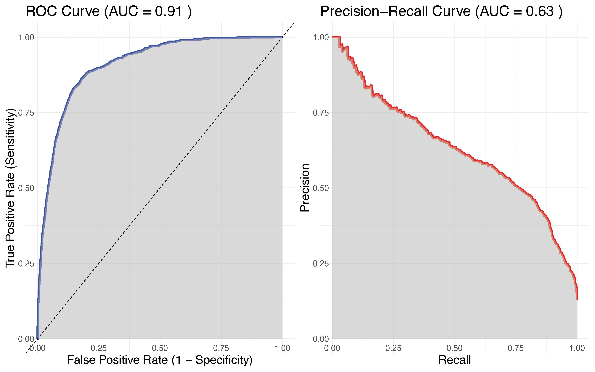
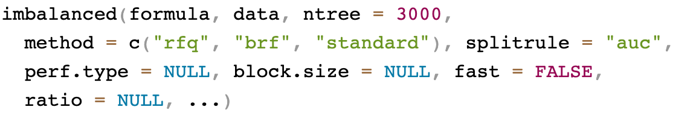
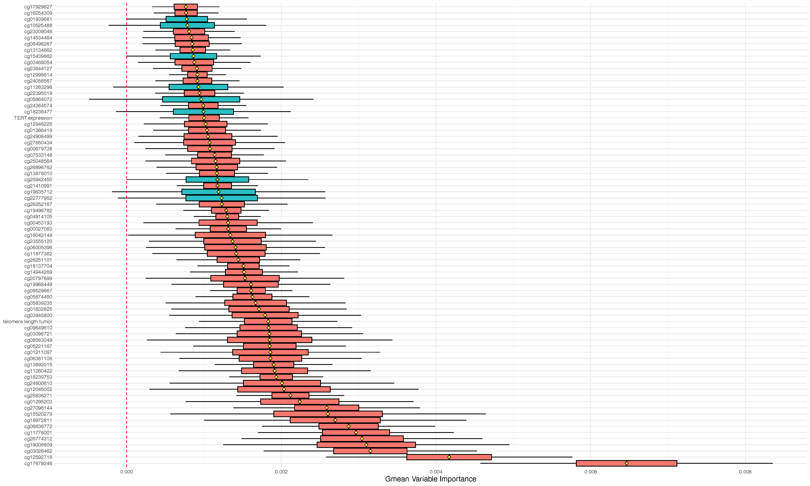
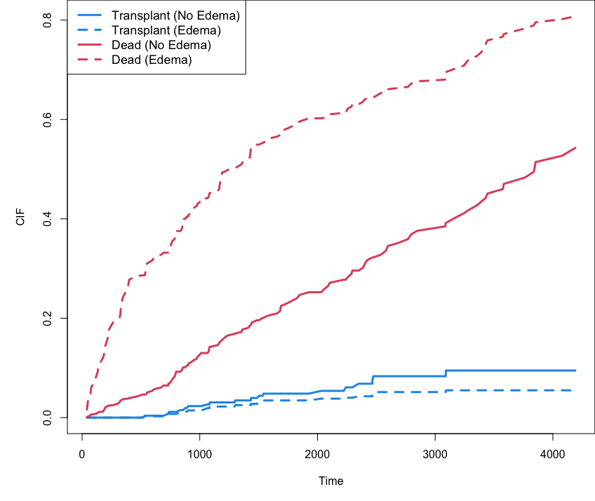
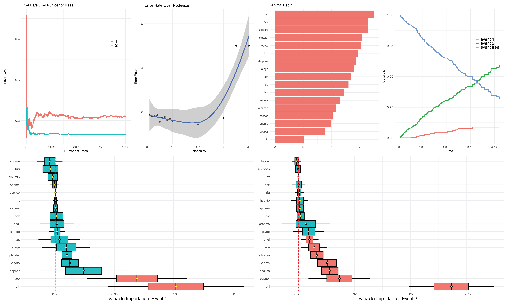
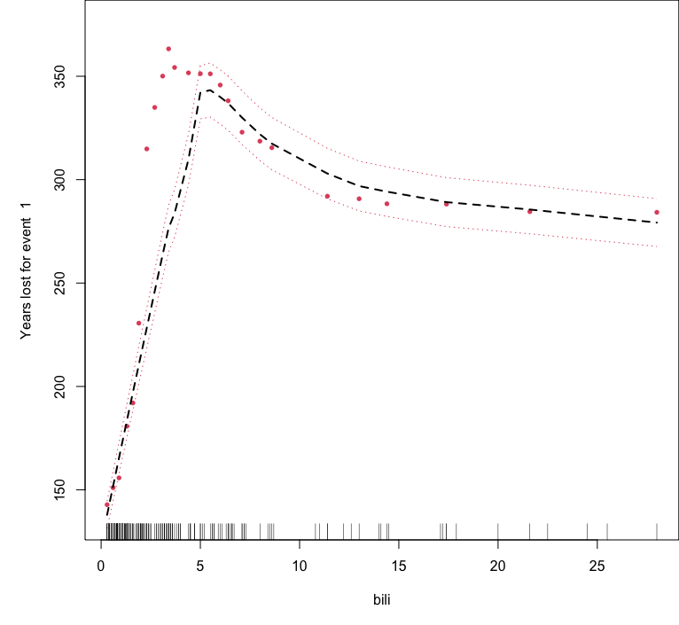
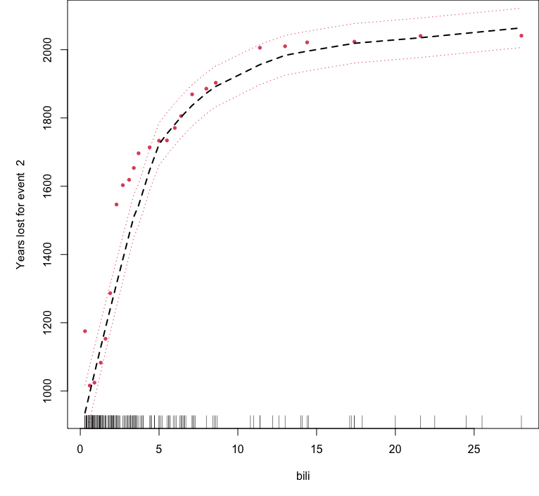

## Advanced examples


1. Class imbalanced data
2. Competing Risks
3. Multivariate Forests

## Imbalanced classification {.smaller}

<br>

| Family                                                                                                                                       | Example Grow Call with Formula Specification                                                                                                                                                                     |
|--------------------------------------|----------------------------------|
| [Regression <br> Quantile Regression]{style="color:#00589b;"}                                                                                                          | `rfsrc(Ozone~., data = airquality)` <br> `quantreg(mpg~., data = mtcars)`                                                                                                                                     |
| [Classification]{style="color:#00589b;"} <br> [Imbalanced Two-Class]{.fragment .highlight-blue fragment-index="1"}                             | rfsrc(Species~., data = iris) <br> [imbalanced(status~., data = breast)]{.fragment .highlight-blue fragment-index="1"}                                                                               |
| [Survival]{style="color:#00589b;"}                                                                                                                                     | `rfsrc(Surv(time, status)~., data = veteran)`                                                                                                                                                                  |
| Competing Risk                                                                                                                              | `rfsrc(Surv(time, status)~., data = wihs)`                                                                                                                                                                     |
| Multivariate Regression <br> Multivariate Mixed Regression <br> Multivariate Quantile Regression <br> Multivariate Mixed Quantile Regression | `rfsrc(Multivar(mpg, cyl)~., data = mtcars)` <br> `rfsrc(cbind(Species,Sepal.Length)~.,data=iris)` <br> `quantreg(cbind(mpg, cyl)~., data = mtcars)` <br> `quantreg(cbind(Species,Sepal.Length)~.,data=iris)` |
| Unsupervised <br> sidClustering <br> Breiman (Shi-Horvath)                                                                                   | `rfsrc(data = mtcars)` <br> `sidClustering(data = mtcars)` <br> `sidClustering(data = mtcars, method = "sh")`                                                                                                    |

: {.striped .border .small}

## Class imbalanced data {.smaller}

In many real world applications, a common problem is the occurrence of
imbalanced data where one class outcome (majority class, 0) is observed
far more frequently than the other (minority class, 1)

::: {.incremental}
1. Business analytics: customer churn data
2. Software and text recognition: spam filtering, detecting coding errors
3. Fault detection and quality control in industrial systems
4. Biomedical data when prevelance of target group is relatively
    small or event measured over short interval
:::

## Example from causal analysis {.smaller}

An investigator studying the value of adjuvant treatment versus
surgery in esophageal patients needed to apply causal techniques for
their analysis.  This required predicting the treatment group using
patient features (treatment overlap analysis).  There are $N_0=6649$
surgery patients and $N_1=988$ adjuvant treatment patients, giving an
imbalanced ratio of $6649/988 \approx 6.8$.

Running a RF classifier on the data, they obtained the following
confusion matrix (from the OOB ensemble):
<br>

|||predicted||
|-----------------|--------------------|-----------------|----------------|
||surgery|adjuvant|error|
|surgery|6567 |  82 | .012 |
|  adjuvant | 850 | 138    | .860|

: {.striped .border .small}

<center>
Overall error rate: 12.2\%
</center>

## Example from causal analysis {.smaller}
Running a RF classifier on the data, they obtained the following
confusion matrix (from the OOB ensemble):
<br>

|||predicted||
|-----------------|--------------------|-----------------|----------------|
||surgery|adjuvant|error|
|surgery|6567 |  82 | .012 |
|  adjuvant | 850 | 138    | .860|

: {.striped .border .small}

<center>
Overall error rate: 12.2\%
</center>

. . .

The TNR (true postive rate) and TPR (false positive rate) are:
$$
\text{TNR} = \frac{6567}{6567+82}=98.8\%,\hskip10pt
\text{TPR} = \frac{138}{850+138}=13.9\%,\hskip10pt
$$
The geometric mean (gmean) is
$$
\text{gmean}=\sqrt{.988\times .139} = 37\%
$$
This is very poor, random guessing gives 0.5

## Metrics for evaluating class imbalanced performance {.smaller}

Avoid using AUC, misclassification error and other standard metrics
and instead use:

1. gmean
2. PR-AUC (precision recall, AUC)


<center>
{width="50%"}<br>
<p style="font-family:arcade classic;font-size:20px">ROC curve and PR-AUC curve for RF classifier from esophageal 
study of adjuvant treatment versus surgery</p>
</center>

::: footer

:::


## Why does the classifier have such poor performance?

The problem here (and for other ML methods) is the
equal misclassification costs used by the Bayes decision rule
$$
\delta(\mathbf{x})=1 \hskip5pt\text{if}\hskip5pt P\{Y = 1 \mid \mathbf{X} = \mathbf{x}\} \ge \frac{1}{2}
$$

In imbalanced data, the probability of an event is very small!!
Therefore, the classifier tends to classify all cases as class labels 0

## RFQ (random forest quantile) classifier

Use a different threshold.  In place of 0.5 (the median) we use
$\pi=P\{Y=1\}$
$$
\delta(\mathbf{x})=1
\hskip5pt\text{if}\hskip5pt
 P\{Y = 1 \mid \mathbf{X} = \mathbf{x}\}
\ge
\pi
\approx \frac{N_1}{N_0+N_1}
$$

This has a dual optimality property (cost-weighted Bayes optimal and
maximizes TNR+TPR)

## General call to imbalanced
::: {.fragment .fade-left}
{width="100%"}
:::


## Classification example: Glioma {.smaller}

### Imbalanced class

::: callout-tip
## Tip

`imbalanced()` is useful if you have two imbalanced class labels
:::

``` {.r code-line-numbers="4|6-9|10-15"}
data(glioma, package = "varPro")
table(glioma$y)
>     Classic-like            Codel      G-CIMP-high       G-CIMP-low         LGm6-GBM Mesenchymal-like          PA-like 
>              148              174              249               25               41              215               26 

## make a super majority class
class.combine <- c("Classic-like", "Codel", "G-CIMP-high", "Mesenchymal-like")
ynew <- factor(1 * !is.element(glioma$y, class.combine))

## replace y with the new super class
glioma2 <- glioma
glioma2$y <- ynew
table(glioma2$y)
>    0   1 
>  786  94 
```


## Imbalanced classification: Glioma {.smaller}

#### standard RF classifier

``` {.r code-line-numbers="1-3|13-14|17|18-24|26-33"}
## standard RF classifier
o1 <- rfsrc(y~.,glioma2)
print(o1)
                         Sample size: 880
           Frequency of class labels: 786, 94
                     Number of trees: 500
           Forest terminal node size: 1
       Average no. of terminal nodes: 29.726
No. of variables tried at each split: 36
              Total no. of variables: 1241
       Resampling used to grow trees: swor
    Resample size used to grow trees: 556
                            Analysis: RF-C
                              Family: class
                      Splitting rule: gini *random*
       Number of random split points: 10
                    Imbalanced ratio: 8.3617
                   (OOB) Brier score: 0.03639723
        (OOB) Normalized Brier score: 0.1455889
                           (OOB) AUC: 0.98621488
                      (OOB) Log-loss: 0.1298745
                        (OOB) PR-AUC: 0.9170852
                        (OOB) G-mean: 0.72932496
   (OOB) Requested performance error: 0.05, 0, 0.46808511

Confusion matrix:

          predicted
  observed   0  1 class.error
         0 786  0      0.0000
         1  44 50      0.4681

      (OOB) Misclassification rate: 0.05
```

## Imbalanced classification: Glioma {.smaller}

#### RFQ classifier

``` {.r code-line-numbers="1-3|13-14|17|18-24|26-33"}
## RFQ classifier
o2 <- imbalanced(y~.,glioma2)
print(o2)
                         Sample size: 880
           Frequency of class labels: 786, 94
                     Number of trees: 3000
           Forest terminal node size: 1
       Average no. of terminal nodes: 26.557
No. of variables tried at each split: 36
              Total no. of variables: 1241
       Resampling used to grow trees: swor
    Resample size used to grow trees: 556
                            Analysis: RFQ
                              Family: class
                      Splitting rule: auc *random*
       Number of random split points: 10
                    Imbalanced ratio: 8.3617
                   (OOB) Brier score: 0.03362459
        (OOB) Normalized Brier score: 0.13449834
                           (OOB) AUC: 0.99057983
                      (OOB) Log-loss: 0.12037099
                        (OOB) PR-AUC: 0.94065642
                        (OOB) G-mean: 0.93830013
   (OOB) Requested performance error: 0.06169987

Confusion matrix:

          predicted
  observed   0  1 class.error
         0 692 94      0.1196
         1   0 94      0.0000

      (OOB) Misclassification rate: 0.1068182
```

## Imbalanced classification: Glioma {.smaller}

``` {.r }
## gmean variable importance with ci
o2 <- imbalanced(y~.,glioma2, importance="permute", block.size=20)
oo2 <- subsample(o2)
plot.subsample(oo2)
``` 

::: {.fragment .fade-left}
{width="82%"}
:::

::: footer

:::


## Competing risk {.smaller}

<br>

| Family                                                                                                                                       | Example Grow Call with Formula Specification                                                                                                                                                                     |
|--------------------------------------|----------------------------------|
| [Regression <br> Quantile Regression]{style="color:#00589b;"}                                                                                                          | `rfsrc(Ozone~., data = airquality)` <br> `quantreg(mpg~., data = mtcars)`                                                                                                                                     |
| [Classification]{style="color:#00589b;"} <br> [Imbalanced Two-Class]{style="color:#00589b;"}                              | `rfsrc(Species~., data = iris)` <br> `imbalanced(status~., data = breast)`                                                                              |
| [Survival]{style="color:#00589b;"}                                                                                                                                     | `rfsrc(Surv(time, status)~., data = veteran)`                                                                                                                                                                  |
| [Competing Risk]{.fragment .highlight-blue fragment-index="1"}                                                                                                                               | [rfsrc(Surv(time, status)~., data = wihs)]{.fragment .highlight-blue fragment-index="1"}                                                                                                                                                                      |
| Multivariate Regression <br> Multivariate Mixed Regression <br> Multivariate Quantile Regression <br> Multivariate Mixed Quantile Regression | `rfsrc(Multivar(mpg, cyl)~., data = mtcars)` <br> `rfsrc(cbind(Species,Sepal.Length)~.,data=iris)` <br> `quantreg(cbind(mpg, cyl)~., data = mtcars)` <br> `quantreg(cbind(Species,Sepal.Length)~.,data=iris)` |
| Unsupervised <br> sidClustering <br> Breiman (Shi-Horvath)                                                                                   | `rfsrc(data = mtcars)` <br> `sidClustering(data = mtcars)` <br> `sidClustering(data = mtcars, method = "sh")`                                                                                                    |

: {.striped .border .small}

## Competing risk {.smaller}
This is a specialized survival (time to event) analysis setting:

1. In competing risk the individual is subject to more than one event.
2. For example, a patient listed to receive a heart transplant can die
while on the waitlist, or they can receive the heart.  The patient is
subject to two competing risks "death" and "transplant"
3. Right-censoring also occurs just like in standard survival analysis

## Competing risk quantities of interest {.smaller}

There are two primary quantities of interest:

#### 1. The cumulative incidence function (CIF) equal to the probability of observing an event of interest by time $t$

a) Use the splitrule `logrankCR` (the default)
b) Plot the values for `obj$cif`
c) Use minimal depth for importance

::: {.fragment .fade-up}
#### 2. The cause-specific hazard function equal to the instantaneous risk of event of interest $j$ occuring at time $t$

a) Use the splitrule `logrank` and option `cause=j`
b) Use option `importance='permute'` to obtain importance
   and extract column $j$ of `obj$importance`  
::: 

## Competing risk example: PBC Mayo Clinic {.smaller}

```{r}
data(pbc, package = "survival")  
pbc$id <- NULL
pbc.cr <- pbc
pbc.cr$status <- as.factor(pbc.cr$status)
pbc.cr$sex <- as.character(pbc.cr$sex)
gt::tab_style_body(data = gt::gt(pbc.cr[1:10,1:18]),
                   fn = function(x) is.factor(x),
                   style = gt::cell_fill(color = "lightblue")
               )
```


``` {.r }
data(pbc, package = "survival")  

pbc$id <- NULL ## remove the ID

## status at endpoint, 0/1/2 for censored, transplant, dead
pbc.cr <- pbc
```

## Competing risk example: PBC Mayo Clinic {.smaller}

``` {.r code-line-numbers="1|12-13|16"}
o <- rfsrc(Surv(time, status) ~ ., pbc.cr)
o
                         Sample size: 276
                    Number of events: 18, 111
                     Number of trees: 500
           Forest terminal node size: 15
       Average no. of terminal nodes: 13.118
No. of variables tried at each split: 5
              Total no. of variables: 17
       Resampling used to grow trees: swor
    Resample size used to grow trees: 174
                            Analysis: RSF
                              Family: surv-CR
                      Splitting rule: logrankCR *random*
       Number of random split points: 10
   (OOB) Requested performance error: 0.18408881, 0.1666207
```

::: callout-tip
## Tip

`rfsrc` recognize competing risk problem automatically when using the survival formula
:::


## event specific and non-event specific variable selection {.smaller}

``` {.r code-line-numbers="1-8|10-12|16-19"}
## canonical example: default Gray's splitting-rule
## status: 0/1/2 for censored, transplant, dead 
o <- rfsrc(Surv(time, status) ~ ., pbc)

## log-rank splitting where each event type is treated as the event of interest 
## log-rank cause-1 specific splitting and targeted VIMP for cause 1="transplant"
o.log1 <- rfsrc(Surv(time, status) ~ ., pbc, 
                splitrule = "logrank", cause = 1, importance = "permute")

## log-rank cause-2 specific splitting and targeted VIMP for cause 2="death"
o.log2 <- rfsrc(Surv(time, status) ~ ., pbc, 
                splitrule = "logrank", cause = 2, importance = "permute")

## extract minimal depth from the Gray split forest: non-event specific
## extract VIMP from the log-rank forests: event-specific
var.perf <- data.frame(md = max.subtree(o)$order[, 1],
                       vimp1 = 100 * o.log1$importance[ ,1],
                       vimp2 = 100 * o.log2$importance[ ,2])
print(var.perf[order(var.perf$md), ], digits = 2)
```

## event specific and non-event specific variable selection {.smaller}

::: columns
::: {.column width="60%"}
``` {.r }
## canonical example: default Gray's splitting-rule
## status: 0/1/2 for censored, transplant, dead 
o <- rfsrc(Surv(time, status) ~ ., pbc)

## log-rank splitting where each event type is treated as the event of interest 
## log-rank cause-1 specific splitting and targeted VIMP for cause 1="transplant"
o.log1 <- rfsrc(Surv(time, status) ~ ., pbc, 
                splitrule = "logrank", cause = 1, importance = "permute")

## log-rank cause-2 specific splitting and targeted VIMP for cause 2="death"
o.log2 <- rfsrc(Surv(time, status) ~ ., pbc, 
                splitrule = "logrank", cause = 2, importance = "permute")

## extract minimal depth from the Gray split forest: non-event specific
## extract VIMP from the log-rank forests: event-specific
var.perf <- data.frame(md = max.subtree(o)$order[, 1],
                       vimp1 = 100 * o.log1$importance[ ,1],
                       vimp2 = 100 * o.log2$importance[ ,2])
print(var.perf[order(var.perf$md), ], digits = 2)
```
::: 
::: {.column width="40%" .fragment .fade-left}
``` {.r }

          md  vimp1   vimp2
bili     2.0  6.407  5.9263
copper   3.5  2.944  2.0612
edema    4.3 -0.140  1.1829
albumin  4.3 -0.820  0.6809
ascites  4.5 -0.012  1.2883
protime  4.7 -0.832  0.5708
age      5.0  7.742  0.8564
chol     5.0  0.304  0.5097
ast      5.6 -0.345  0.3896
alk.phos 6.0 -1.068  0.0504
trig     6.0 -0.485  0.0089
stage    6.1  0.866  0.3493
platelet 6.3  0.409 -0.1191
hepato   6.6  0.772  0.1488
spiders  7.2 -0.121  0.1349
sex      7.3  0.125  0.0289
trt      7.9 -0.217 -0.0174
```
:::
:::

## CIF stratified by edema {.smaller}

``` {.r code-line-numbers="1-3|4-7|8"}
## cumulative incidence function (CIF) for transplant and dead stratified by edema
cif <- o$cif.oob; Time <- o$time.interest
edema <- o$xvar$edema
cif.transplant <- cbind(apply(cif[,,1][edema == 0,], 2, mean),
                        apply(cif[,,1][edema > 0,], 2, mean))
cif.dead  <- cbind(apply(cif[,,2][edema == 0,], 2, mean),
                   apply(cif[,,2][edema > 0,], 2, mean))
matplot(Time, cbind(cif.transplant, cif.dead), type = "l",
        lty = c(1,2,1,2), col = c(4, 4, 2, 2), lwd = 3, ylab = "CIF")
legend("topleft", legend = c("Transplant (No Edema)", "Transplant (Edema)", 
                  "Dead (No Edema)", "Dead (Edema)"),
       lty = c(1,2,1,2), col = c(4, 4, 2, 2), lwd = 3, cex = 1.1)
```

::: {.fragment .fade-left}
{width="40%"}
:::

::: footer

:::

## The run.rfsrc function for an overview {.smaller}
``` {.r}
## tip!!! perform the same analysis as above with one line
run.rfsrc(Surv(time, status) ~ ., pbc, ntree=1000, alpha=.10)
```

::: {.fragment .fade-left}
{width="80%"}
:::

## The run.rfsrc function for an overview {.smaller}

{width="130%"}

::: footer

:::


## Partial plot {.smaller}
#### using "target" to specify the event of interest
``` {.r code-line-numbers="1-3"}
## target = an integer value between 1 and J indicating the event of interest
## where J is the number of event types
plot.variable(o, target = 1, 
              xvar.names = "bili", partial = TRUE, smooth.lines = TRUE)
```

::: {.fragment .fade-left}
{width="46%"}
:::

## Partial plot {.smaller}
#### using "target" to specify the event of interest
::: columns
::: {.column width="50%"}
``` {.r code-line-numbers="1-3"}
## target = an integer value between 1 and J indicating the event of interest
## where J is the number of event types
plot.variable(o, target = 1, 
              xvar.names = "bili", partial = TRUE, smooth.lines = TRUE)
```

{width="100%"}
:::
::: {.column width="50%" .fragment .fade-left}

``` {.r code-line-numbers="1-3"}
## target = an integer value between 1 and J indicating the event of interest
## where J is the number of event types
plot.variable(o, target = 2, 
              xvar.names = "bili", partial = TRUE, smooth.lines = TRUE)
```

::: {.fragment .fade-left}
{width="100%"}
:::
:::
:::

## Multivariate analysis {.smaller}

<br>

| Family                                                                                                                                       | Example Grow Call with Formula Specification                                                                                                                                                                     |
|--------------------------------------|----------------------------------|
| [Regression <br> Quantile Regression]{style="color:#00589b;"}                                                                                                          | `rfsrc(Ozone~., data = airquality)` <br> `quantreg(mpg~., data = mtcars)`                                                                                                                                     |
| [Classification]{style="color:#00589b;"} <br> [Imbalanced Two-Class]{style="color:#00589b; font-weight: bold;"}                              | `rfsrc(Species~., data = iris)` <br> `imbalanced(status~., data = breast)`   |                                                                           |
| [Survival]{style="color:#00589b;"}                                                                                                                                     | `rfsrc(Surv(time, status)~., data = veteran)`                                                                                                                                                                  |
| [Competing Risk]{style="color:#00589b;"}                                                                                                                               | `rfsrc(Surv(time, status)~., data = wihs)`                                                                                                                                                                     |
| [Multivariate Regression <br> Multivariate Mixed Regression <br> Multivariate Quantile Regression <br> Multivariate Mixed Quantile Regression]{.fragment .highlight-blue fragment-index="1"}  | [rfsrc(Multivar(mpg, cyl)~., data = mtcars)]{.fragment .highlight-blue fragment-index="1"}  <br> `rfsrc(cbind(Species,Sepal.Length)~.,data=iris)` <br> `quantreg(cbind(mpg, cyl)~., data = mtcars)` <br> `quantreg(cbind(Species,Sepal.Length)~.,data=iris)` |
| Unsupervised <br> sidClustering <br> Breiman (Shi-Horvath)                                                                                   | `rfsrc(data = mtcars)` <br> `sidClustering(data = mtcars)` <br> `sidClustering(data = mtcars, method = "sh")`                                                                                                    |

: {.striped .border .small}

## Multivariate example: Nutrigenomic Study {.smaller}

Study the effects of five diet treatments on 21 liver lipids and 120 hepatic gene expression in wild-type and PPAR-alpha deficient mice. We regress gene expression, diet and genotype (x-variables) on lipid expressions (multivariate y-responses) [@martin2007novel]

```{r}
data(nutrigenomic, package = "randomForestSRC")  
gt::gt(data.frame(nutrigenomic$lipids[,1:7],diet=nutrigenomic$diet,genotype=nutrigenomic$genotype,nutrigenomic$genes[,1:10])[1:5,])
```

::: columns
::: {.column width="57%"}
``` {.r code-line-numbers="1-3|5-6|7-8"}
data(nutrigenomic, package = "randomForestSRC")
names(nutrigenomic)
> [1]  "lipids"   "genes"    "diet"     "genotype"

dim(nutrigenomic$lipids)
> [1]  40 21
dim(nutrigenomic$genes)
> [1]  40 120
```
:::
::: {.column width="43%" .fragment}
``` {.r code-line-numbers="1-4|6-8"}
## diet and genotype are factors
head(nutrigenomic$diet)
> [1]  lin  sun  sun  fish ref  coc
> Levels: coc fish lin ref sun

head(nutrigenomic$genotype)
> [1]  wt wt wt wt wt wt
> Levels: ppar wt
```
:::
:::

## Multivariate example: Nutrigenomic Study {.smaller}

``` {.r code-line-numbers="1-5|7-11"}
## parse into y and x data
ydta <- nutrigenomic$lipids
xdta <- data.frame(nutrigenomic$genes,
                   diet = nutrigenomic$diet,
                   genotype = nutrigenomic$genotype)

## multivariate mixed forest call
o <- rfsrc(get.mv.formula(colnames(ydta)),
            data.frame(ydta, xdta),
            importance=TRUE, nsplit = 10,
            splitrule = "mahalanobis")
```
::: {.fragment .fade-up}
``` {.r code-line-numbers="1,12-13|16-17"}
> print(o)
                         Sample size: 40
                     Number of trees: 500
           Forest terminal node size: 5
       Average no. of terminal nodes: 4.776
No. of variables tried at each split: 41
              Total no. of variables: 122
              Total no. of responses: 21
         User has requested response: C14.0
       Resampling used to grow trees: swor
    Resample size used to grow trees: 25
                            Analysis: mRF-R
                              Family: regr+
                      Splitting rule: mahalanobis *random*
       Number of random split points: 10
                     (OOB) R squared: 0.13227364
   (OOB) Requested performance error: 0.55613339
```
:::

## Multivariate example: Nutrigenomic Study {.smaller}

``` {.r}
## acquire the error rate for each of the 21-coordinates 
## standardize to allow for comparison across coordinates
serr <- get.mv.error(o, standardize = TRUE)
```

::: {.fragment .fade-up .fade-in-then-semi-out}
``` {.r }
> serr
    C14.0     C16.0     C18.0  C16.1n.9  C16.1n.7  C18.1n.9  C18.1n.7  C20.1n.9  C20.3n.9  C18.2n.6  C18.3n.6 
0.8671651 0.6519146 0.6632005 0.7146180 0.8788133 0.7754928 0.8148566 0.7766450 0.8629866 0.8355279 0.9773675 
 C20.2n.6  C20.3n.6  C20.4n.6  C22.4n.6  C22.5n.6  C18.3n.3  C20.3n.3  C20.5n.3  C22.5n.3  C22.6n.3 
0.8439182 0.7456620 0.8378708 0.8915473 0.8949931 0.9301005 0.9438823 0.6832386 0.8470016 0.5416053 
```
:::

::: {.fragment .fade-up}
``` {.r }
## acquire standardized VIMP 
svimp <- get.mv.vimp(obj, standardize = TRUE)
```
:::

::: {.fragment .fade-up }
``` {.r }
> head(svimp)
              C14.0         C16.0         C18.0      C16.1n.9     C16.1n.7     C18.1n.9      C18.1n.7      C20.1n.9      C20.3n.9      C18.2n.6      C18.3n.6
X36b4 -0.0011838300 -0.0011120623 -2.986438e-03 -0.0023431724 -0.001224286 -0.002843073 -0.0015607315 -0.0005896246 -0.0000214573  0.0004547212 -0.0006680341
ACAT1 -0.0046534735  0.0029068448  9.230050e-04  0.0022818757 -0.005663879  0.003297788 -0.0031493826 -0.0016189507 -0.0013414155 -0.0002053584 -0.0010019447
ACAT2  0.0136148438  0.0081002291  2.995972e-03  0.0111641579  0.008484230  0.021038781  0.0173969634  0.0055616191  0.0041388219  0.0072896355 -0.0005133367
ACBP   0.0036475488  0.0335889422  1.050479e-02  0.0046146024  0.003332181  0.001875450  0.0058926949  0.0127454125  0.0089004756  0.0127657144 -0.0004641915
ACC1  -0.0006048965 -0.0002409629 -2.053589e-03 -0.0008960043 -0.001153418 -0.001132043 -0.0006816805  0.0019148640 -0.0011168252  0.0005493523 -0.0003399971
ACC2   0.0091886014 -0.0029555916  2.252395e-05  0.0002228193  0.011012313  0.004644160  0.0098393504 -0.0004550441  0.0068958281  0.0056158617  0.0015149188
           C20.2n.6      C20.3n.6      C20.4n.6      C22.4n.6      C22.5n.6      C18.3n.3      C20.3n.3     C20.5n.3      C22.5n.3     C22.6n.3
X36b4 -0.0008007217 -0.0002797032 -9.960998e-05 -0.0016751088 -0.0011467476  0.0012917637  0.0009019783 -0.001953023 -0.0028467311 -0.004910317
ACAT1  0.0016278408  0.0015450041  1.460450e-03  0.0039728775 -0.0002436180 -0.0015271289 -0.0009404719  0.002487745  0.0085764654  0.002279551
ACAT2  0.0163623835  0.0039925515  1.082762e-02  0.0243844140  0.0234540852  0.0256505212  0.0340391420  0.025389222  0.0117149395  0.010141345
ACBP   0.0054934515  0.0086732580  7.791429e-04  0.0015539132 -0.0023644673  0.0211272426  0.0095212814  0.005460451  0.0069928914  0.009941966
ACC1  -0.0003640483 -0.0024303740 -1.041940e-03  0.0000992922 -0.0004331203 -0.0008617263 -0.0009875129 -0.001643309 -0.0007186863 -0.003139676
ACC2  -0.0010663573 -0.0007101648 -1.196044e-03 -0.0014820461 -0.0023466329  0.0017062532  0.0006796071  0.002065533 -0.0011808523  0.003489718
```
:::

## Split rules for multivariate regression {.smaller}
<br>

| Family                                                                                                                                                                        | `splitrule`                                                                                                                                                                                |
|--------------------------------------|----------------------------------|
| Regression <br> Quantile Regression                                                                                             | `mse` <br> `la.quantile.regr, quantile.regr,` `mse`|
| Classification <br> Imbalanced Two-Class                                                                                                                                      | `gini, auc, entropy` <br> `gini, auc, entropy`                                                                                                                                             |
| Survival                                                                                                                                                                      | `logrank, bs.gradient, logrankscore`                                                                                                                                                       |
| Competing Risk                                                                                                                                                                | `logrankCR, logrank`                                                                                                                                                                       |
| [Multivariate Regression]{style="color:#00589b;"} <br> Multivariate Classification <br> Multivariate Mixed Regression <br> Multivariate Quantile Regression <br> Multivariate Mixed Quantile Regression | [mv.mse]{style="color:#00589b;"}, [mahalanobis]{style="color:#00589b;"} <br> `mv.gini` <br> `mv.mix` <br> [mv.mse]{style="color:#00589b;"} <br> `mv.mix`                                                                                                             |
| Unsupervised <br> sidClustering <br> Breiman (Shi-Horvath)                                                                                                                    | `unsupv` <br> $\{$`mv.mse, mv.gini, mv.mix`$\}$, `mahalanobis` <br> `gini, auc, entropy`                                                                                                   |

: {.striped .border .small}


## Split rules {.smaller}
#### mahalanobis splitting 
``` {.r code-line-numbers="4,18|20-21"}
o <- rfsrc(get.mv.formula(colnames(ydta)),
             data.frame(ydta, xdta),
             importance=TRUE, nsplit = 10,
             splitrule = "mahalanobis")
> print(o)
                         Sample size: 40
                     Number of trees: 500
           Forest terminal node size: 5
       Average no. of terminal nodes: 4.776
No. of variables tried at each split: 41
              Total no. of variables: 122
              Total no. of responses: 21
         User has requested response: C14.0
       Resampling used to grow trees: swor
    Resample size used to grow trees: 25
                            Analysis: mRF-R
                              Family: regr+
                      Splitting rule: mahalanobis *random*
       Number of random split points: 10
                     (OOB) R squared: 0.13227364
   (OOB) Requested performance error: 0.55613339
```

## Split rules {.smaller}
#### default composite (independence) splitting
``` {.r code-line-numbers="4,18|20-21"}
o2 <- rfsrc(get.mv.formula(colnames(ydta)),
              data.frame(ydta, xdta),
              importance=TRUE, nsplit = 10)
              
> print(o2)
                         Sample size: 40
                     Number of trees: 500
           Forest terminal node size: 5
       Average no. of terminal nodes: 4.45
No. of variables tried at each split: 41
              Total no. of variables: 122
              Total no. of responses: 21
         User has requested response: C14.0
       Resampling used to grow trees: swor
    Resample size used to grow trees: 25
                            Analysis: mRF-R
                              Family: regr+
                      Splitting rule: mv *random*
       Number of random split points: 10
                     (OOB) R squared: 0.38963538
   (OOB) Requested performance error: 0.39118801
```

## Split rules {.smaller}
#### compare VIMP under the two split rules

``` {.r}
## compare standardized VIMP for top 25 variables
imp <- data.frame(mahalanobis = rowMeans(get.mv.vimp(o,  standardize = TRUE)),
                  default     = rowMeans(get.mv.vimp(o2, standardize = TRUE)))
```

::: {.fragment .fade-up}
``` {.r }
> print(100 * imp[order(imp[,"mahalanobis"], decreasing = TRUE)[1:25], ])
         mahalanobis      default
diet      10.1554383 50.157098614
CYP3A11    6.9094201  7.390394227
CYP2c29    4.3809975  2.318045460
PMDCI      3.0008368  4.127672741
Ntcp       2.2830390  1.219654570
genotype   2.0163456  7.149894438
CYP4A10    1.2867264 -0.032280665
SR.BI      1.2344900  1.298163431
GSTpi2     1.1666067  2.810511592
THIOL      1.0794705  1.230275963
CAR1       1.0716575  2.320816813
SPI1.1     0.9334952  1.622246274
G6Pase     0.8642624  0.121325455
Lpin       0.8477423  3.189846540
AOX        0.8048813  0.004006545
mHMGCoAS   0.7943659  0.419456736
FAT        0.7777474 -0.045086923
PLTP       0.5652898  1.217041153
ACOTH      0.5040769  1.326771272
Tpbeta     0.5003534 -0.054229018
L.FABP     0.4952051 -0.061771625
Tpalpha    0.4547016  0.221539122
ACBP       0.4307385  0.985221687
BSEP       0.4185126  0.248101073
FDFT       0.4046558  0.235316552
```
:::

::: footer

:::


## Outline  { .smaller background-color="azure"}

::: columns

::: {.column width="47.5%"}
#### [Part I: Training](https://luminwin.github.io/shortCourse/presentationPartI.html)

1.	Quick start
2.	Data structures allowed
3.	Training (grow) with examples <br>(regression, classification, survival)

#### [Part II:  Inference and Prediction](https://luminwin.github.io/shortCourse/presentationPartII.html)

1.	Inference (OOB)
2.	Prediction Error
3.	Prediction
4.	Restore
5.	Partial Plots
:::

::: {.column width="5%"}

:::

::: {.column width="47.5%" }
#### [Part III: Variable Selection](https://luminwin.github.io/shortCourse/presentationPartIII.html)

1.	VIMP
2.	Subsampling (Confidence Intervals)
3.	Minimal Depth
4.	VarPro

#### [Part IV:  Advanced Examples](https://luminwin.github.io/shortCourse/presentationPartIV.html)

1.	Class Imbalanced Data
2.	Competing Risks
3.	Multivariate Forests
:::
:::


## References